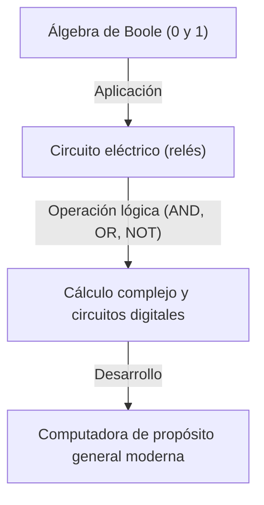
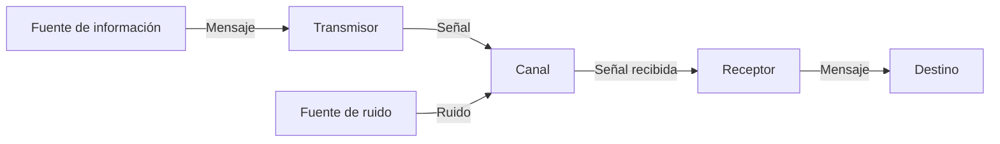

# Claude Shannon: El genio que creó la era digital

Los teléfonos inteligentes, el internet, las computadoras y la inteligencia artificial que usamos a diario. Los conceptos de "comunicación digital" e "información" que son la base de todos ellos, surgieron de la mente de un solo genio. Su nombre era Claude Elwood Shannon (1916–2001). Él pasó a la historia como el "padre de la teoría de la información" y es considerado uno de los científicos más grandes e influyentes del siglo XX.

En este artículo, exploraremos en detalle la vida de Shannon, desde su infancia hasta el revolucionario artículo que sentó las bases de la sociedad digital moderna, así como su lado más humano y lleno de "espíritu lúdico".

## 1. Infancia y pasión por la invención

Claude Shannon nació el 30 de abril de 1916 en Petoskey, un pequeño pueblo en el estado de Michigan, Estados Unidos, y creció en Gaylord. Su padre era un hombre de negocios y su madre era profesora de idiomas y directora de una escuela secundaria. Desde una edad temprana, Shannon mostró un interés inusual por la maquinaria y la electrónica, recogiendo chatarra alrededor de su casa para construir una red de telégrafo secreta con sus amigos usando alambre de púas, y sistemas de comunicación aprovechando las cercas de las granjas.

Además, un dato interesante es que su abuelo fue un inventor y un pariente lejano de Thomas Edison. El joven Shannon soñaba con convertirse en un gran inventor como Edison y se sumergió en la construcción de aviones a escala y barcos a control remoto. Ya desde esta época, su talento como ingeniero para "entender los mecanismos fundamentales de las cosas y reconstruirlos" estaba germinando en su interior.

## 2. De la Universidad de Michigan al MIT: El encuentro con el álgebra de Boole y los circuitos de relés

En 1932, Shannon ingresó a la Universidad de Michigan y obtuvo dos licenciaturas: en matemáticas y en ingeniería eléctrica. Haber estado en contacto tanto con la belleza lógica de las matemáticas como con los aspectos prácticos de la ingeniería eléctrica tendría un significado decisivo para sus futuras investigaciones.

En 1936, ingresó a la escuela de posgrado del Instituto Tecnológico de Massachusetts (MIT) y comenzó a investigar bajo la dirección de Vannevar Bush. En ese momento, Bush estaba desarrollando una gigantesca calculadora analógica llamada analizador diferencial. A Shannon se le asignó el mantenimiento de los complejos circuitos de relés de esta computadora.

Aquí, Shannon se dio cuenta de que el "álgebra de Boole (álgebra lógica)" inventada por el matemático del siglo XIX George Boole y los interruptores (encendido y apagado) de los circuitos eléctricos coincidían matemática y perfectamente. Demostró que las operaciones lógicas (AND, OR, NOT) de "verdadero (1)" y "falso (0)" podían representarse físicamente mediante la conexión en serie o en paralelo de circuitos eléctricos.

En 1937, a la edad de 21 años, Shannon publicó su tesis de maestría titulada "Un análisis simbólico de circuitos de relés y conmutación" (A Symbolic Analysis of Relay and Switching Circuits). Esta tesis fue aclamada como "la tesis de maestría más importante e influyente del siglo XX" y se convirtió en la base del diseño de los circuitos digitales modernos. Este descubrimiento demostró que "no importa cuán complejo sea el cálculo lógico, se puede ejecutar únicamente con combinaciones de encendido y apagado de interruptores (0 y 1)", estableciendo así el principio fundamental que constituye el núcleo de las computadoras actuales.

## 3. La Segunda Guerra Mundial y la investigación sobre la teoría criptográfica

Durante la Segunda Guerra Mundial, Shannon se unió a los Laboratorios Bell y trabajó en sistemas de control de tiro y en la investigación de la teoría criptográfica. Aquí también conoció al genial matemático británico Alan Turing, con quien tuvo profundas discusiones sobre las máquinas y la inteligencia humana.

Shannon avanzó en su investigación sobre la teoría criptográfica y en 1945 redactó un informe clasificado titulado "Una teoría matemática de la criptografía" (A Mathematical Theory of Cryptography), que fue publicado después de la guerra, en 1949, como "La teoría de la comunicación en los sistemas secretos". En él, proporcionó la demostración matemática del "cifrado completamente indescifrable (libreta de un solo uso o one-time pad)". Además, definió claramente por primera vez los conceptos de "Información" y "Redundancia" en el contexto de la criptografía, lo cual fue un escalón crucial hacia la posterior teoría de la información.

## 4. 1948: El nacimiento de la teoría de la información

En 1948, Shannon publicó un artículo histórico titulado "Una teoría matemática de la comunicación" (A Mathematical Theory of Communication) en la revista académica de los Laboratorios Bell (Bell System Technical Journal). Este artículo fue el momento en que se fundó de manera independiente el nuevo campo de estudio conocido como "teoría de la información".

En el mundo anterior a Shannon, la "información" era un concepto vago y subjetivo que se creía dependiente del significado o el contenido. Sin embargo, Shannon descartó intencionalmente el "significado" de la información y la definió matemáticamente de forma puramente probabilística y estadística. Adoptó públicamente por primera vez el "bit" (abreviatura de binary digit) como la unidad para medir la información, demostrando que cualquier información (texto, voz, imágenes, etc.) puede representarse como una secuencia de bits de 0 y 1.

### Modelado de sistemas de comunicación

Shannon describió todos los sistemas de comunicación con el siguiente modelo simple.

Este modelo era universal y aplicable a cualquier transmisión de información, desde teléfonos, transmisiones de televisión e internet, hasta las conversaciones entre personas o la transcripción del ADN.

### El teorema de Shannon y la cantidad de información (entropía)

Él también introdujo la "entropía de la información" como un concepto que representa la incertidumbre de la información. Matematizó el concepto intuitivo de que cuanto menor es la probabilidad de que ocurra un evento, mayor es la cantidad de información obtenida al conocerlo.

Además, Shannon demostró matemáticamente que sin importar cuánto ruido exista en un canal de comunicación, si la velocidad de transmisión está por debajo de la "capacidad del canal (límite de Shannon)", es posible transmitir información teóricamente sin errores (con una probabilidad de error cercana a cero) al aplicar una codificación de corrección de errores adecuada. Esto se conoce como el "teorema de codificación de canales de Shannon" y fue un descubrimiento asombroso que cambió el sentido común de los ingenieros de comunicaciones de la época. En ese entonces, se pensaba que la única manera de combatir el ruido era aumentando la potencia de la señal. Hoy en día, si podemos recibir imágenes claras de sondas espaciales en los confines del universo, o reproducir música desde un CD rayado, es gracias a la tecnología de corrección de errores basada en este teorema.

## 5. El lado humano del genio: Un hombre que amaba los malabares y el monociclo

La grandeza de Shannon radicaba no solo en su intelecto incomparable, sino también en su "espíritu lúdico" (Playfulness), sumamente humano. Era completamente indiferente a la posición, la fama y la riqueza, y realizaba sus investigaciones e invenciones simplemente para satisfacer su propia curiosidad.

La imagen de Shannon moviéndose por los pasillos de los Laboratorios Bell en monociclo mientras hacía malabares se ha convertido en una leyenda entre sus colegas. Construyó una teoría matemática sobre los malabares, formulando el "teorema de los malabares", y llegó incluso a inventar una máquina que hacía malabares.

Además, fue uno de los pioneros que sentó las bases para los programas de computadora que juegan al ajedrez. Su artículo publicado en 1950 tuvo una enorme influencia en el desarrollo posterior del ajedrez por computadora. También inventó a "Teseo", un ratón mecánico capaz de explorar y memorizar un laberinto por sí solo, lo que constituyó un intento pionero para demostrar los primeros conceptos de la inteligencia artificial (aprendizaje automático).

La casa de Shannon estaba llena de inventos extraños y divertidos. Desde la "Máquina definitiva" (Ultimate Machine), una caja de la cual salía una mano solo para apagar el interruptor que alguien acababa de encender, hasta una trompeta que escupía fuego o un frisbee personalizado; su curiosidad era inagotable.

## 6. Últimos años y legado

En 1956, Shannon se convirtió en profesor en el MIT, donde continuó investigando mientras enseñaba. Sin embargo, no le gustaba el bullicio del mundo académico ni la fama, y poco a poco desapareció de la vida pública para sumergirse en sus pasatiempos e invenciones en casa. En sus últimos años padeció la enfermedad de Alzheimer, y se dice que no llegó a ser plenamente consciente de que sus grandes logros habían florecido en el internet y la sociedad digital moderna. El 24 de febrero de 2001, Shannon falleció a la edad de 84 años.

## Resumen

Las semillas sembradas por Claude Shannon han crecido hasta convertirse en el gigantesco bosque que es la sociedad de la información digital de hoy. Sin él, el internet actual, los teléfonos inteligentes, la música digital y la inteligencia artificial no existirían, o bien, tendrían una forma completamente diferente.

Shannon, quien redujo la información a 0 y 1, y demostró matemáticamente cómo transmitir información de manera precisa a través de un mar de ruido. Su vida es una maravillosa demostración de cómo la pura curiosidad y el espíritu lúdico pueden conducir a grandes descubrimientos que transforman el mundo de raíz. Cuando tengas un dispositivo digital en tus manos, ¿por qué no dedicar un momento a recordar al genio que disfrutaba haciendo malabares mientras montaba en un monociclo?
