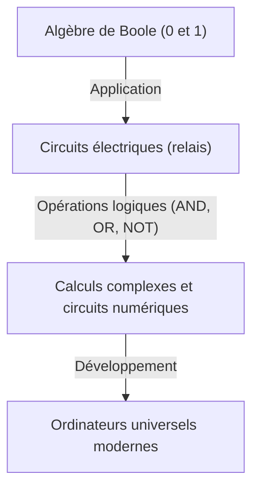
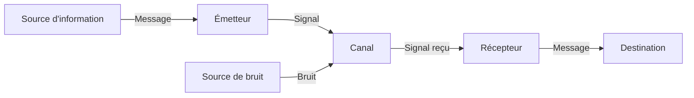

# Claude Shannon : Le génie qui a créé l'ère numérique

Les smartphones, Internet, les ordinateurs et l'intelligence artificielle que nous utilisons quotidiennement. Les concepts de « communication numérique » et d'« information » qui sous-tendent tout cela sont nés de l'esprit d'un seul génie. Son nom est Claude Elwood Shannon (1916–2001). Il est entré dans l'histoire en tant que « père de la théorie de l'information » et est considéré comme l'un des scientifiques les plus grands et les plus influents du XXe siècle.

Dans cet article, nous explorerons en profondeur la vie de Shannon, depuis son enfance, en passant par les articles révolutionnaires qui ont jeté les bases de la société numérique moderne, jusqu'à sa personnalité pleine d'humanité et de « sens du jeu ».

## 1. Enfance et passion pour l'invention

Claude Shannon est né le 30 avril 1916 à Petoskey, une petite ville de l'État du Michigan aux États-Unis, et a grandi à Gaylord. Son père était un homme d'affaires, et sa mère, professeur de langues, était également directrice de lycée. Dès son plus jeune âge, Shannon a montré un intérêt extraordinaire pour les machines et l'électronique, rassemblant des objets de récupération autour de sa maison pour construire un réseau télégraphique secret avec ses amis utilisant du fil barbelé, ainsi qu'un système de communication utilisant les clôtures de la ferme.

Un fait intéressant est que son grand-père était inventeur et un parent éloigné de Thomas Edison. Le jeune Shannon, rêvant de devenir un grand inventeur comme Edison, s'est plongé dans la construction d'aéromodèles et de bateaux radiocommandés. Dès cette époque, son talent d'ingénieur pour « comprendre les mécanismes fondamentaux des choses et les reconstruire » commençait déjà à germer en lui.

## 2. De l'Université du Michigan au MIT : La rencontre de l'algèbre de Boole et des circuits à relais

En 1932, Shannon est entré à l'Université du Michigan et a obtenu deux diplômes de licence en mathématiques et en génie électrique. Le contact avec la beauté logique des mathématiques et les aspects pratiques de l'ingénierie électrique a eu une signification décisive pour ses recherches ultérieures.

En 1936, il a poursuivi ses études supérieures au Massachusetts Institute of Technology (MIT) et a commencé ses recherches sous la direction de Vannevar Bush. Bush développait alors un énorme ordinateur analogique appelé analyseur différentiel. Shannon fut chargé de la maintenance des circuits à relais complexes de cette machine.

C'est là que Shannon a réalisé que l'« algèbre de Boole (algèbre logique) », inventée par le mathématicien du XIXe siècle George Boole, correspondait parfaitement et mathématiquement aux interrupteurs (marche et arrêt) des circuits électriques. Il a prouvé que les opérations logiques (AND, OR, NOT) de « vrai (1) » et « faux (0) » pouvaient être physiquement représentées par les connexions en série et en parallèle des circuits électriques.

En 1937, à l'âge de 21 ans, Shannon a publié sa thèse de master, « Une analyse symbolique des circuits à relais et commutateurs (A Symbolic Analysis of Relay and Switching Circuits) ». Cette thèse a été saluée comme « la thèse de master la plus importante et la plus influente du XXe siècle » et a constitué la base de la conception moderne des circuits numériques. Cette découverte a montré que « n'importe quel calcul logique complexe, aussi complexe soit-il, peut être exécuté avec seulement une combinaison de commutateurs allumés et éteints (0 et 1) », établissant ainsi le principe fondamental des ordinateurs d'aujourd'hui.

## 3. La Seconde Guerre mondiale et l'étude de la cryptographie

Pendant la Seconde Guerre mondiale, Shannon a rejoint les Laboratoires Bell, où il a travaillé sur les systèmes de contrôle de tir et la théorie cryptographique. C'est là qu'il a rencontré le génial mathématicien britannique Alan Turing, avec qui il a eu de profondes discussions sur l'intelligence des machines et des humains.

Shannon a fait progresser la recherche sur la théorie de la cryptographie et a compilé en 1945 un rapport classifié intitulé « Une théorie mathématique de la cryptographie (A Mathematical Theory of Cryptography) » (publié publiquement après la guerre en 1949). Dans ce rapport, il a fourni une preuve mathématique du « masque jetable (one-time pad) » comme étant un code totalement indéchiffrable. Il a également clairement défini pour la première fois les concepts d'« Information » et de « Redondance (Redundancy) » dans le contexte de la cryptographie, ce qui a constitué un tremplin majeur pour sa théorie de l'information ultérieure.

## 4. 1948 : La naissance de la théorie de l'information

En 1948, Shannon a publié un article historique intitulé « Une théorie mathématique de la communication (A Mathematical Theory of Communication) » dans la revue universitaire des Laboratoires Bell (Bell System Technical Journal). Cet article a marqué le moment où il a fondé à lui seul le nouveau domaine académique de la « théorie de l'information ».

Dans le monde d'avant Shannon, l'« information » était un concept vague et subjectif, considéré comme dépendant du sens ou du contenu. Cependant, Shannon a intentionnellement écarté le « sens » de l'information et l'a définie mathématiquement comme un pur problème de probabilités et de statistiques. Il a été le premier à adopter publiquement le « bit (abréviation de binary digit) » comme unité de mesure de l'information, montrant que toutes les informations (texte, voix, image, etc.) pouvaient être représentées par des séquences de 0 et de 1.

### Modélisation des systèmes de communication

Shannon a décrit tout système de communication à l'aide du modèle simple suivant.

Ce modèle était universellement applicable à toutes les transmissions d'informations, qu'il s'agisse des téléphones, de la télédiffusion, d'Internet, ou même des conversations humaines et de la transcription de l'ADN.

### Le théorème de Shannon et la quantité d'information (Entropie)

Il a également introduit l'« entropie de l'information » en tant que concept représentant l'incertitude de l'information. Il a formulé mathématiquement l'idée intuitive selon laquelle plus la probabilité d'un événement est faible, plus la quantité d'informations obtenue lorsqu'on l'apprend est grande.

En outre, Shannon a prouvé mathématiquement que, quelle que soit la quantité de bruit présente dans un canal de communication, tant que le taux de transmission est inférieur à la « capacité du canal (limite de Shannon) », il est théoriquement possible de transmettre des informations sans erreur (avec une probabilité tendant vers zéro) en utilisant un codage correcteur d'erreurs approprié. Ceci est connu sous le nom de « théorème de codage de canal de Shannon », une découverte étonnante qui a renversé le bon sens des ingénieurs en communication de l'époque. À cette époque, on pensait que la seule façon de lutter contre le bruit était d'augmenter la puissance du signal. Si nous pouvons aujourd'hui recevoir des images claires de sondes spatiales lointaines ou lire de la musique à partir d'un CD rayé, c'est grâce à la technologie de correction d'erreurs basée sur ce théorème.

## 5. Le vrai visage du génie : L'homme qui aimait le jonglage et le monocycle

La grandeur de Shannon résidait, outre son intellect inégalé, dans son « sens du jeu (Playfulness) » extrêmement humain. Il était totalement indifférent au statut, à la renommée ou à la richesse, et menait des recherches et des inventions uniquement pour satisfaire sa propre curiosité.

L'image de Shannon se déplaçant dans les couloirs des Laboratoires Bell en faisant du monocycle tout en jonglant est devenue légendaire parmi ses collègues. Non seulement il a construit une théorie mathématique du jonglage et dérivé le « théorème du jonglage », mais il a même inventé une machine à jongler.

Il a également été l'un des pionniers à jeter les bases des programmes informatiques de jeu d'échecs. Un article qu'il a publié en 1950 a eu une influence profonde sur le développement ultérieur des échecs informatiques. De plus, il a inventé « Thésée », une souris mécanique capable d'explorer un labyrinthe de manière autonome et de le mémoriser, ce qui a été une tentative pionnière pour démontrer les concepts de l'intelligence artificielle primitive (apprentissage automatique).

La maison de Shannon était remplie d'inventions étranges et amusantes. Sa curiosité était inépuisable, comme en témoignent la « machine ultime (Ultimate Machine) », une boîte de laquelle sort une main pour l'éteindre elle-même lorsqu'on l'allume, une trompette cracheuse de feu ou encore un frisbee personnalisé.

## 6. Ses dernières années et son héritage

En 1956, Shannon est devenu professeur au MIT, où il a continué à enseigner et à mener des recherches. Cependant, détestant l'agitation et la célébrité du monde académique, il a progressivement disparu de la scène publique pour se consacrer à ses passe-temps et à ses inventions chez lui. On dit qu'à la fin de sa vie, atteint de la maladie d'Alzheimer, il n'était pas pleinement conscient que ses grandes réalisations s'épanouissaient dans l'Internet moderne et la société numérique. Le 24 février 2001, Shannon est décédé à l'âge de 84 ans.

## Conclusion

Les graines semées par Claude Shannon ont poussé pour devenir l'immense forêt qu'est aujourd'hui la société de l'information numérique. Sans lui, l'Internet d'aujourd'hui, les smartphones, la musique numérique et l'intelligence artificielle n'auraient pas existé, ou auraient pris une forme complètement différente.

Shannon a réduit l'information à des 0 et des 1 et a mathématiquement prouvé comment transmettre des informations avec précision dans un océan de bruit. Sa vie montre de manière éclatante comment la curiosité pure et le sens du jeu peuvent conduire à de grandes découvertes qui changent fondamentalement le monde. Lorsque nous prenons en main un appareil numérique, pourquoi ne pas penser un instant à ce génie qui s'amusait à jongler sur un monocycle ?
