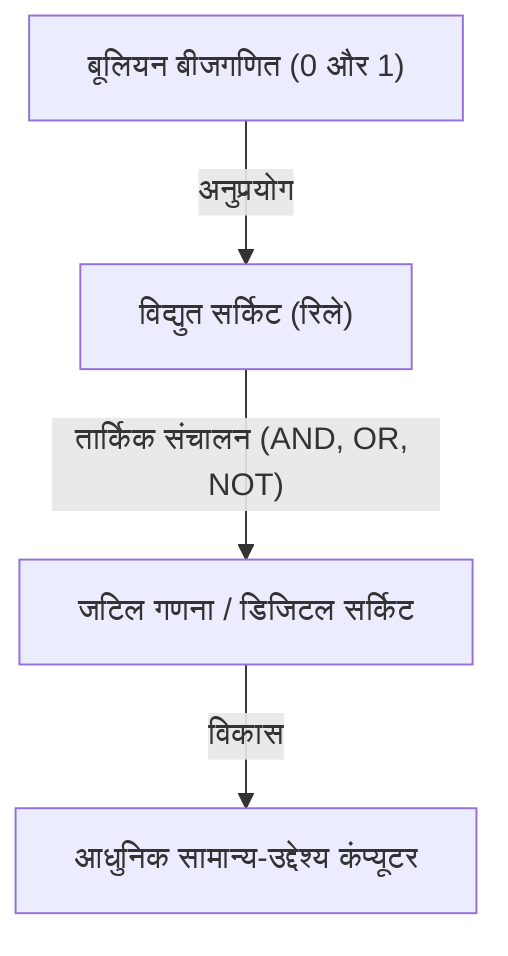
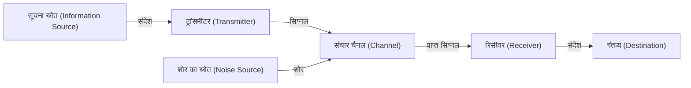

# क्लॉड शैनन: डिजिटल युग का निर्माण करने वाले जीनियस

हम रोज़मर्रा की ज़िंदगी में जो स्मार्टफोन, इंटरनेट, कंप्यूटर और आर्टिफिशियल इंटेलिजेंस का उपयोग करते हैं। इन सभी का आधार "डिजिटल संचार" और "सूचना" की अवधारणा एक जीनियस के दिमाग की उपज है। उनका नाम क्लॉड एल्वूड शैनन (Claude Elwood Shannon, 1916–2001) है। इतिहास में उनका नाम "सूचना सिद्धांत के जनक" के रूप में दर्ज़ है, और उन्हें 20वीं सदी के सबसे महान और प्रभावशाली वैज्ञानिकों में गिना जाता है।

इस लेख में, हम शैनन के प्रारंभिक जीवन से लेकर आधुनिक डिजिटल समाज की नींव रखने वाले उनके अभूतपूर्व शोध पत्रों, और उनके "चंचल" स्वभाव वाले मानवीय पहलू पर गहराई से चर्चा करेंगे।

## 1. प्रारंभिक जीवन और आविष्कार के प्रति जुनून

क्लॉड शैनन का जन्म 30 अप्रैल 1916 को पेटोस्की, मिशिगन, अमेरिका के एक छोटे से शहर में हुआ था और वे गेलॉर्ड में पले-बढ़े। उनके पिता एक व्यापारी थे, और उनकी माँ एक भाषा शिक्षिका और हाई स्कूल की प्रिंसिपल थीं। बचपन से ही शैनन ने मशीनों और इलेक्ट्रॉनिक उपकरणों में असाधारण रुचि दिखाई। वे अपने घर के आसपास कबाड़ इकट्ठा करते थे और कंटीले तारों का उपयोग करके दोस्तों के साथ एक गुप्त टेलीग्राफ नेटवर्क, या खेत की बाड़ का उपयोग करके संचार प्रणाली बनाते थे।

एक दिलचस्प तथ्य यह भी है कि उनके दादा एक आविष्कारक थे और थॉमस एडिसन के दूर के रिश्तेदार थे। युवा शैनन ने एडिसन जैसे महान आविष्कारक बनने का सपना देखा और मॉडल हवाई जहाज और रेडियो-नियंत्रित नावें बनाने में खुद को डुबो दिया। इस समय से, "चीजों के मूल तंत्र को समझने और उनका पुनर्निर्माण करने" की उनकी इंजीनियरिंग प्रतिभा पहले से ही आकार ले रही थी।

## 2. मिशिगन विश्वविद्यालय से MIT तक: बूलियन बीजगणित और रिले सर्किट का मिलन

1932 में, शैनन ने मिशिगन विश्वविद्यालय में प्रवेश लिया और गणित और इलेक्ट्रिकल इंजीनियरिंग दोनों में स्नातक की उपाधि प्राप्त की। गणित की तार्किक सुंदरता और इलेक्ट्रिकल इंजीनियरिंग के व्यावहारिक पहलुओं दोनों के संपर्क में आने का उनके भविष्य के शोध पर निर्णायक प्रभाव पड़ा।

1936 में, वह मैसाचुसेट्स इंस्टीट्यूट ऑफ टेक्नोलॉजी (MIT) के ग्रेजुएट स्कूल गए और वन्नेवर बुश के मार्गदर्शन में शोध शुरू किया। उस समय बुश डिफरेंशियल एनालाइज़र नामक एक विशाल एनालॉग कंप्यूटर विकसित कर रहे थे। शैनन को इस कंप्यूटर के जटिल रिले सर्किट के रखरखाव का काम सौंपा गया था।

यहाँ शैनन ने महसूस किया कि 19वीं सदी के गणितज्ञ जॉर्ज बूल द्वारा तैयार किया गया "बूलियन बीजगणित (तार्किक बीजगणित)", और विद्युत सर्किट के स्विच (चालू और बंद) गणितीय रूप से पूरी तरह मेल खाते हैं। उन्होंने साबित किया कि "सत्य (1)" और "असत्य (0)" के तार्किक संचालन (AND, OR, NOT) को भौतिक रूप से विद्युत सर्किट के श्रृंखला और समानांतर कनेक्शन द्वारा दर्शाया जा सकता है।

1937 में, 21 वर्ष की आयु में, शैनन ने अपना मास्टर थीसिस, 'ए सिम्बोलिक एनालिसिस ऑफ रिले एंड स्विचिंग सर्किट्स (A Symbolic Analysis of Relay and Switching Circuits)' प्रकाशित किया। इस थीसिस को "20वीं सदी का सबसे महत्वपूर्ण और प्रभावशाली मास्टर थीसिस" माना गया, और यह आधुनिक डिजिटल सर्किट डिजाइन की नींव बन गया। इस खोज ने दिखाया कि "कोई भी तार्किक गणना, चाहे वह कितनी भी जटिल क्यों न हो, केवल स्विच को चालू और बंद (0 और 1) करके की जा सकती है," जिसने आज के कंप्यूटरों के मूल सिद्धांत को स्थापित किया।

## 3. द्वितीय विश्व युद्ध और क्रिप्टोग्राफी का शोध

द्वितीय विश्व युद्ध के दौरान, शैनन बेल लैब्स में शामिल हो गए और अग्नि नियंत्रण प्रणालियों (fire control systems) और क्रिप्टोग्राफी पर काम किया। यहीं उनकी मुलाकात ब्रिटिश गणितज्ञ एलन ट्यूरिंग से हुई, और उन्होंने मशीन और मानव बुद्धि पर गहरी चर्चा की।

शैनन ने क्रिप्टोग्राफी पर अपना शोध जारी रखा और 1945 में 'ए मैथमेटिकल थ्योरी ऑफ क्रिप्टोग्राफी (A Mathematical Theory of Cryptography)' नामक एक गोपनीय रिपोर्ट तैयार की (जिसे बाद में 1949 में 'कम्युनिकेशन थ्योरी ऑफ सेक्रेसी सिस्टम्स' के रूप में प्रकाशित किया गया)। इसमें उन्होंने "पूरी तरह से अटूट कोड (वन-टाइम पैड)" का गणितीय प्रमाण प्रदान किया। उन्होंने पहली बार क्रिप्टोग्राफी के संदर्भ में "सूचना (Information)" और "अतिरिक्तता (Redundancy)" की अवधारणाओं को भी स्पष्ट रूप से परिभाषित किया, जो बाद में सूचना सिद्धांत के लिए एक महत्वपूर्ण कदम बन गया।

## 4. 1948: सूचना सिद्धांत का जन्म

1948 में, शैनन ने बेल सिस्टम टेक्निकल जर्नल में 'ए मैथमेटिकल थ्योरी ऑफ कम्युनिकेशन (A Mathematical Theory of Communication)' नामक एक ऐतिहासिक पेपर प्रकाशित किया। यह वह क्षण था जब "सूचना सिद्धांत" के नए शैक्षणिक क्षेत्र की स्थापना हुई थी।

शैनन से पहले की दुनिया में, "सूचना" को एक अस्पष्ट और व्यक्तिपरक अवधारणा माना जाता था जो अर्थ और सामग्री पर निर्भर करती थी। हालाँकि, शैनन ने जानबूझकर सूचना से "अर्थ" को हटा दिया और सूचना को विशुद्ध रूप से संभावना और सांख्यिकी की समस्या के रूप में गणितीय रूप से परिभाषित किया। उन्होंने पहली बार सूचना को मापने की इकाई के रूप में सार्वजनिक रूप से "बिट (bit: binary digit का संक्षिप्त रूप)" को अपनाया, यह दिखाते हुए कि सभी सूचनाओं (पाठ, ऑडियो, चित्र आदि) को 0 और 1 के बिट अनुक्रम के रूप में दर्शाया जा सकता है।

### संचार प्रणालियों की मॉडलिंग

शैनन ने निम्नलिखित सरल मॉडल का उपयोग करके सभी संचार प्रणालियों का वर्णन किया।

यह मॉडल एक सार्वभौमिक था जिसे टेलीफोन, टेलीविजन प्रसारण, इंटरनेट और यहां तक ​​कि मानव बातचीत और डीएनए ट्रांसक्रिप्शन जैसे सभी सूचना हस्तांतरण पर लागू किया जा सकता था।

### शैनन का प्रमेय और सूचना की मात्रा (एंट्रॉपी)

उन्होंने सूचना की अनिश्चितता को दर्शाने के लिए "सूचना एंट्रॉपी" की अवधारणा भी पेश की। उन्होंने इस सहज ज्ञान युक्त अवधारणा को तैयार किया कि किसी घटना के घटित होने की संभावना जितनी कम होगी, उसके बारे में जानने पर आपको उतनी ही अधिक जानकारी प्राप्त होगी।

इसके अलावा, शैनन ने गणितीय रूप से साबित कर दिया कि संचार चैनल में कितना भी शोर क्यों न हो, जब तक कि संचरण दर उस चैनल की "चैनल क्षमता (शैनन सीमा)" से नीचे है, उचित त्रुटि-सुधार एन्कोडिंग लागू करके सैद्धांतिक रूप से त्रुटि रहित (शून्य के करीब संभावना के साथ) सूचना प्रेषित करना संभव है। इसे "शैनन का चैनल कोडिंग प्रमेय" कहा जाता है, और यह उस समय के संचार इंजीनियरों के लिए एक आश्चर्यजनक खोज थी जिसने उनके सामान्य ज्ञान को पलट दिया। उस समय, यह माना जाता था कि शोर का मुकाबला करने का एकमात्र तरीका सिग्नल आउटपुट को बढ़ाना था। आज, हम अंतरिक्ष में गहरे प्रोब से स्पष्ट चित्र प्राप्त कर सकते हैं और खरोंच वाली सीडी से संगीत चला सकते हैं, यह इस प्रमेय पर आधारित त्रुटि-सुधार तकनीक के कारण है।

## 5. जीनियस का मानवीय पक्ष: यूनीसाइकिल और जग्लिंग से प्यार करने वाला आदमी

शैनन की महानता, उनकी बेजोड़ बुद्धिमत्ता के अलावा, उनके अत्यंत मानवीय और "चंचल स्वभाव (Playfulness)" में निहित थी। वे स्थिति, प्रसिद्धि और धन के प्रति बिल्कुल उदासीन थे, और केवल अपनी जिज्ञासा को संतुष्ट करने के लिए शोध और आविष्कार करते थे।

बेल लैब्स के गलियारों में यूनीसाइकिल की सवारी करते हुए जग्लिंग करने वाले शैनन की छवि उनके सहयोगियों के बीच एक किंवदंती बन गई है। उन्होंने न केवल जग्लिंग के गणितीय सिद्धांत का निर्माण किया और "जग्लिंग प्रमेय" प्राप्त किया, बल्कि जग्लिंग करने वाली मशीन का भी आविष्कार किया।

वे शतरंज खेलने वाले कंप्यूटर प्रोग्राम की नींव रखने वाले अग्रदूतों में से impersonating एक थे। 1950 में प्रकाशित उनके पेपर ने कंप्यूटर शतरंज के बाद के विकास पर गहरा प्रभाव डाला। इसके अलावा, उन्होंने "थिसियस (Theseus)" नामक एक यांत्रिक माउस का आविष्कार किया जो अपने आप भूलभुलैया को नेविगेट कर सकता था और उसे याद रख सकता था, जो प्रारंभिक कृत्रिम बुद्धिमत्ता (मशीन लर्निंग) की अवधारणा को प्रदर्शित करने वाला एक अग्रणी प्रयास था।

शैनन का घर अजीब और दिलचस्प आविष्कारों से भरा था। "अल्टीमेट मशीन (Ultimate Machine)", जो चालू होने पर एक बॉक्स से हाथ निकालती है और खुद को बंद कर लेती है, आग उगलने वाला ट्रम्पेट, और अनुकूलित फ्रिसबी—उनकी जिज्ञासा की कोई सीमा नहीं थी।

## 6. बाद के वर्ष और विरासत

1956 में, शैनन एमआईटी (MIT) में प्रोफेसर बने और पढ़ाते हुए अपना शोध जारी रखा। हालाँकि, उन्हें शिक्षाविदों की हलचल और प्रसिद्धि नापसंद थी, और धीरे-धीरे वे सार्वजनिक जीवन से दूर हो गए और घर पर अपने शौक और आविष्कारों में डूब गए। कहा जाता है कि अपने बाद के वर्षों में वे अल्जाइमर रोग से पीड़ित थे और इस बात को पूरी तरह से नहीं समझ पाए कि उनकी महान उपलब्धियां आधुनिक इंटरनेट और डिजिटल समाज में कैसे विकसित हुई हैं। 24 फरवरी 2001 को 84 वर्ष की आयु में शैनन का निधन हो गया।

## निष्कर्ष

क्लॉड शैनन द्वारा बोए गए बीज आज के डिजिटल सूचना समाज के विशाल जंगल में विकसित हो गए हैं। उनके बिना, आज का इंटरनेट, स्मार्टफोन, डिजिटल संगीत और कृत्रिम बुद्धिमत्ता या तो मौजूद नहीं होते, या बिल्कुल अलग रूप में होते।

शैनन, जिन्होंने सूचना को 0 और 1 में बदल दिया और गणितीय रूप से साबित किया कि शोर के समुद्र में भी सूचना को सटीक रूप से कैसे प्रेषित किया जाए। उनका जीवन खूबसूरती से दर्शाता है कि कैसे शुद्ध जिज्ञासा और चंचलता दुनिया को मौलिक रूप से बदलने वाली महान खोजों को जन्म दे सकती है। जब हम अपने डिजिटल उपकरणों को उठाते हैं, तो क्यों न कुछ पल के लिए उस जीनियस को याद करें जिसने यूनीसाइकिल की सवारी करते हुए जग्लिंग का आनंद लिया।
