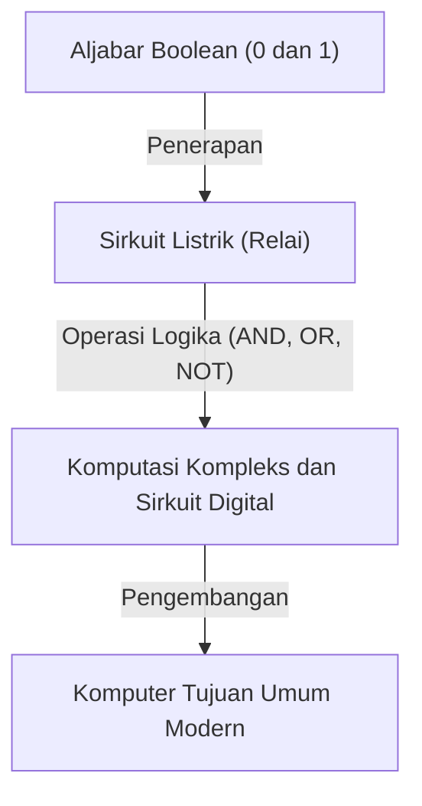
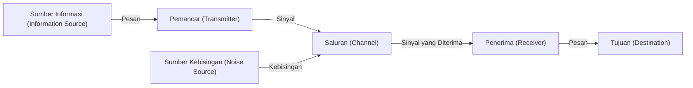

# Claude Shannon: Sang Jenius yang Menciptakan Era Digital

Ponsel pintar, internet, komputer, dan kecerdasan buatan yang kita gunakan setiap hari. Konsep "komunikasi digital" dan "informasi" yang mendasari semua ini lahir dari otak seorang jenius. Namanya adalah Claude Elwood Shannon (1916–2001). Ia mencatatkan namanya dalam sejarah sebagai "Bapak Teori Informasi" dan dihitung sebagai salah satu ilmuwan terhebat dan paling berpengaruh di abad ke-20.

Dalam artikel ini, kami akan menggali lebih dalam dan menjelaskan secara detail, mulai dari masa kecil Shannon, makalah-makalah terobosan yang meletakkan dasar bagi masyarakat digital modern, hingga sifatnya yang sangat manusiawi dan penuh dengan "rasa ingin bermain".

## 1. Masa Kecil dan Gairah untuk Penemuan

Claude Shannon lahir pada 30 April 1916 di Petoskey, sebuah kota kecil di Michigan, Amerika Serikat, dan dibesarkan di Gaylord. Ayahnya adalah seorang pengusaha, dan ibunya adalah seorang guru bahasa sekaligus kepala sekolah menengah atas. Sejak usia dini, Shannon menunjukkan ketertarikan yang luar biasa terhadap mesin dan perangkat elektronik. Ia mengumpulkan barang-barang rongsokan di sekitar rumahnya untuk membangun jaringan telegraf rahasia dengan teman-temannya menggunakan kawat berduri, serta sistem komunikasi menggunakan pagar peternakan.

Selain itu, ada fakta menarik bahwa kakeknya adalah seorang penemu dan kerabat jauh dari Thomas Edison. Di masa mudanya, Shannon bermimpi menjadi penemu hebat seperti Edison, dan ia membenamkan dirinya dalam pembuatan model pesawat terbang dan perahu yang dikendalikan dari jarak jauh. Sejak saat itu, bakatnya sebagai seorang insinyur untuk "memahami dan merekonstruksi mekanisme dasar dari segala hal" telah mulai bersemi di dalam dirinya.

## 2. Dari Universitas Michigan ke MIT: Pertemuan antara Aljabar Boolean dan Sirkuit Relai

Pada tahun 1932, Shannon masuk ke Universitas Michigan dan memperoleh dua gelar sarjana dalam bidang matematika dan teknik elektro. Paparannya terhadap keindahan logis dari matematika serta aspek praktis dari teknik elektro terbukti menjadi hal yang krusial bagi penelitian-penelitiannya di kemudian hari.

Pada tahun 1936, ia melanjutkan ke sekolah pascasarjana di Massachusetts Institute of Technology (MIT) dan mulai melakukan penelitian di bawah bimbingan Vannevar Bush. Pada saat itu, Bush sedang mengembangkan sebuah komputer analog raksasa yang disebut *Differential Analyzer*. Shannon ditugaskan untuk memelihara sirkuit relai yang rumit pada mesin komputasi ini.

Di sinilah Shannon menyadari bahwa "Aljabar Boolean (aljabar logika)", yang diciptakan oleh matematikawan abad ke-19 George Boole, memiliki kecocokan matematis yang sempurna dengan sakelar (hidup dan mati) dari sirkuit listrik. Ia membuktikan bahwa operasi logika ("Benar" (1) dan "Salah" (0) seperti AND, OR, NOT) dapat secara fisik direpresentasikan oleh koneksi sirkuit listrik secara seri dan paralel.

Pada tahun 1937, di usia 21 tahun, Shannon menerbitkan tesis masternya yang berjudul *A Symbolic Analysis of Relay and Switching Circuits*. Tesis ini dipuji sebagai "tesis master paling penting dan berpengaruh di abad ke-20" dan menjadi dasar bagi desain sirkuit digital modern. Penemuan ini menunjukkan bahwa "tidak peduli seberapa rumitnya sebuah perhitungan logis, itu bisa dijalankan hanya dengan kombinasi sakelar on dan off (0 dan 1)", sehingga meletakkan prinsip fundamental yang mendasari komputer masa kini.

## 3. Perang Dunia II dan Penelitian Teori Kriptografi

Selama Perang Dunia II, Shannon bergabung dengan Bell Labs dan mengerjakan sistem kontrol tembakan dan teori kriptografi. Di sana, ia juga bertemu dengan matematikawan jenius asal Inggris, Alan Turing, dan terlibat dalam diskusi mendalam tentang kecerdasan mesin dan manusia.

Shannon memajukan penelitian tentang teori kriptografi dan menyusun laporan rahasia berjudul *A Mathematical Theory of Cryptography* pada tahun 1945 (kemudian diterbitkan pada tahun 1949 sebagai *Communication Theory of Secrecy Systems*). Dalam karya ini, ia memberikan pembuktian matematis untuk "sandi yang sepenuhnya tidak dapat dipecahkan (one-time pad)". Dia juga secara jelas mendefinisikan konsep "Informasi (Information)" dan "Redundansi (Redundancy)" untuk pertama kalinya dalam konteks kriptografi, yang menjadi batu loncatan penting menuju teori informasi di kemudian hari.

## 4. Tahun 1948: Kelahiran Teori Informasi

Pada tahun 1948, Shannon menerbitkan sebuah makalah bersejarah berjudul *A Mathematical Theory of Communication* dalam jurnal akademis Bell System Technical Journal. Makalah ini menjadi momen di mana bidang studi baru yang disebut "Teori Informasi" diciptakan secara mandiri.

Di dunia sebelum Shannon, "informasi" adalah sebuah konsep subjektif dan ambigu yang dianggap bergantung pada makna dan konten. Namun, Shannon dengan sengaja membuang "makna" dari informasi dan mendefinisikannya secara murni dan matematis sebagai masalah probabilitas dan statistik. Ia adalah orang pertama yang secara publik mengadopsi "bit" (singkatan dari binary digit) sebagai unit ukuran informasi, dengan menunjukkan bahwa semua jenis informasi (teks, suara, gambar, dll.) dapat direpresentasikan sebagai urutan bit 0 dan 1.

### Pemodelan Sistem Komunikasi

Shannon mendeskripsikan semua sistem komunikasi dengan model sederhana berikut ini.

Model ini bersifat universal dan dapat diterapkan pada segala bentuk transmisi informasi, mulai dari telepon, siaran televisi, internet, hingga percakapan antar manusia dan transkripsi DNA.

### Teorema Shannon dan Kuantitas Informasi (Entropi)

Ia juga memperkenalkan "Entropi Informasi" sebagai konsep yang mewakili ketidakpastian informasi. Ia merumuskan secara matematis konsep intuitif bahwa peristiwa dengan probabilitas kejadian yang lebih rendah mengandung jumlah informasi yang lebih besar saat diketahui.

Selain itu, Shannon secara matematis membuktikan bahwa tidak peduli berapa banyak kebisingan (noise) yang ada dalam sebuah saluran komunikasi, selama kecepatannya berada di bawah "kapasitas saluran (Batas Shannon)" dari saluran tersebut, informasi dapat ditransmisikan tanpa kesalahan secara teoritis (dengan probabilitas kesalahan yang mendekati nol) dengan menggunakan pengkodean koreksi kesalahan yang tepat. Hal ini disebut "Teorema Pengkodean Saluran Shannon", dan ini adalah penemuan mengejutkan yang menjungkirbalikkan akal sehat para insinyur komunikasi pada masa itu. Karena pada saat itu diyakini bahwa satu-satunya cara untuk mengatasi kebisingan adalah dengan meningkatkan kekuatan sinyal. Alasan mengapa kita sekarang dapat menerima gambar yang jelas dari pesawat ruang angkasa di ujung alam semesta yang jauh atau memutar musik dari CD yang tergores adalah berkat teknologi koreksi kesalahan berdasarkan teorema ini.

## 5. Sisi Lain Sang Jenius: Pria yang Mencintai Juggling dan Sepeda Roda Satu

Kehebatan Shannon terletak pada "rasa ingin bermain (Playfulness)" yang sangat manusiawi, di samping kecerdasannya yang tak tertandingi. Ia sama sekali tidak peduli pada status, ketenaran, atau kekayaan, dan melakukan penelitian serta penemuannya semata-mata untuk memuaskan rasa ingin tahunya.

Pemandangan Shannon yang mengendarai sepeda roda satu sambil melakukan juggling di lorong-lorong Bell Labs telah menjadi legenda di kalangan rekan-rekannya. Ia tidak hanya membangun teori matematis tentang juggling dan merumuskan "Teorema Juggling", tetapi juga menciptakan mesin untuk melakukan juggling itu sendiri.

Ia juga merupakan salah satu perintis yang meletakkan dasar bagi program komputer untuk bermain catur. Makalah yang diterbitkannya pada tahun 1950 memberikan pengaruh besar terhadap perkembangan catur komputer di kemudian hari. Lebih lanjut, ia menciptakan tikus mekanik yang disebut "Theseus" yang dapat menavigasi dan mengingat labirin secara mandiri, sebuah upaya perintis yang mendemonstrasikan konsep awal kecerdasan buatan (pembelajaran mesin).

Rumah Shannon dipenuhi dengan penemuan-penemuan yang aneh dan menarik. Rasa ingin tahunya tidak pernah ada habisnya, dari "Mesin Tertinggi (Ultimate Machine)"—sebuah kotak yang jika sakelarnya dinyalakan, akan mengeluarkan tangan hanya untuk mematikan sakelar itu kembali—hingga terompet yang menyemburkan api dan piring terbang (frisbee) yang telah dimodifikasi.

## 6. Tahun-Tahun Terakhir dan Warisan

Pada tahun 1956, Shannon menjadi profesor di MIT, di mana ia mengajar sambil melanjutkan penelitiannya. Namun, ia membenci kebisingan dan ketenaran di dunia akademis, sehingga perlahan-lahan ia menghilang dari pandangan publik dan membenamkan dirinya dalam hobi serta penemuannya di rumah. Di tahun-akhirnya, ia menderita penyakit Alzheimer, dan konon ia tidak dapat sepenuhnya menyadari bahwa pencapaian besarnya telah berkembang menjadi internet dan masyarakat digital modern yang kita saksikan saat ini. Pada tanggal 24 Februari 2001, Shannon meninggal dunia pada usia 84 tahun.

## Kesimpulan

Benih-benih yang ditaburkan oleh Claude Shannon telah tumbuh menjadi hutan besar yang disebut masyarakat informasi digital modern. Tanpanya, internet modern, ponsel pintar, musik digital, dan kecerdasan buatan mungkin tidak akan ada sama sekali, atau mungkin hadir dalam bentuk yang sangat berbeda.

Shannon, yang mereduksi informasi menjadi 0 dan 1, serta membuktikan secara matematis cara untuk mengirimkan informasi dengan akurat di lautan kebisingan. Kehidupannya dengan indah menunjukkan bagaimana rasa ingin tahu murni dan semangat bermain dapat mengarah pada penemuan-penemuan hebat yang secara mendasar mengubah dunia. Saat kita memegang perangkat digital di tangan, ada baiknya meluangkan sejenak waktu untuk memikirkan sang jenius yang menikmati hidup dengan mengendarai sepeda roda satu dan bermain juggling.
