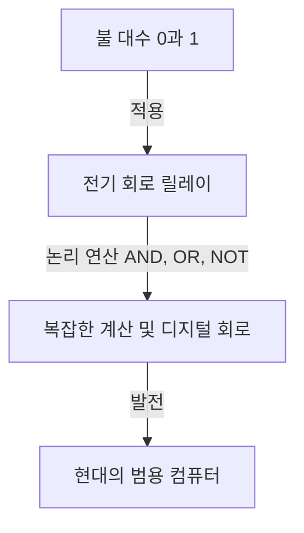

# 정보 이론의 아버지, 클로드 섀넌: 디지털 시대를 창조한 천재

우리가 일상적으로 이용하는 스마트폰, 인터넷, 컴퓨터, 그리고 인공지능. 이 모든 것의 기반이 되는 "디지털 통신"과 "정보"의 개념은 한 천재의 두뇌에서 탄생했습니다. 그의 이름은 클로드 엘우드 섀넌(Claude Elwood Shannon, 1916–2001)입니다. 그는 '정보 이론의 아버지'로서 역사에 이름을 새겼으며, 20세기에서 가장 위대하고 영향력 있는 과학자 중 한 명으로 꼽힙니다.

본 기사에서는 섀넌의 성장 과정부터 현대 디지털 사회의 초석을 다진 획기적인 논문, 그리고 인간미 넘치는 '장난기' 가득한 본모습까지 매우 상세하게 파헤쳐 설명합니다.

## 1. 어린 시절과 발명에 대한 열정

클로드 섀넌은 1916년 4월 30일 미국 미시간주의 작은 마을 퍼토스키에서 태어나 게일로드에서 자랐습니다. 아버지는 사업가였고, 어머니는 어학 교사이자 고등학교 교장도 역임했습니다. 섀넌은 어릴 적부터 기계와 전자 기기에 비정상적일 정도로 흥미를 보였고, 집 주변의 잡동사니를 모아 철조망을 이용해 친구와 비밀 전신망을 만들거나 농장의 울타리를 이용한 통신 시스템을 구축하곤 했습니다.

또한 그의 할아버지가 발명가였으며, 에디슨의 먼 친척이라는 흥미로운 사실도 있습니다. 어린 시절의 섀넌은 에디슨 같은 위대한 발명가가 되기를 꿈꾸며 모형 비행기와 무선 조종 보트 제작에 몰두했습니다. 이 무렵부터 이미 그의 내면에는 "사물의 근본적인 작동 원리를 이해하고 재구축한다"는 엔지니어로서의 재능이 싹트고 있었습니다.

## 2. 미시간 대학에서 MIT로: 불 대수와 릴레이 회로의 만남

1932년, 섀넌은 미시간 대학에 진학하여 수학과 전기공학 두 개의 학사 학위를 취득했습니다. 수학의 논리적인 아름다움과 전기공학의 실용적인 측면 모두를 접한 것은 훗날 그의 연구에 결정적인 의미를 갖게 됩니다.

1936년, 그는 매사추세츠 공과대학교(MIT) 대학원에 진학하여 배너바 부시의 지도 아래 연구를 시작했습니다. 부시는 당시에 미분 해석기라고 불리는 거대한 아날로그 계산기를 개발하고 있었습니다. 섀넌은 이 계산기의 복잡한 릴레이 회로 유지 보수를 담당하게 되었습니다.

여기서 섀넌은 19세기 수학자 조지 불이 고안한 '불 대수(논리 대수)'와 전기 회로의 스위치(온과 오프)가 수학적으로 완전히 일치한다는 사실을 깨달았습니다. '참(1)'과 '거짓(0)'의 논리 연산(AND, OR, NOT)이 전기 회로의 직렬연결이나 병렬연결을 통해 물리적으로 표현될 수 있음을 증명한 것입니다.

1937년, 섀넌은 21세의 나이에 석사 논문 『계전기 및 개폐 회로의 기호적 해석(A Symbolic Analysis of Relay and Switching Circuits)』을 발표했습니다. 이 논문은 "20세기에서 가장 중요하고 영향력 있는 석사 논문"이라는 찬사를 받았으며, 현대 디지털 회로 설계의 기초가 되었습니다. 이 발견을 통해 "아무리 복잡한 논리 계산이라도 스위치의 온/오프 조합(0과 1)만으로 실행할 수 있다"는 사실이 입증되었고, 오늘날 컴퓨터의 근간을 이루는 원리가 확립되었습니다.

## 3. 제2차 세계대전과 암호 이론 연구

제2차 세계대전 중 섀넌은 벨 연구소에 입사하여 화기 관제 시스템과 암호 이론 연구에 종사했습니다. 여기서 그는 영국의 천재 수학자 앨런 튜링과도 만나 기계와 인간의 지능에 대해 깊은 논의를 나누었습니다.

섀넌은 암호 이론에 관한 연구를 진행하여 1945년에 『암호의 수학적 이론(A Mathematical Theory of Cryptography)』이라는 기밀 보고서를 작성했습니다(전후인 1949년에 『비화 통신의 통신 이론』으로 공개됨). 이 보고서에서 그는 "완전히 해독 불가능한 암호(원타임 패드)"의 수학적 증명을 수행했습니다. 또한 '정보(Information)'와 '중복성(Redundancy)'이라는 개념을 암호의 맥락에서 처음으로 명확하게 정의했으며, 이는 훗날 정보 이론으로 나아가는 중요한 발판이 되었습니다.

## 4. 1948년: 정보 이론의 탄생

1948년, 섀넌은 벨 연구소의 학술지(Bell System Technical Journal)에 『통신의 수학적 이론(A Mathematical Theory of Communication)』이라는 역사적인 논문을 발표했습니다. 이 논문이야말로 '정보 이론'이라는 새로운 학문 분야를 단독으로 창설한 순간이었습니다.

섀넌 이전의 세계에서 '정보'란 모호하고 주관적인 개념이었으며, 의미나 내용에 의존하는 것으로 생각되었습니다. 그러나 섀넌은 정보에서 '의미'를 의도적으로 배제하고, 정보를 순수하게 확률과 통계의 문제로서 수학적으로 정의했습니다. 정보를 측정하는 단위로 '비트(bit: binary digit의 약자)'를 처음으로 공식 채택하였고, 모든 정보(문자, 음성, 이미지 등)는 0과 1의 비트열로 표현될 수 있음을 보여주었습니다.

### 통신 시스템의 모델화

섀넌은 모든 통신 시스템을 다음과 같은 간단한 모델로 설명했습니다.

이 모델은 전화, TV 방송, 인터넷, 심지어 인간들 사이의 대화나 DNA의 전사에 이르기까지 모든 정보 전달에 적용 가능한 보편적인 것이었습니다.

### 섀넌의 정리와 정보량(엔트로피)

그는 또한 정보의 불확실성을 나타내는 개념으로 '정보 엔트로피'를 도입했습니다. 일어날 확률이 낮은 사건일수록 그것을 알았을 때 얻을 수 있는 정보량이 크다는 직관적인 개념을 수식화한 것입니다.

더 나아가 섀넌은 통신로에 아무리 많은 노이즈(잡음)가 존재하더라도, 그 통신로의 '통신로 용량(섀넌 한계)'을 밑도는 속도라면 적절한 오류 정정 부호화를 수행함으로써 이론상 오류 없이(한없이 0에 가까운 확률로) 정보를 전송할 수 있음을 수학적으로 증명했습니다. 이는 '섀넌의 통신로 부호화 정리'라고 불리며, 당시 통신 엔지니어들의 상식을 뒤엎는 경이적인 발견이었습니다. 당시에는 노이즈에 대항하기 위해서는 신호의 출력을 키우는 수밖에 없다고 생각했기 때문입니다. 현재 우리가 우주 저편에 있는 탐사선으로부터 선명한 이미지를 수신하거나 흠집이 난 CD에서 음악을 재생할 수 있는 것은 이 정리에 기반한 오류 정정 기술 덕분입니다.

## 5. 천재의 본모습: 저글링과 외발자전거를 사랑한 남자

섀넌의 위대함은 유례없는 지성에 더해 지극히 인간미 넘치는 '장난기(Playfulness)'에 있었습니다. 그는 지위나 명성, 부에는 전혀 무관심했으며, 오직 자신의 호기심을 채우기 위해 연구와 발명을 진행했습니다.

벨 연구소의 복도를 외발자전거를 타며 저글링을 하면서 이동하는 섀넌의 모습은 동료들 사이에서 전설이 되었습니다. 그는 저글링의 수학적 이론을 구축하여 '저글링 정리'를 도출해 냈을 뿐만 아니라, 저글링을 하는 기계조차 발명해 냈습니다.

또한 그는 체스를 두는 컴퓨터 프로그램의 기초를 다진 선구자 중 한 명이기도 합니다. 1950년에 발표한 논문은 훗날 컴퓨터 체스의 발전에 지대한 영향을 미쳤습니다. 나아가 미로를 스스로 탐색하고 기억하는 기계식 쥐 '테세우스'를 발명했는데, 이는 초기 인공지능(기계 학습) 개념을 입증하는 선구적인 시도가 되었습니다.

섀넌의 집은 기묘하고 재미있는 발명품들로 넘쳐났습니다. 스위치를 켜면 상자에서 손이 나와 스스로 스위치를 끄는 '궁극의 기계(Ultimate Machine)'나 불을 뿜는 트럼펫, 개조된 프리스비 등 그의 호기심은 끝이 없었습니다.

## 6. 말년과 유산

1956년, 섀넌은 MIT 교수로 취임하여 교편을 잡으면서 연구를 계속했습니다. 하지만 그는 학계의 번잡함과 명성을 싫어했고, 점차 공식 석상에서 자취를 감추고 집에서 취미와 발명에 몰두하게 되었습니다. 말년에는 알츠하이머병을 앓아, 자신의 위대한 업적이 현대의 인터넷이나 디지털 사회로 꽃피웠다는 사실을 완전히 인식하지 못했다고 합니다. 2001년 2월 24일, 섀넌은 84세의 나이로 세상을 떠났습니다.

## 맺음말

클로드 섀넌이 뿌린 씨앗은 현재의 디지털 정보화 사회라는 거대한 숲으로 성장했습니다. 그가 없었다면 오늘날의 인터넷도, 스마트폰도, 디지털 음악도, 인공지능도 존재하지 않았거나, 혹은 전혀 다른 형태가 되었을 것입니다.

정보를 0과 1로 환원하고, 노이즈의 바다 속에서 정확하게 정보를 전달하는 방법을 수학적으로 증명한 섀넌. 그의 삶은 순수한 호기심과 장난기가 어떻게 세상을 근본적으로 바꾸는 위대한 발견으로 이어지는지를 훌륭하게 보여줍니다. 우리가 디지털 기기를 손에 쥘 때, 잠시나마 외발자전거를 타며 저글링을 즐기던 천재의 모습을 떠올려 보는 것은 어떨까요?
