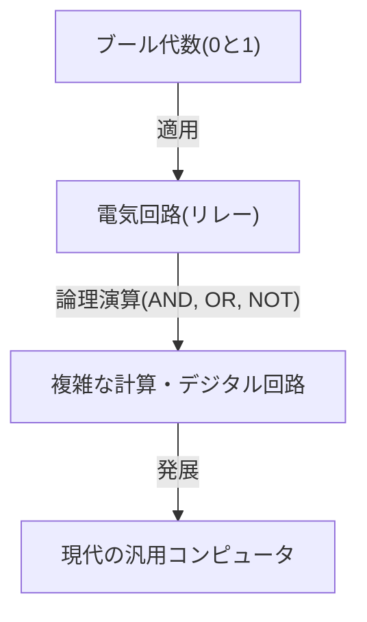

# クロード・シャノン：デジタル時代を創り出した天才

私たちが日常的に利用しているスマートフォン、インターネット、コンピュータ、そして人工知能。これらすべての基盤となっている「デジタル通信」と「情報」の概念は、ある一人の天才の頭脳から生み出されました。彼の名はクロード・エルウッド・シャノン（Claude Elwood Shannon, 1916–2001）。彼は「情報理論の父」として歴史に名を刻み、20世紀における最も偉大で影響力のある科学者の一人として数えられています。

本記事では、シャノンの生い立ちから、現代のデジタル社会の礎を築いた画期的な論文、そして彼の人間味あふれる「遊び心」に満ちた素顔まで、非常に詳細に深掘りして解説していきます。

## 1. 幼少期と発明への情熱

クロード・シャノンは1916年4月30日、アメリカ合衆国ミシガン州の小さな町、ペトスキーで生まれ、ゲイロードで育ちました。父親は実業家であり、母親は語学教師であり高校の校長も務めていました。シャノンは幼い頃から機械や電子機器に対して異常なほどの興味を示し、自宅の周りにあるガラクタを集めては、有刺鉄線を使った友人との秘密の電信網や、農場のフェンスを利用した通信システムを構築していました。

また、彼の祖父は発明家であり、エジソンの遠い親戚にあたるという興味深い事実もあります。幼き日のシャノンは、エジソンのような偉大な発明家になることを夢見て、模型飛行機やラジコンボートの製作に没頭しました。この頃からすでに、彼の内には「物事の根本的な仕組みを理解し、再構築する」というエンジニアとしての才能が芽生えていたのです。

## 2. ミシガン大学からMITへ：ブール代数とリレー回路の出会い

1932年、シャノンはミシガン大学に進学し、数学と電気工学の二つの学士号を取得しました。数学の論理的な美しさと、電気工学の実用的な側面の双方に触れたことは、後の彼の研究にとって決定的な意味を持つことになります。

1936年、彼はマサチューセッツ工科大学（MIT）の大学院に進学し、ヴァネヴァー・ブッシュの指導の下で研究を始めました。ブッシュは当時、微分解析機と呼ばれる巨大なアナログ計算機を開発していました。シャノンはこの計算機の複雑なリレー回路の保守を担当することになりました。

ここでシャノンは、19世紀の数学者ジョージ・ブールが考案した「ブール代数（論理代数）」と、電気回路のスイッチ（オンとオフ）が数学的に完全に一致することに気がつきました。「真(1)」と「偽(0)」の論理演算（AND、OR、NOT）が、電気回路の直列接続や並列接続によって物理的に表現できることを証明したのです。

1937年、シャノンは21歳の時に修士論文『継電器および開閉回路の記号的解析（A Symbolic Analysis of Relay and Switching Circuits）』を発表しました。この論文は「20世紀で最も重要かつ影響力のある修士論文」と称賛され、現代のデジタル回路設計の基礎となりました。この発見により、「どんなに複雑な論理計算でも、スイッチのオン・オフの組み合わせ（0と1）だけで実行できる」ことが示され、今日のコンピュータの根幹を成す原理が確立されたのです。

## 3. 第二次世界大戦と暗号理論の研究

第二次世界大戦中、シャノンはベル研究所に入所し、火器管制システムや暗号理論の研究に従事しました。ここで彼は、イギリスの天才数学者アラン・チューリングとも出会い、機械と人間の知能について深い議論を交わしています。

シャノンは暗号理論に関する研究を進め、1945年に『暗号の数学的理論（A Mathematical Theory of Cryptography）』という機密扱いの報告書をまとめました（戦後の1949年に『秘話通信の通信理論』として公開）。この中で彼は、「完全に解読不可能な暗号（ワンタイムパッド）」の数学的な証明を行いました。また、「情報（Information）」と「冗長性（Redundancy）」という概念を暗号の文脈で初めて明確に定義し、これが後の情報理論への重要な足がかりとなりました。

## 4. 1948年：情報理論の誕生

1948年、シャノンはベル研究所の学術誌（Bell System Technical Journal）に『通信の数学的理論（A Mathematical Theory of Communication）』という歴史的な論文を発表しました。この論文こそが、「情報理論」という新しい学問分野を単独で創設した瞬間でした。

シャノン以前の世界では、「情報」とは曖昧で主観的な概念であり、意味や内容に依存するものだと考えられていました。しかしシャノンは、情報から「意味」を意図的に切り捨て、情報を純粋に確率と統計の問題として数学的に定義しました。情報を測る単位として「ビット（bit：binary digitの略）」を初めて公に採用し、あらゆる情報（文字、音声、画像など）は0と1のビット列として表現できることを示しました。

### 通信システムのモデル化

シャノンは、あらゆる通信システムを以下のシンプルなモデルで記述しました。

このモデルは、電話、テレビ放送、インターネット、さらには人間同士の会話やDNAの転写に至るまで、あらゆる情報伝達に適用可能な普遍的なものでした。

### シャノンの定理と情報量（エントロピー）

彼はまた、情報の不確実性を表す概念として「情報エントロピー」を導入しました。起こり得る確率が低い出来事ほど、それを知った時に得られる情報量は大きいという直感的な概念を数式化したのです。

さらにシャノンは、通信路にどれだけのノイズ（雑音）が存在しても、その通信路の「通信路容量（シャノン限界）」を下回る速度であれば、適切なエラー訂正符号化を行うことで、理論上エラーなく（限りなくゼロの確率で）情報を伝送できることを数学的に証明しました。これは「シャノンの通信路符号化定理」と呼ばれ、当時の通信エンジニアたちにとって常識を覆す驚異的な発見でした。当時、ノイズに対抗するためには信号の出力を大きくするしかないと考えられていたからです。現在私たちが、宇宙の彼方にある探査機からクリアな画像を受信したり、傷のついたCDから音楽を再生できたりするのは、この定理に基づく誤り訂正技術のおかげです。

## 5. 天才の素顔：ジャグリングと一輪車を愛した男

シャノンの偉大さは、その比類なき知性に加えて、極めて人間味あふれる「遊び心（Playfulness）」にありました。彼は地位や名声、富には全く無頓着であり、ただ自分の好奇心を満たすために研究や発明を行っていました。

ベル研究所の廊下を、一輪車に乗りながらジャグリングをして移動するシャノンの姿は、同僚たちの間で伝説となっています。彼はジャグリングの数学的な理論を構築し、「ジャグリングの定理」を導き出しただけでなく、ジャグリングをする機械すら発明してしまいました。

また、彼はチェスをプレイするコンピュータプログラムの基礎を築いた先駆者の一人でもあります。1950年に発表した論文は、後のコンピュータチェスの発展に多大な影響を与えました。さらに、迷路を自力で探索して記憶する機械式のネズミ「テセウス」を発明し、これは初期の人工知能（機械学習）の概念を実証する先駆的な試みとなりました。

シャノンの自宅は、奇妙で面白い発明品で溢れていました。スイッチを入れると箱から手が出てきて自分でスイッチを切るだけの「究極の機械（Ultimate Machine）」や、炎を吹くトランペット、カスタマイズされたフリスビーなど、彼の好奇心は尽きることがありませんでした。

## 6. 後年と遺産

1956年、シャノンはMITの教授に就任し、教鞭を執りながら研究を続けました。しかし、彼は学界の喧騒や名声を嫌い、次第に公の場から姿を消して、自宅での趣味や発明に没頭するようになりました。晩年はアルツハイマー病を患い、自身の偉大な業績が現代のインターネットやデジタル社会として花開いていることを完全に認識することはできなかったと言われています。2001年2月24日、シャノンは84歳でこの世を去りました。

## まとめ

クロード・シャノンが蒔いた種は、現在のデジタル情報化社会という巨大な森へと成長しました。彼がいなければ、今日のインターネットも、スマートフォンも、デジタル音楽も、人工知能も存在しなかったか、あるいは全く違った形になっていたことでしょう。

情報を0と1に還元し、ノイズの海の中で正確に情報を伝える方法を数学的に証明したシャノン。彼の人生は、純粋な好奇心と遊び心が、いかにして世界を根本から変えるような偉大な発見につながるかを見事に示してくれています。私たちがデジタルデバイスを手にする時、少しだけ、一輪車に乗りながらジャグリングを楽しむ天才の姿に思いを馳せてみてはいかがでしょうか。
