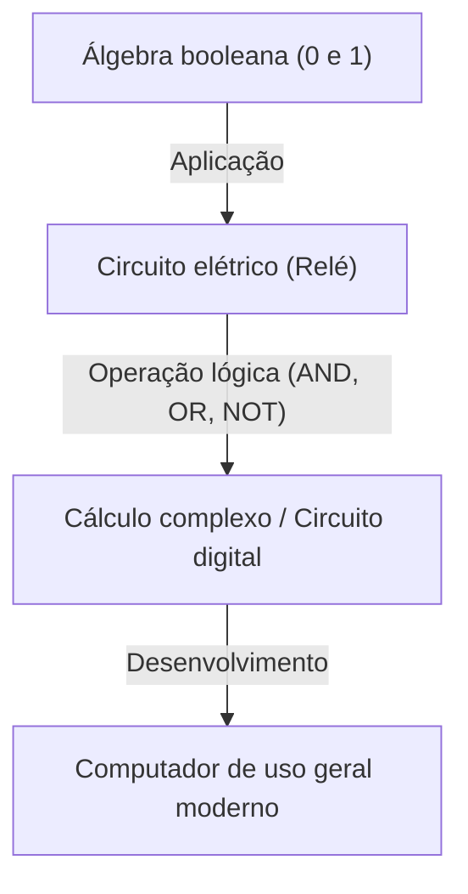
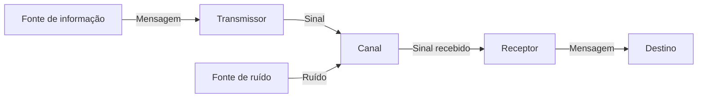

# Claude Shannon: O gênio que criou a era digital

Os smartphones, a internet, os computadores e a inteligência artificial que usamos diariamente. Os conceitos de "comunicação digital" e "informação", que formam a base de tudo isso, nasceram da mente de um único gênio. Seu nome era Claude Elwood Shannon (1916–2001). Ele gravou seu nome na história como o "pai da teoria da informação" e é considerado um dos cientistas mais notáveis e influentes do século XX.

Neste artigo, exploraremos a fundo, desde a infância de Shannon, passando pelos artigos inovadores que lançaram as bases da nossa moderna sociedade digital, até a sua personalidade profundamente humana e cheia de "espírito lúdico".

## 1. Infância e paixão por invenções

Claude Shannon nasceu em 30 de abril de 1916, em Petoskey, uma pequena cidade no estado de Michigan, EUA, e cresceu em Gaylord. Seu pai era empresário e sua mãe professora de idiomas e diretora de uma escola de ensino médio. Desde muito jovem, Shannon demonstrou um interesse extraordinário por máquinas e dispositivos eletrônicos; ele costumava reunir sucata ao redor de sua casa para construir redes secretas de telégrafo usando arame farpado com seus amigos e sistemas de comunicação que utilizavam as cercas da fazenda.

Há também o fato interessante de que seu avô era um inventor e parente distante de Thomas Edison. Em sua infância, Shannon sonhava em se tornar um grande inventor como Edison e se dedicava à construção de aeromodelos e barcos controlados por rádio. Desde essa época, já brotava nele o talento de engenheiro para "compreender e reconstruir o mecanismo fundamental das coisas".

## 2. Da Universidade de Michigan ao MIT: O encontro da álgebra booleana e os circuitos de relés

Em 1932, Shannon ingressou na Universidade de Michigan, onde obteve dois diplomas de bacharel em matemática e engenharia elétrica. A exposição tanto à beleza lógica da matemática quanto aos aspectos práticos da engenharia elétrica seria de importância crucial para suas pesquisas posteriores.

Em 1936, ingressou na pós-graduação do Instituto de Tecnologia de Massachusetts (MIT) e começou a pesquisar sob a orientação de Vannevar Bush. Na época, Bush estava desenvolvendo um gigantesco computador analógico chamado analisador diferencial. Shannon ficou encarregado da manutenção dos complexos circuitos de relés desse computador.

Foi lá que Shannon percebeu que a "álgebra booleana (álgebra lógica)", inventada pelo matemático do século XIX George Boole, correspondia matemática e perfeitamente aos interruptores de circuitos elétricos (ligado e desligado). Ele provou que as operações lógicas (AND, OR, NOT) de "verdadeiro (1)" e "falso (0)" poderiam ser fisicamente representadas pelas conexões em série e em paralelo de circuitos elétricos.

Em 1937, aos 21 anos, Shannon publicou sua dissertação de mestrado intitulada "A Symbolic Analysis of Relay and Switching Circuits". Esta dissertação foi aclamada como "a dissertação de mestrado mais importante e influente do século XX" e tornou-se a base para o design de circuitos digitais modernos. Esta descoberta demonstrou que "não importa quão complexo seja o cálculo lógico, ele pode ser executado usando apenas combinações de liga-desliga (0 e 1) de interruptores", estabelecendo assim os princípios fundamentais dos computadores de hoje.

## 3. Segunda Guerra Mundial e a pesquisa em criptografia

Durante a Segunda Guerra Mundial, Shannon ingressou no Bell Labs, onde trabalhou em sistemas de controle de fogo e pesquisas sobre criptografia. Lá ele também conheceu o gênio da matemática britânico Alan Turing, com quem teve discussões profundas sobre máquinas e inteligência humana.

Shannon avançou em suas pesquisas sobre a teoria da criptografia e, em 1945, compilou um relatório confidencial intitulado "A Mathematical Theory of Cryptography" (publicado após a guerra, em 1949, como "Communication Theory of Secrecy Systems"). Neste documento, ele forneceu uma prova matemática de "uma cifra perfeitamente inquebrável (one-time pad)". Ele também definiu claramente os conceitos de "Informação" e "Redundância" no contexto da criptografia pela primeira vez, o que serviu como um importante trampolim para a posterior teoria da informação.

## 4. 1948: O nascimento da teoria da informação

Em 1948, Shannon publicou um artigo histórico, "A Mathematical Theory of Communication", no Bell System Technical Journal. Este artigo foi o momento em que ele, sozinho, fundou um novo campo de estudo chamado "teoria da informação".

No mundo antes de Shannon, a "informação" era considerada um conceito vago e subjetivo, dependente do significado ou do conteúdo. No entanto, Shannon intencionalmente descartou o "significado" da informação e a definiu matematicamente como um problema puramente probabilístico e estatístico. Ele foi o primeiro a usar publicamente a palavra "bit" (abreviação de dígito binário) como uma unidade de medida de informação e mostrou que todas as informações (texto, áudio, imagens, etc.) poderiam ser representadas como uma sequência de bits de 0s e 1s.

### Modelagem de sistemas de comunicação

Shannon descreveu todos os sistemas de comunicação usando o seguinte modelo simples:

Este modelo era universalmente aplicável a qualquer transmissão de informações, desde telefones, transmissões de televisão e a internet, até conversas humanas e a transcrição do DNA.

### Teorema de Shannon e a quantidade de informação (Entropia)

Ele também introduziu a "entropia da informação" como um conceito para representar a incerteza da informação. Ele formulou o conceito intuitivo de que quanto menor a probabilidade de um evento ocorrer, maior a quantidade de informação obtida ao saber dele.

Além disso, Shannon provou matematicamente que, não importa quanto ruído (interferência) exista em um canal de comunicação, enquanto a velocidade de transmissão estiver abaixo da "capacidade do canal (limite de Shannon)" e com o uso da codificação correta para correção de erros, é teoricamente possível transmitir informações sem erros (com uma probabilidade que se aproxima de zero). Isso é conhecido como "teorema da codificação de canais de Shannon", uma descoberta impressionante que virou o senso comum dos engenheiros de comunicação da época de cabeça para baixo. Na época, pensava-se que a única maneira de combater o ruído era aumentar a potência do sinal. Hoje em dia, somos capazes de receber imagens nítidas de sondas a bilhões de quilômetros no espaço ou reproduzir músicas de um CD arranhado graças às técnicas de correção de erros baseadas neste teorema.

## 5. O outro lado do gênio: O homem que amava malabarismos e monociclos

A grandeza de Shannon não residia apenas em seu intelecto inigualável, mas também em sua profunda humanidade e "espírito lúdico". Ele era totalmente indiferente ao status, à fama ou à riqueza, dedicando-se a pesquisas e invenções puramente para satisfazer sua própria curiosidade.

A visão de Shannon percorrendo os corredores do Bell Labs andando de monociclo enquanto fazia malabarismos tornou-se uma lenda entre seus colegas. Ele não apenas construiu uma teoria matemática do malabarismo e deduziu o "teorema do malabarismo", como também inventou uma máquina para fazer malabarismos.

Ele também foi um dos pioneiros no lançamento das bases para programas de computador que jogam xadrez. Um artigo que ele publicou em 1950 teve uma influência imensa no desenvolvimento subsequente do xadrez computacional. Além disso, ele inventou um rato mecânico chamado "Teseu", que explorava um labirinto por conta própria e o memorizava; este foi um esforço pioneiro para demonstrar os conceitos iniciais de inteligência artificial (aprendizado de máquina).

A casa de Shannon estava repleta de invenções peculiares e divertidas. Sua curiosidade parecia não ter limites; ela incluía coisas como a "Ultimate Machine", uma caixa que, quando você ligava o interruptor, uma mão saía de dentro e o desligava, uma trombeta que cuspia fogo e um frisbee personalizado.

## 6. Últimos anos e legado

Em 1956, Shannon tornou-se professor no MIT, continuando sua pesquisa enquanto lecionava. No entanto, ele não gostava da agitação e da fama da academia e, gradualmente, desapareceu da vista do público para mergulhar em seus hobbies e invenções em casa. Em seus últimos anos, ele sofreu da doença de Alzheimer e diz-se que ele não foi capaz de compreender completamente que suas grandes realizações floresceram na moderna internet e na sociedade digital. Em 24 de fevereiro de 2001, Shannon faleceu aos 84 anos de idade.

## Conclusão

As sementes plantadas por Claude Shannon cresceram até se tornarem a vasta floresta que é a nossa atual sociedade da informação digital. Sem ele, a internet de hoje, os smartphones, a música digital e a inteligência artificial poderiam não existir ou teriam assumido formas completamente diferentes.

Shannon reduziu a informação a 0s e 1s e provou matematicamente como transmitir informações com precisão em um mar de ruído. Sua vida é um maravilhoso testemunho de como a pura curiosidade e o espírito lúdico podem levar a grandes descobertas que mudam fundamentalmente o mundo. Quando pegarmos um dispositivo digital, que tal dedicar um momento para pensar naquele gênio, andando em seu monociclo enquanto desfrutava de seus malabarismos?
