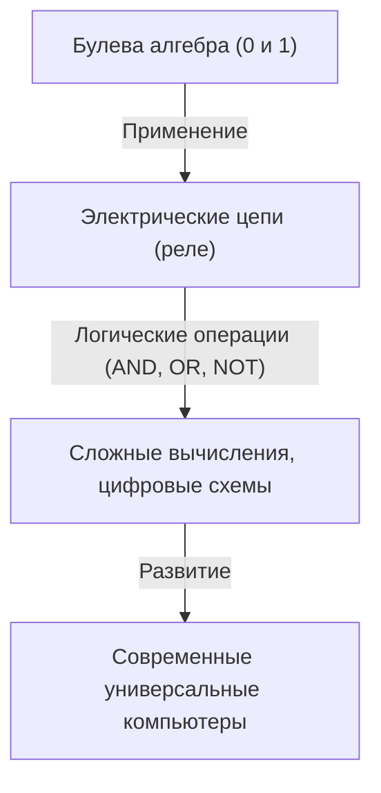
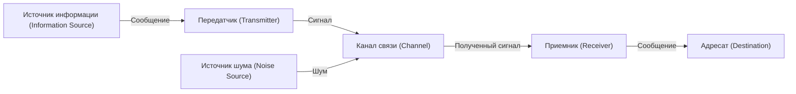

# Клод Шеннон: Гений, создавший цифровую эпоху

Смартфоны, интернет, компьютеры и искусственный интеллект, которые мы используем ежедневно. Концепции «цифровой связи» и «информации», являющиеся основой всего этого, родились в уме одного гения. Его звали Клод Элвуд Шеннон (Claude Elwood Shannon, 1916–2001). Он вошел в историю как «отец теории информации» и считается одним из величайших и самых влиятельных ученых 20-го века.

В этой статье мы подробно расскажем о жизни Шеннона, от его детства и новаторских работ, заложивших основы современного цифрового общества, до его человечного и полного «игривости» характера.

## 1. Детские годы и страсть к изобретениям

Клод Шеннон родился 30 апреля 1916 года в небольшом городке Петоски, штат Мичиган, США, а вырос в Гейлорде. Его отец был бизнесменом, а мать — преподавателем языков и директором средней школы. С ранних лет Шеннон проявлял необычайный интерес к механике и электронике. Собирая вокруг дома разный хлам, он создавал секретные телеграфные сети с друзьями, используя колючую проволоку, и системы связи, задействуя фермерские заборы.

Также интересен тот факт, что его дед был изобретателем и дальним родственником Томаса Эдисона. В детстве Шеннон мечтал стать великим изобретателем, как Эдисон, и с увлечением создавал модели самолетов и радиоуправляемые лодки. Уже тогда в нем начал зарождаться инженерный талант — способность «понимать фундаментальные механизмы вещей и воссоздавать их».

## 2. От Мичиганского университета до MIT: Встреча булевой алгебры и релейных схем

В 1932 году Шеннон поступил в Мичиганский университет, где получил две степени бакалавра: по математике и электротехнике. Соприкосновение с логической красотой математики и практическими аспектами электротехники имело решающее значение для его будущих исследований.

В 1936 году он поступил в аспирантуру Массачусетского технологического института (MIT) и начал исследования под руководством Вэнивара Буша. Буш в то время разрабатывал гигантский аналоговый компьютер, называемый дифференциальным анализатором. Шеннону поручили обслуживание сложных релейных схем этого компьютера.

Здесь Шеннон понял, что «булева алгебра (алгебра логики)», придуманная математиком 19-го века Джорджем Булем, и переключатели электрических цепей (включено и выключено) математически полностью совпадают. Он доказал, что логические операции «истина (1)» и «ложь (0)» (AND, OR, NOT) могут быть физически представлены посредством последовательного и параллельного соединения электрических цепей.

В 1937 году, в возрасте 21 года, Шеннон опубликовал свою магистерскую диссертацию «Символический анализ релейных и переключательных схем (A Symbolic Analysis of Relay and Switching Circuits)». Эта работа была признана «самой важной и влиятельной магистерской диссертацией 20-го века» и стала основой проектирования современных цифровых схем. Это открытие показало, что «любые, даже самые сложные логические вычисления, могут быть выполнены с использованием только комбинаций включения и выключения переключателей (0 и 1)», тем самым установив фундаментальный принцип, лежащий в основе современных компьютеров.

## 3. Вторая мировая война и исследования в области криптографии

Во время Второй мировой войны Шеннон поступил на работу в Bell Labs, где занимался системами управления огнем и исследованиями в области криптографии. Здесь он познакомился с британским гениальным математиком Аланом Тьюрингом, с которым вел глубокие дискуссии о машинном и человеческом интеллекте.

Шеннон продвигал исследования в теории криптографии и в 1945 году составил секретный отчет под названием «Математическая теория криптографии (A Mathematical Theory of Cryptography)» (опубликованный после войны в 1949 году как «Теория связи в секретных системах»). В этой работе он привел математическое доказательство существования «абсолютно нераскрываемого шифра (одноразовый блокнот)». Кроме того, он впервые четко определил понятия «информация (Information)» и «избыточность (Redundancy)» в контексте криптографии, что стало важной ступенью к его будущей теории информации.

## 4. 1948 год: Рождение теории информации

В 1948 году Шеннон опубликовал историческую статью «Математическая теория связи (A Mathematical Theory of Communication)» в научном журнале Bell System Technical Journal. Именно эта работа в одиночку создала новую академическую дисциплину — «теорию информации».

В мире до Шеннона «информация» была расплывчатым, субъективным понятием, зависящим от смысла и содержания. Однако Шеннон намеренно отбросил «смысл» и математически определил информацию исключительно как проблему вероятности и статистики. Он впервые публично применил «бит (bit: сокращение от binary digit)» в качестве единицы измерения информации и показал, что любая информация (текст, звук, изображения и т.д.) может быть представлена в виде последовательности нулей и единиц.

### Моделирование систем связи

Шеннон описал все системы связи с помощью следующей простой модели.

Эта модель была универсальна и применима к любой передаче информации: от телефонии, телевизионного вещания и интернета до человеческого разговора и транскрипции ДНК.

### Теорема Шеннона и количество информации (энтропия)

Он также ввел понятие «информационной энтропии» как меру неопределенности информации. Он математически формализовал интуитивную идею о том, что чем менее вероятно событие, тем больше информации мы получаем, узнав о нем.

Более того, Шеннон математически доказал, что независимо от количества шума в канале связи, информацию можно передавать теоретически без ошибок (с вероятностью, стремящейся к нулю), при условии, что скорость передачи ниже «пропускной способности канала (предела Шеннона)» и используется соответствующее кодирование с исправлением ошибок. Это назвали «теоремой Шеннона о кодировании канала», и [для инженеров](/ru/p/prompt-engineering-for-engineers/) связи того времени это было поразительным открытием, перевернувшим их представления. Тогда считалось, что единственный способ борьбы с шумом — это увеличение мощности сигнала. То, что сегодня мы можем получать четкие изображения с космических зондов на краю вселенной или воспроизводить музыку с поцарапанного компакт-диска, стало возможным благодаря технологиям исправления ошибок, основанным на этой теореме.

## 5. Истинное лицо гения: Человек, который любил жонглирование и одноколесный велосипед

Величие Шеннона, помимо его непревзойденного интеллекта, заключалось в его чрезвычайно человечной «игривости (Playfulness)». Он был совершенно равнодушен к статусу, славе и богатству, и занимался исследованиями и изобретениями просто для того, чтобы удовлетворить свое любопытство.

Образ Шеннона, едущего по коридорам Bell Labs на одноколесном велосипеде и одновременно жонглирующего, стал легендой среди его коллег. Он разработал математическую теорию жонглирования, вывел «теорему жонглирования» и даже изобрел машину для жонглирования.

Кроме того, он был одним firm пионеров, заложивших основы компьютерных программ для игры в шахматы. Его статья, опубликованная в 1950 году, оказала огромное влияние на последующее развитие компьютерных шахмат. Он также изобрел механическую мышь «Тесей», которая могла самостоятельно перемещаться по лабиринтам и запоминать их, что стало новаторской попыткой демонстрации ранних концепций искусственного интеллекта (машинного обучения).

Дом Шеннона был полон странных и забавных изобретений. От «Абсолютной машины (Ultimate Machine)», которая при включении просто высовывала руку из коробки и сама себя выключала, до огнедышащих труб и модифицированных фрисби — его любопытство было неиссякаемым.

## 6. Поздние годы и наследие

В 1956 году Шеннон стал профессором MIT, продолжая исследования во время преподавания. Однако он не любил суету академического мира и славу, постепенно исчезая с публики и погружаясь в свои хобби и изобретения дома. Считается, что в последние годы жизни он страдал от болезни Альцгеймера и не мог в полной мере осознать, что его великие достижения расцвели в виде современного интернета и цифрового общества. 24 февраля 2001 года Шеннон ушел из жизни в возрасте 84 лет.

## Заключение

Семена, посеянные Клодом Шенноном, выросли в огромный лес современного цифрового информационного общества. Без него сегодняшний интернет, смартфоны, цифровая музыка и искусственный интеллект не существовали бы или выглядели бы совершенно иначе.

Шеннон математически доказал способ точной передачи информации в море шума, сведя её к 0 и 1. Его жизнь прекрасно показывает, как чистое любопытство и игривость могут привести к великим открытиям, которые в корне меняют мир. Когда мы берем в руки цифровое устройство, почему бы нам не вспомнить на мгновение о гении, который наслаждался жонглированием, катаясь на одноколесном велосипеде.
