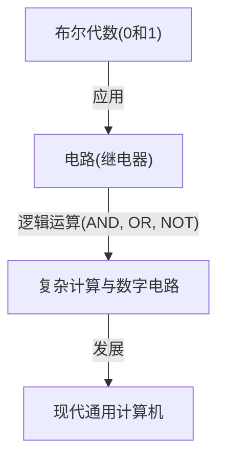

# 克劳德·香农：开创数字时代的天才

我们日常使用的智能手机、互联网、计算机以及人工智能，所有这些的基础——“数字通信”与“信息”的概念，都源自一位天才的大脑。他的名字叫克劳德·埃尔伍德·香农（Claude Elwood Shannon, 1916–2001）。他作为“信息论之父”名垂青史，被誉为20世纪最伟大且最具影响力的科学家之一。

在本文中，我们将深入挖掘并详细解说香农的成长经历、奠定现代数字社会基础的突破性论文，以及他充满“玩心”和人情味的真实面貌。

## 1. 童年时期与对发明的热情

克劳德·香农于1916年4月30日出生在美国密歇根州的一个小镇佩托斯基（Petoskey），在盖洛德（Gaylord）长大。他的父亲是一位商人，母亲是一位语言教师，同时也是高中的校长。香农从小就对机械和电子设备表现出异乎寻常的兴趣，他收集家周围的废铜烂铁，用铁丝网和朋友建立秘密的电报网，还利用农场的围栏搭建通信系统。

此外，一个有趣的现象是，他的祖父也是一位发明家，并且是爱迪生的远亲。童年时代的香农梦想成为像爱迪生那样伟大的发明家，沉迷于制作模型飞机和无线电遥控船。从那时起，他体内就已经萌生了“理解事物根本机制并进行重构”的工程师天赋。

## 2. 从密歇根大学到麻省理工学院：布尔代数与继电器电路的相遇

1932年，香农进入密歇根大学，获得了数学和电气工程的双学士学位。接触到数学的逻辑之美与电气工程的实用性，对他后来的研究具有决定性的意义。

1936年，他进入麻省理工学院（MIT）研究生院，在万尼瓦尔·布什（Vannevar Bush）的指导下开始研究。当时，布什正在开发一种被称为微分分析机的大型模拟计算机。香农负责维护这台计算机复杂的继电器电路。

在这里，香农发现，19世纪数学家乔治·布尔（George Boole）提出的“布尔代数（逻辑代数）”与电路的开关（开和关）在数学上完全一致。他证明了“真(1)”与“假(0)”的逻辑运算（AND、OR、NOT）可以通过电路的串联和并联在物理上表现出来。

1937年，21岁的香农发表了他的硕士论文《继电器与开关电路的符号分析》（A Symbolic Analysis of Relay and Switching Circuits）。这篇论文被赞誉为“20世纪最重要且最具影响力的硕士论文”，成为了现代数字电路设计的基石。这一发现表明，“无论多么复杂的逻辑计算，都可以仅通过开关的开合组合（0和1）来执行”，从而确立了构成今天计算机核心的原理。

## 3. 第二次世界大战与密码学理论研究

在第二次世界大战期间，香农加入了贝尔实验室，从事火控系统和密码理论的研究。在这里，他还结识了英国天才数学家阿兰·图灵（Alan Turing），两人就机器与人类智能进行了深刻的讨论。

香农推进了关于密码理论的研究，并于1945年汇编了一份名为《密码学的数学理论》（A Mathematical Theory of Cryptography）的机密报告（战后于1949年以《保密系统的通信理论》为题公开）。在这份报告中，他对“完全无法破解的密码（一次性密码本，One-time pad）”进行了数学证明。此外，他首次在密码学语境中明确定义了“信息（Information）”和“冗余度（Redundancy）”的概念，这成为后来创立信息论的重要基石。

## 4. 1948年：信息论的诞生

1948年，香农在贝尔实验室的学术期刊（Bell System Technical Journal）上发表了具有历史意义的论文《通信的数学理论》（A Mathematical Theory of Communication）。这篇论文单枪匹马地开创了“信息论”这一全新学科领域的瞬间。

在香农之前的时代里，“信息”是一个模糊且主观的概念，被认为依赖于意义和内容。然而，香农刻意将“意义”从信息中剥离，将信息纯粹作为概率和统计的问题进行数学定义。他首次公开采用“比特（bit：binary digit的缩写）”作为衡量信息的单位，并证明了所有信息（文字、声音、图像等）都可以表示为0和1的比特流。

### 通信系统的建模

香农用以下简单的模型描述了所有的通信系统。

这个模型具有普适性，可应用于从电话、电视广播、互联网，甚至到人际对话和DNA转录等一切信息传递过程。

### 香农定理与信息量（熵）

他还引入了“信息熵（Entropy）”作为表示信息不确定性的概念。他将一种直观的概念进行了公式化：发生的概率越小的事件，在得知它发生时所获得的信息量就越大。

此外，香农从数学上证明了，无论信道中存在多少噪声，只要传输速率低于该信道的“信道容量（香农极限）”，通过进行适当的纠错编码，理论上就能无误差（概率趋近于零）地传输信息。这被称为“香农信道编码定理”，对当时的通信工程师来说是一个颠覆常识的惊人发现。因为在当时，人们认为对抗噪声的唯一方法就是增大信号的输出功率。今天，我们能够接收到来自宇宙深处探测器的清晰图像，或者从有划痕的CD中播放音乐，都要归功于基于该定理的纠错技术。

## 5. 天才的真实面貌：热爱抛接杂耍与独轮车的男人

香农的伟大之处，除了他无与伦比的智慧之外，还在于他极具人情味的“玩心（Playfulness）”。他对地位、名声和财富毫不在意，进行研究和发明仅仅是为了满足自己的好奇心。

在贝尔实验室的走廊里，香农一边骑着独轮车一边玩抛接杂耍（Juggling）的身影在同事之间成为了传奇。他不仅构建了抛接杂耍的数学理论并推导出了“抛接杂耍定理”，甚至还发明了一台可以进行抛接杂耍的机器。

此外，他也是奠定计算机下棋程序基础的先驱之一。他在1950年发表的论文对后来计算机国际象棋的发展产生了深远的影响。他还发明了一只能够自行探索迷宫并记住路线的机械老鼠“忒修斯（Theseus）”，这是验证早期人工智能（机器学习）概念的先驱性尝试。

香农的家里摆满了各种奇怪又有趣的发明。比如打开开关后会从盒子里伸出一只手自己把开关关掉的“终极机器（Ultimate Machine）”、会喷火的小号、定制的飞盘等等，他的好奇心永无止境。

## 6. 晚年与遗产

1956年，香农成为麻省理工学院的教授，一边执教一边继续研究。然而，他讨厌学术界的喧嚣和名声，逐渐从公众视野中消失，沉浸在自家的爱好和发明中。据说他晚年患上了阿尔茨海默病，未能完全意识到自己的伟大成就已经在现代互联网和数字社会中开花结果。2001年2月24日，香农与世长辞，享年84岁。

## 总结

克劳德·香农播下的种子，如今已成长为名为“数字信息社会”的参天大树。如果没有他，今天的互联网、智能手机、数字音乐和人工智能也许根本不会存在，或者会是完全不同的面貌。

香农将信息还原为0和1，并从数学上证明了在噪声海洋中准确传递信息的方法。他的一生完美地展示了纯粹的好奇心和玩心是如何带来从根本上改变世界的伟大发现的。当我们拿起数字设备时，不妨稍微花点时间，去想象一下那位一边骑着独轮车一边享受抛接杂耍乐趣的天才身影吧。
