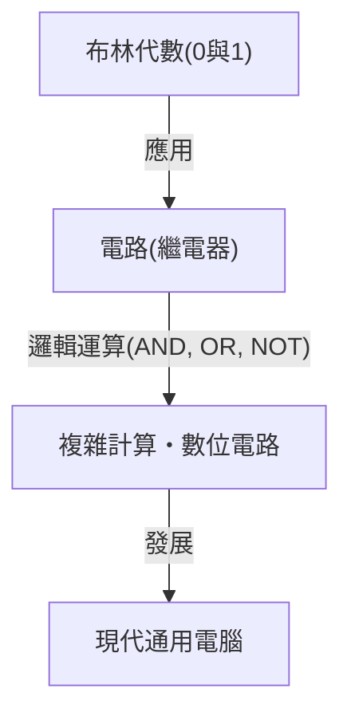

# 克勞德·香農：開創數位時代的天才

我們日常使用的智慧型手機、網際網路、電腦以及人工智慧。作為這一切基礎的「數位通訊」與「資訊」概念，皆源自一位天才的頭腦。他的名字是克勞德·艾爾伍德·香農（Claude Elwood Shannon, 1916–2001）。他作為「資訊理論之父」名留青史，並被列為20世紀最偉大、最具影響力的科學家之一。

本文將從香農的成長背景，到奠定現代數位社會基礎的劃時代論文，再到他充滿人情味與「玩心」的真實面貌，進行非常詳細的深入解說。

## 1. 幼年時期與對發明的熱情

克勞德·香農於1916年4月30日出生在美國密西根州的小鎮佩托斯基，並在蓋洛德長大。父親是實業家，母親則是語言教師，也曾擔任高中校長。香農從小就對機械與電子設備展現出異於常人的興趣，他會收集家裡周遭的廢棄物，利用有刺鐵絲網建立與朋友間的秘密電報網，或是利用農場圍欄架設通訊系統。

此外，他的祖父是一位發明家，而且他與愛迪生是遠房親戚，這是一個有趣的關聯。幼年時期的香農夢想成為像愛迪生那樣的偉大發明家，沉迷於製作模型飛機和遙控船。從這個時候起，他內心「理解事物根本運作原理並加以重建」的工程師天賦就已經開始萌芽。

## 2. 從密西根大學到麻省理工學院：布林代數與繼電器電路的相遇

1932年，香農進入密西根大學，取得了數學與電機工程兩個學士學位。接觸到數學的邏輯之美與電機工程的實用性，對他後來的研究具有決定性的意義。

1936年，他進入麻省理工學院（MIT）研究所，在萬尼瓦爾·布希的指導下展開研究。當時布希正在開發一種被稱為微分解析機的巨大類比計算機。香農負責維護這台計算機複雜的繼電器電路。

在這裡，香農發現19世紀數學家喬治·布林提出的「布林代數（邏輯代數）」，與電路開關（開和關）在數學上完全吻合。他證明了「真 (1)」與「假 (0)」的邏輯運算（AND、OR、NOT），可以透過電路的串聯或並聯在物理上表現出來。

1937年，21歲的香農發表了碩士論文《繼電器與開關電路的符號分析》（A Symbolic Analysis of Relay and Switching Circuits）。這篇論文被譽為「20世紀最重要且最具影響力的碩士論文」，成為現代數位電路設計的基礎。這項發現表明，「無論多麼複雜的邏輯計算，都只需要開關的開與關（0和1）就能執行」，確立了當今電腦運作的核心原理。

## 3. 第二次世界大戰與密碼理論研究

第二次世界大戰期間，香農進入貝爾實驗室，從事火控系統與密碼理論的研究。在那裡，他結識了英國天才數學家艾倫·圖靈，兩人針對機器與人類智慧進行了深入的討論。

香農持續推進密碼理論的研究，在1945年撰寫了一份機密報告《密碼的數學理論》（A Mathematical Theory of Cryptography）（戰後的1949年以《保密系統的通訊理論》為題公開發表）。在報告中，他完成了對「完全無法破解的密碼（一次性密碼本）」的數學證明。同時，他首次在密碼學的語境中明確定義了「資訊（Information）」與「冗餘度（Redundancy）」的概念，這成為後來資訊理論的重要基石。

## 4. 1948年：資訊理論的誕生

1948年，香農在貝爾實驗室的學術期刊（Bell System Technical Journal）上發表了歷史性的論文《通訊的數學理論》（A Mathematical Theory of Communication）。這篇論文正是單憑一己之力創立了「資訊理論」這個新學科領域的瞬間。

在香農之前的世界裡，「資訊」是一個模糊且主觀的概念，被認為取決於其意義或內容。然而，香農刻意排除了資訊的「意義」，純粹從機率與統計的問題出發，對資訊進行了數學定義。他首次公開採用「位元（bit：binary digit 的縮寫）」作為衡量資訊的單位，並證明了所有資訊（文字、語音、圖像等）都可以表示為0和1的位元串。

### 通訊系統的建模

香農使用以下簡單的模型描述了所有的通訊系統。

這個模型具有普遍性，可應用於電話、電視廣播、網際網路，甚至人與人之間的對話以及DNA的轉錄等所有資訊傳遞過程。

### 香農定理與資訊量（熵）

他還引入了「資訊熵」這個概念來表示資訊的不確定性。這將一種直觀的概念公式化：發生的機率越低的事件，當我們得知它時所獲得的資訊量就越大。

此外，香農從數學上證明了：無論通訊頻道中存在多少雜訊，只要傳輸速率低於該通訊頻道的「通訊頻道容量（香農極限）」，藉由適當的錯誤更正編碼，理論上就能無錯誤地（以趨近於零的機率）傳輸資訊。這被稱為「香農通訊頻道編碼定理」，對當時的通訊工程師來說，這是一項顛覆常識的驚人發現。因為在當時，人們認為對抗雜訊的唯一方法就是增加訊號的輸出功率。今天我們能夠接收來自宇宙深處探測器傳來的清晰圖像，或是從刮傷的CD中播放音樂，都要歸功於基於這項定理的錯誤更正技術。

## 5. 天才的真面目：熱愛雜耍與單輪車的男人

香農的偉大之處，除了無與倫比的智慧，還在於他充滿人情味的「玩心（Playfulness）」。他對地位、名聲與財富毫不在乎，進行研究與發明純粹是為了滿足自己的好奇心。

香農騎著單輪車在貝爾實驗室走廊上一邊玩雜耍一邊移動的身影，在同事之間成為了傳奇。他不僅構建了雜耍的數學理論，推導出「雜耍定理」，甚至還發明了會玩雜耍的機器。

此外，他也是奠定西洋棋電腦程式基礎的先驅之一。他在1950年發表的論文，對後來電腦西洋棋的發展產生了深遠的影響。他還發明了能自行探索迷宮並記住路線的機械老鼠「忒修斯」，這是實證早期人工智慧（機器學習）概念的先驅性嘗試。

香農的家裡充滿了各種奇特有趣的發明品。例如，打開開關後會從盒子裡伸出一隻手自己把開關關掉的「終極機器（Ultimate Machine）」、會噴火的小號、以及客製化的飛盤等，他的好奇心無窮無盡。

## 6. 晚年與遺產

1956年，香農就任MIT教授，一邊執教一邊繼續研究。然而，他厭倦了學術界的喧囂與名聲，逐漸從公開場合消失，專心在家中從事興趣與發明。晚年他罹患了阿茲海默症，據說他已無法完全意識到自己的偉大成就如今已在現代網際網路與數位社會中開花結果。2001年2月24日，香農辭世，享壽84歲。

## 總結

克勞德·香農播下的種子，如今已成長為當今數位資訊化社會這片巨大的森林。如果沒有他，今天的網際網路、智慧型手機、數位音樂和人工智慧可能根本不會存在，或者會呈現出完全不同的樣貌。

將資訊還原為0和1，並從數學上證明如何在雜訊之海中準確傳遞資訊的香農。他的一生完美地展示了純粹的好奇心與玩心，如何能帶來從根本上改變世界的偉大發現。當我們拿起數位裝置時，不妨花一點時間，想像一下那位一邊騎著單輪車一邊享受雜耍的天才身影。
