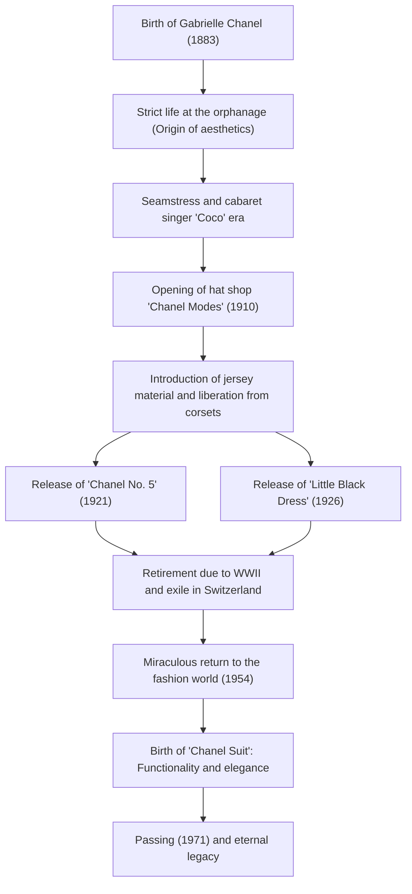

# Coco Chanel: The Life and Philosophy of the Revolutionary Who Liberated Women

In the 20th-century fashion world, perhaps no one has fundamentally overturned women's lifestyles quite like Gabrielle "Coco" Chanel. She was not merely a clothing designer, but a thinker and an entrepreneur who offered a new set of values named "freedom" to women bound by convention. In this article, we delve deep into the life of Coco Chanel, who rose from poverty to the pinnacle of the world, the philosophy underlying her work, and her immense influence that continues to this day.

## From Orphanage to Cabaret: A Childhood of Adversity

Born in 1883 in Saumur, southwestern France, Gabrielle Chanel's childhood was far from glamorous. When she was 12, her mother died of illness, and she was placed in a convent orphanage by her peddler father. The strict discipline of this convent, the nun's habits based on black and white, and the ascetic architectural style became the origin of Chanel's aesthetic sense.

After leaving the orphanage, she worked as a seamstress while singing at a cabaret frequented by cavalry officers. From the titles of the songs she sang at the time, such as "Ko Ko Ri Ko" and "Who Saw Coco in the Trocadero?", she came to be called by the nickname "Coco". Although she did not achieve success as a singer, her relationships with wealthy officer Étienne Balsan and the English businessman Arthur "Boy" Capel, who became the love of her life, drastically changed her destiny.

## The Dawn of a Fashion Empire and the Challenge to "Freedom"

With financial backing from Boy Capel, she opened a hat shop called "Chanel Modes" on Rue Cambon in Paris in 1910. It was common sense for women of the time to constrict their bodies with suffocating corsets and wear gigantic hats excessively decorated with feathers and flowers. However, the simple and practical hats designed by Chanel quickly gained a reputation among progressive aristocrats and actresses.

Her innovation did not stop at hats. She took notice of jersey material, which had only been used for men's underwear at the time, and presented stretchy, easy-to-move-in dresses. This meant the liberation of women's bodies from corsets and the birth of clothing for active, independent modern women. Chanel directly projected her own lifestyle—that of a woman who "enjoys horseback riding, plays sports, and works"—onto fashion.

## Revolutionary Icons: No. 5 and the Little Black Dress

In the 1920s, Chanel created two legends that changed fashion history.

One was the perfume "Chanel No. 5", released in 1921. While single-flower scents were the mainstream at the time, she collaborated with genius perfumer Ernest Beaux to create an unprecedented abstract and modern scent by boldly combining natural ingredients with synthetic ones (aldehydes). Her philosophy of "a perfume for women that smells like a woman" had come to magnificent fruition.

The other was the "Little Black Dress (LBD)", released in 1926. She elevated black, which had only been used for mourning attire at the time, to a color for everyday chic fashion. American Vogue praised this simple and elegant black dress as "Chanel's Ford" (a widely adopted garment that everyone wears, like the Model T Ford).

## A Dramatic Return and Eternal Legacy

In 1939, with the outbreak of World War II, Chanel closed her couture house, leaving only the perfume and accessory boutiques. Although her actions during the war remain a subject of debate, she was forced into exile in Switzerland after the war.

However, in 1954, Chanel, now over 70, suddenly returned to the Paris fashion world. In contrast to the then-mainstream "New Look" by Christian Dior, which extremely cinched the waist, she rebelled, saying it was "forcing women into cramped clothes". What she presented was the "Chanel Suit", which was easy to move in and functional, yet used the finest tweed materials. This suit gathered enthusiastic support, especially in America, as the battle dress for modern women advancing into society.

Until the day she closed her 87-year life at the Hôtel Ritz in Paris in 1971, she continued to hold her scissors and pour her passion into design.

## Trajectory of Achievements (Mermaid Diagram)

## Conclusion: What Chanel Left for Us

Coco Chanel's philosophy lies in the aesthetics of subtraction: "eliminate all that is unnecessary." "If you were born without wings, do nothing to prevent them from growing," and "In order to be irreplaceable one must always be different." The numerous quotes she left behind reflect her very way of life.

What Chanel designed was not just clothing, but a proposal for a new way of living: "how women should live." Walking on their own feet, making choices by their own will. Behind the freedom and comfort that we modern women take for granted lies the existence of a great woman who continued to fight against convention.
