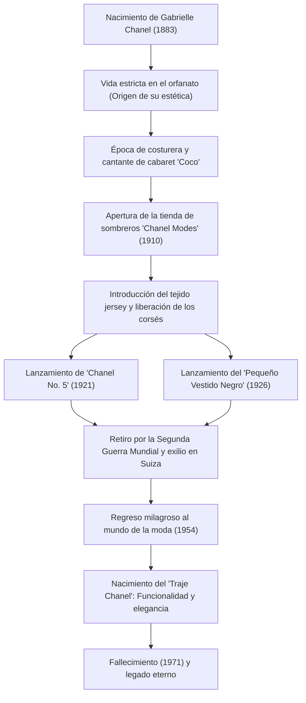

# Coco Chanel: La Vida y Filosofía de la Revolucionaria que Liberó a las Mujeres

En el mundo de la moda del siglo XX, tal vez nadie haya revolucionado fundamentalmente el estilo de vida de las mujeres como Gabrielle "Coco" Chanel. Ella no era simplemente una diseñadora de ropa, sino una pensadora y emprendedora que ofreció una nueva escala de valores llamada "libertad" a las mujeres atadas por las convenciones. En este artículo, profundizamos en la vida de Coco Chanel, que ascendió de la pobreza a la cima del mundo, la filosofía que subyace a su trabajo y su inmensa influencia que continúa hasta hoy.

## Del Orfanato al Cabaret: Una Infancia de Adversidad

Nacida en 1883 en Saumur, en el suroeste de Francia, la infancia de Gabrielle Chanel estuvo lejos de ser glamurosa. A los 12 años, su madre murió de una enfermedad, y fue internada en un orfanato de un convento por su padre vendedor ambulante. La estricta disciplina de este convento, los hábitos de las monjas basados en el blanco y negro, y el estilo arquitectónico ascético se convirtieron en el origen del sentido estético de Chanel.

Tras salir del orfanato, trabajó como costurera mientras cantaba en un cabaret frecuentado por oficiales de caballería. A partir de los títulos de las canciones que cantaba entonces, como "Ko Ko Ri Ko" y "¿Quién ha visto a Coco en el Trocadero?", empezaron a llamarla por el apodo de "Coco". Aunque no alcanzó el éxito como cantante, sus relaciones con el adinerado oficial Étienne Balsan y el empresario inglés Arthur "Boy" Capel, quien se convertiría en el amor de su vida, cambiaron drásticamente su destino.

## El Amanecer de un Imperio de la Moda y el Desafío a la "Libertad"

Con el apoyo financiero de Boy Capel, en 1910 abrió una tienda de sombreros llamada "Chanel Modes" en la Rue Cambon de París. Era de sentido común para las mujeres de la época constreñir sus cuerpos con corsés asfixiantes y llevar sombreros gigantescos decorados en exceso con plumas y flores. Sin embargo, los sombreros simples y prácticos diseñados por Chanel ganaron rápidamente reputación entre aristócratas y actrices progresistas.

Su innovación no se detuvo en los sombreros. Se fijó en el tejido de punto (jersey), que entonces solo se usaba para la ropa interior masculina, y presentó vestidos elásticos y fáciles de llevar. Esto significó la liberación de los cuerpos femeninos de los corsés y el nacimiento de la ropa para mujeres modernas activas e independientes. Chanel proyectó directamente su propio estilo de vida —el de una mujer que "disfruta montando a caballo, hace deporte y trabaja"— en la moda.

## Iconos Revolucionarios: El No. 5 y el Pequeño Vestido Negro

En la década de 1920, Chanel creó dos leyendas que cambiaron la historia de la moda.

Una fue el perfume "Chanel No. 5", lanzado en 1921. Mientras que las fragancias de una sola flor eran la corriente principal en ese momento, colaboró con el genio perfumista Ernest Beaux para crear un aroma abstracto y moderno sin precedentes al combinar audazmente ingredientes naturales con sintéticos (aldehídos). Su filosofía de "un perfume para mujeres con olor a mujer" había fructificado magníficamente.

La otra fue el "Pequeño Vestido Negro (LBD)", lanzado en 1926. Elevó el negro, que en ese entonces solo se usaba para ropa de luto, a un color para la moda elegante de todos los días. La revista Vogue estadounidense elogió este vestido negro simple y elegante como "el Ford de Chanel" (una prenda ampliamente adoptada que todo el mundo usa, como el modelo Ford T).

## Un Regreso Dramático y un Legado Eterno

En 1939, con el estallido de la Segunda Guerra Mundial, Chanel cerró su casa de alta costura, dejando solo las boutiques de perfumes y accesorios. Aunque sus acciones durante la guerra siguen siendo un tema de debate, tras la guerra se vio obligada a exiliarse en Suiza.

Sin embargo, en 1954, Chanel, con más de 70 años, regresó repentinamente al mundo de la moda de París. En contraste con el entonces predominante "New Look" de Christian Dior, que ceñía extremadamente la cintura, ella se rebeló, diciendo que estaba "encerrando a las mujeres en ropas ajustadas". Lo que presentó fue el "Traje Chanel", que era fácil para moverse y funcional, aunque utilizaba los mejores materiales de tweed. Este traje reunió un apoyo entusiasta, especialmente en América, como el uniforme de batalla para las mujeres modernas que avanzaban en la sociedad.

Hasta el día que cerró su vida de 87 años en el Hotel Ritz de París en 1971, continuó empuñando sus tijeras y volcando su pasión en el diseño.

## Trayectoria de Logros (Diagrama Mermaid)

## Conclusión: Lo que Chanel nos Dejó

La filosofía de Coco Chanel reside en la estética de la resta: "eliminar todo lo innecesario". "Si naciste sin alas, no hagas nada para evitar que crezcan", y "Para ser irremplazable, uno siempre debe ser diferente". Las numerosas frases que dejó reflejan su propia forma de vida.

Lo que Chanel diseñó no fue solo ropa, sino una propuesta para una nueva forma de vivir: "cómo deberían vivir las mujeres". Caminando sobre sus propios pies, tomando decisiones por su propia voluntad. Detrás de la libertad y comodidad que las mujeres modernas damos por sentado, se encuentra la existencia de una gran mujer que continuó luchando contra las convenciones.
