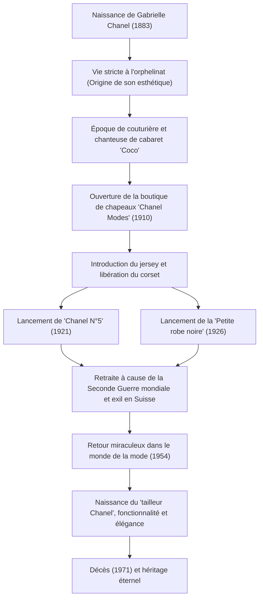

# Coco Chanel : La vie et la philosophie de la révolutionnaire qui a libéré les femmes

Dans le monde de la mode du 20e siècle, personne d'autre que Gabrielle "Coco" Chanel n'a bouleversé aussi fondamentalement le mode de vie des femmes. Elle n'était pas seulement une créatrice de vêtements, mais une penseuse et une entrepreneuse qui a offert une nouvelle valeur appelée "liberté" aux femmes liées par les conventions. Cet article se penche sur la vie de Coco Chanel, de son enfance pauvre au sommet du monde, sur la philosophie qui la sous-tend et sur son immense influence qui perdure aujourd'hui.

## De l'orphelinat au cabaret : L'enfance dans l'adversité

L'enfance de Gabrielle Chanel, née en 1883 à Saumur dans le sud-ouest de la France, n'a pas du tout été glamour. À l'âge de 12 ans, sa mère meurt de maladie et son père, un colporteur, la place dans un orphelinat affilié à un couvent. La discipline stricte du couvent, les habits de religieuse noirs et blancs et l'architecture austère sont devenus l'origine de l'esthétique de la future Chanel.

Après avoir quitté l'orphelinat, elle a travaillé comme couturière tout en chantant dans un cabaret fréquenté par des officiers de cavalerie. C'est à partir des titres des chansons qu'elle interprétait alors, "Ko Ko Ri Ko" et "Qui qu'a vu Coco dans l'Trocadéro", qu'elle a gagné le surnom de "Coco". Bien qu'elle n'ait pas réussi comme chanteuse, les relations qu'elle y a nouées avec le riche officier Étienne Balsan et son amant de toujours, l'homme d'affaires britannique Arthur "Boy" Capel, changeront considérablement son destin.

## L'aube d'un empire de la mode et le défi de la "liberté"

Avec le soutien financier de Boy Capel, elle a ouvert la boutique de chapeaux "Chanel Modes" dans la rue Cambon à Paris en 1910. À l'époque, il était de coutume pour les femmes de serrer leur corps dans des corsets étouffants et de porter d'énormes chapeaux excessivement décorés de plumes et de fleurs. Cependant, les chapeaux simples et pratiques conçus par Chanel sont rapidement devenus populaires parmi les aristocrates et les actrices progressistes.

Son esprit d'innovation ne s'est pas arrêté aux chapeaux. Remarquant le jersey, un matériau alors utilisé uniquement pour les sous-vêtements masculins, elle a présenté des robes extensibles et faciles à porter. Cela signifiait la libération du corps féminin du corset et la naissance de vêtements pour la femme moderne active et indépendante. Chanel a projeté son propre style de vie de "femme qui aime l'équitation, fait du sport et travaille" directement dans la mode.

## Icônes révolutionnaires : Le N°5 et la petite robe noire

Dans les années 1920, Chanel a créé deux légendes qui changeront l'histoire de la mode.

L'une est le parfum "Chanel N°5" lancé en 1921. Alors que les parfums de l'époque étaient principalement basés sur une seule senteur florale, elle a collaboré avec le parfumeur de génie Ernest Beaux pour combiner audacieusement des ingrédients naturels avec des ingrédients synthétiques (aldéhydes), créant un parfum abstrait et moderne sans précédent. Sa philosophie "un parfum pour femme à odeur de femme" a porté ses fruits de manière spectaculaire.

L'autre est la "petite robe noire" (LBD) présentée en 1926. Elle a sublimé la couleur noire, utilisée uniquement pour les vêtements de deuil à l'époque, en une couleur de mode quotidienne et chic. Le magazine américain Vogue a fait l'éloge de cette robe noire simple et élégante comme "la Ford de Chanel" (des vêtements largement répandus que tout le monde porte, comme la Ford T).

## Retour dramatique et héritage éternel

En 1939, avec le déclenchement de la Seconde Guerre mondiale, Chanel a fermé sa maison de couture, ne laissant que les boutiques de parfums et d'accessoires. Bien que ses actions pendant la guerre fassent toujours l'objet de débats, elle a été forcée de s'exiler en Suisse après la guerre.

Cependant, en 1954, à plus de 70 ans, Chanel est soudainement revenue dans le monde de la mode parisienne. Contre le "New Look" de Christian Dior, avec sa taille extrêmement cintrée qui prévalait à l'époque, elle s'est rebellée en disant qu'il "enfermait les femmes dans des vêtements étriqués". Elle a alors proposé le "tailleur Chanel", fonctionnel et facile à porter tout en utilisant du tweed de la plus haute qualité. Ce tailleur a recueilli un soutien enthousiaste, en particulier en Amérique, comme uniforme des femmes modernes entrant dans la société.

Jusqu'au jour de sa mort à l'hôtel Ritz à Paris en 1971, à l'âge de 87 ans, elle a continué à tenir des ciseaux et à se consacrer passionnément au design.

## La trajectoire de ses réalisations (Diagramme Mermaid)

## Conclusion : Ce que Chanel nous a laissé

La philosophie de Coco Chanel réside dans l'esthétique de la soustraction : "éliminer tout ce qui est inutile". "Si vous êtes né sans ailes, ne faites rien pour les empêcher de pousser", "Pour être irremplaçable, il faut toujours être différente". Les nombreuses citations célèbres qu'elle a laissées reflètent son propre mode de vie.

Ce que Chanel a conçu n'était pas seulement des vêtements, mais une proposition pour une nouvelle façon de vivre : "comment une femme devrait vivre". Marcher sur ses propres pieds et faire des choix selon sa propre volonté. Derrière la liberté et le confort dont nous jouissons naturellement dans le monde moderne se cache l'existence d'une grande femme qui n'a cessé de lutter contre les conventions.
