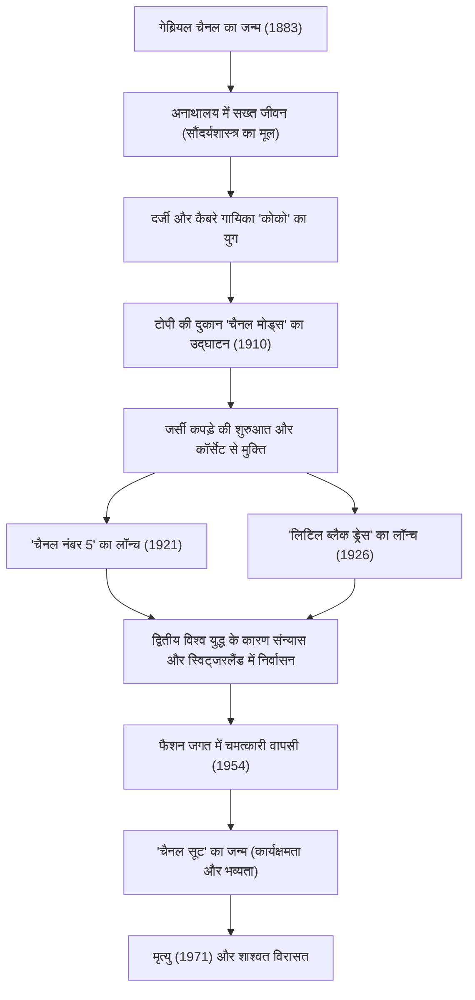

# कोको चैनल: महिलाओं को मुक्त करने वाली क्रांतिकारी का जीवन और दर्शन

20वीं सदी की फैशन दुनिया में, शायद गेब्रियल "कोको" चैनल के अलावा किसी और ने महिलाओं की जीवनशैली को इतने मौलिक रूप से नहीं बदला। वह केवल एक कपड़ों की डिजाइनर नहीं थीं, बल्कि एक विचारक और उद्यमी थीं, जिन्होंने रूढ़ियों से बंधी महिलाओं को "स्वतंत्रता" नामक एक नया मूल्य प्रदान किया। इस लेख में, हम कोको चैनल के जीवन, उनकी गरीब परवरिश से लेकर दुनिया के शिखर तक पहुँचने, उनके दर्शन और आज भी जारी उनके अपार प्रभाव पर गहराई से विचार करेंगे।

## अनाथालय से कैबरे तक: विपत्ति में बचपन

1883 में दक्षिण-पश्चिम फ्रांस के सौमुर में जन्मी गेब्रियल चैनल का बचपन बिल्कुल भी ग्लैमरस नहीं था। 12 साल की उम्र में बीमारी के कारण उनकी माँ की मृत्यु हो गई, और उनके फेरीवाले पिता ने उन्हें एक कॉन्वेंट से जुड़े अनाथालय में छोड़ दिया। कॉन्वेंट का सख्त अनुशासन, काले और सफेद रंग के नन के कपड़े, और सादा वास्तुकला भविष्य की चैनल के सौंदर्यशास्त्र का मूल बन गया।

अनाथालय छोड़ने के बाद, उन्होंने एक दर्जी के रूप में काम किया और साथ ही घुड़सवार अधिकारियों के कैबरे में गाना गाया। यहीं उन्होंने "को को री को" और "ट्रोकाडेरो में कोको को किसने देखा" गाने गाए, जिससे उन्हें "कोको" उपनाम मिला। हालांकि उन्हें एक गायिका के रूप में सफलता नहीं मिली, लेकिन यहां अमीर अधिकारी एटिने बलसान और उनके जीवन भर के प्रेमी, ब्रिटिश व्यवसायी आर्थर "बॉय" कैपेल के साथ बने संबंधों ने उनके भाग्य को काफी बदल दिया।

## एक फैशन साम्राज्य की शुरुआत और "स्वतंत्रता" के लिए चुनौती

बॉय कैपेल की वित्तीय सहायता से, उन्होंने 1910 में पेरिस में रुए कैम्बोन पर "चैनल मोड्स" नामक एक टोपी की दुकान खोली। उस समय महिलाओं के लिए दमघोंटू कॉर्सेट पहनना और पंखों और फूलों से सजी भारी टोपियां पहनना आम बात थी। हालांकि, चैनल द्वारा डिजाइन की गई सरल और व्यावहारिक टोपियां प्रगतिशील कुलीन महिलाओं और अभिनेत्रियों के बीच तेजी से लोकप्रिय हो गईं।

उनका नवाचार टोपियों तक ही सीमित नहीं रहा। जर्सी फैब्रिक को देखकर, जिसका उपयोग उस समय केवल पुरुषों के अंडरवियर के लिए किया जाता था, उन्होंने स्ट्रेचेबल और आसानी से पहनने वाले कपड़े पेश किए। इसका मतलब महिलाओं के शरीर को कॉर्सेट से मुक्त करना और एक सक्रिय और स्वतंत्र आधुनिक महिला के लिए कपड़ों का जन्म था। चैनल ने "घुड़सवारी, खेल और काम करने वाली महिला" की अपनी जीवनशैली को सीधे फैशन में उतार दिया।

## क्रांतिकारी प्रतीक: नंबर 5 और लिटिल ब्लैक ड्रेस

1920 के दशक में, चैनल ने दो ऐसी किंवदंतियां बनाईं जिन्होंने फैशन के इतिहास को बदल दिया।

एक है 1921 में लॉन्च किया गया परफ्यूम "चैनल नंबर 5"। उस समय के परफ्यूम मुख्य रूप से एक ही फूल की सुगंध पर आधारित होते थे, लेकिन प्रतिभाशाली परफ्यूमर अर्नेस्ट बीक्स के साथ मिलकर, उन्होंने एक अभूतपूर्व सारगर्भित और आधुनिक सुगंध बनाने के लिए प्राकृतिक अवयवों को कृत्रिम अवयवों (एल्डिहाइड) के साथ साहसपूर्वक जोड़ा। "एक महिला की सुगंध वाला महिलाओं के लिए परफ्यूम" का उनका दर्शन शानदार ढंग से फलीभूत हुआ।

दूसरा है 1926 में पेश की गई "लिटिल ब्लैक ड्रेस" (LBD)। उन्होंने काले रंग को, जो उस समय केवल शोक के कपड़ों के रूप में इस्तेमाल किया जाता था, रोजमर्रा के और आकर्षक फैशन रंग के रूप में उन्नत किया। अमेरिकी वोग पत्रिका ने इस सरल और सुरुचिपूर्ण काले रंग की पोशाक की "चैनल की फोर्ड" (फोर्ड मॉडल टी की तरह व्यापक रूप से इस्तेमाल होने वाली और सभी द्वारा पहनी जाने वाली पोशाक) के रूप में प्रशंसा की।

## एक नाटकीय वापसी और शाश्वत विरासत

1939 में, द्वितीय विश्व युद्ध के प्रकोप के साथ, चैनल ने अपना कॉउचर हाउस बंद कर दिया, और केवल परफ्यूम और एक्सेसरीज की दुकानें छोड़ दीं। हालांकि युद्ध के दौरान उनके कार्यों पर आज भी बहस होती है, लेकिन युद्ध के बाद उन्हें स्विट्जरलैंड में निर्वासित जीवन जीने के लिए मजबूर होना पड़ा।

हालांकि, 1954 में, 70 वर्ष से अधिक उम्र में, चैनल अचानक पेरिस की फैशन दुनिया में लौट आईं। उस समय प्रचलित क्रिश्चियन डायर के "न्यू लुक" का, जिसकी कमर बहुत कसी हुई होती थी, उन्होंने यह कहते हुए विरोध किया कि यह "महिलाओं को तंग कपड़ों में कैद कर रहा है"। इसके जवाब में, उन्होंने "चैनल सूट" पेश किया, जो बेहतरीन ट्वीड का उपयोग करते हुए कार्यात्मक और घूमने-फिरने में आसान था। इस सूट ने विशेष रूप से अमेरिका में, समाज में प्रवेश करने वाली आधुनिक महिलाओं की वर्दी के रूप में भारी समर्थन प्राप्त किया।

1971 में पेरिस के रिट्ज होटल में 87 वर्ष की आयु में अपनी मृत्यु के दिन तक, वह कैंची पकड़े रहीं और डिजाइन के प्रति भावुक रूप से समर्पित रहीं।

## उपलब्धियों का प्रक्षेपवक्र (Mermaid आरेख)

## निष्कर्ष: चैनल ने हमारे लिए क्या छोड़ा

कोको चैनल का दर्शन घटाव के सौंदर्यशास्त्र में निहित है: "जो भी अनावश्यक है उसे हटा दें"। "यदि आप बिना पंखों के पैदा हुए हैं, तो ऐसा कुछ न करें जिससे उन्हें बढ़ने से रोका जा सके", "अपरिवर्तनीय होने के लिए, व्यक्ति को हमेशा अलग होना चाहिए"। उनके द्वारा छोड़े गए कई प्रसिद्ध उद्धरण उनके अपने जीवन जीने के तरीके को दर्शाते हैं।

चैनल ने जो डिजाइन किया वह केवल कपड़े नहीं थे, बल्कि जीवन जीने के एक नए तरीके का प्रस्ताव था: "एक महिला को कैसे जीना चाहिए"। अपने पैरों पर चलना और अपनी मर्जी से चुनाव करना। आधुनिक दुनिया में हम स्वाभाविक रूप से जिस स्वतंत्रता और आराम का आनंद लेते हैं, उसके पीछे एक महान महिला का अस्तित्व है जो लगातार रूढ़ियों से लड़ती रही।
