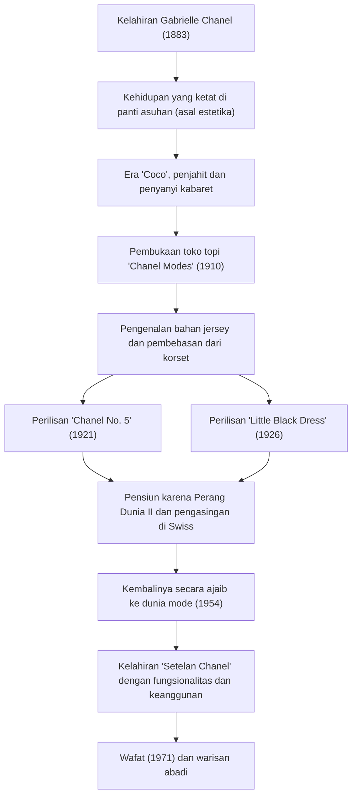

# Coco Chanel: Kehidupan dan Filosofi Sang Revolusioner yang Membebaskan Wanita

Di dunia mode abad ke-20, mungkin tidak ada tokoh lain yang secara mendasar membalikkan gaya hidup wanita selain Gabrielle "Coco" Chanel. Dia bukan sekadar desainer pakaian, melainkan seorang pemikir dan pengusaha yang menawarkan serangkaian nilai baru bernama "kebebasan" bagi para wanita yang terikat oleh adat istiadat. Dalam artikel ini, kita akan menggali lebih dalam kehidupan Coco Chanel, dari masa kecilnya yang miskin hingga mencapai puncak dunia, filosofi yang mendasarinya, dan pengaruhnya yang sangat besar yang berlanjut hingga hari ini.

## Dari Panti Asuhan ke Kabaret: Masa Kecil yang Penuh Kesulitan

Lahir pada tahun 1883 di Saumur, barat daya Prancis, masa kecil Gabrielle Chanel sama sekali tidak glamor. Pada usia 12 tahun, ibunya meninggal karena penyakit, dan ia ditinggalkan oleh ayahnya yang merupakan pedagang keliling di sebuah panti asuhan yang terhubung dengan biara. Disiplin ketat di biara ini, kebiasaan berpakaian hitam dan putih, dan arsitektur pertapaannya kemudian menjadi asal muasal estetika Chanel.

Setelah meninggalkan panti asuhan, dia bekerja sebagai penjahit sambil bernyanyi di kabaret tempat perwira kavaleri berkumpul. Ia mulai dipanggil dengan julukan "Coco" dari judul lagu yang ia nyanyikan saat itu, "Ko Ko Ri Ko" dan "Qui qu'a vu Coco dans l'Trocadéro?". Meskipun ia tidak sukses sebagai penyanyi, hubungannya di sini dengan perwira kaya Étienne Balsan dan industrialis Inggris Arthur "Boy" Capel, yang akan menjadi cinta dalam hidupnya, sangat mengubah nasibnya.

## Awal Kerajaan Mode dan Tantangan Menuju "Kebebasan"

Dengan dukungan finansial dari Boy Capel, ia membuka toko topi bernama "Chanel Modes" di Rue Cambon di Paris pada tahun 1910. Pada saat itu, adalah hal biasa bagi wanita untuk mengenakan korset yang mencekik untuk mengencangkan tubuh mereka dan memakai topi raksasa yang didekorasi secara berlebihan dengan bulu dan bunga. Namun, topi sederhana dan praktis yang dirancang Chanel dengan cepat menjadi populer di kalangan bangsawan progresif dan aktris.

Inovasinya tidak berhenti pada topi. Dia fokus pada bahan jersey, yang pada waktu itu hanya digunakan untuk bahan pakaian dalam pria, dan merilis gaun yang elastis dan mudah untuk bergerak. Ini berarti membebaskan tubuh wanita dari korset dan kelahiran pakaian untuk wanita modern yang aktif dan mandiri. Chanel memproyeksikan gaya hidupnya sendiri, yaitu "wanita yang menikmati berkuda, berolahraga, dan bekerja", secara langsung ke dalam mode.

## Ikon Revolusioner: No. 5 dan Little Black Dress

Pada tahun 1920-an, Chanel menciptakan dua legenda yang mengubah sejarah mode.

Salah satunya adalah parfum "Chanel No. 5" yang dirilis pada tahun 1921. Parfum pada saat itu didominasi oleh aroma bunga tunggal, tetapi bersama dengan ahli parfum jenius Ernest Beaux, ia dengan berani menggabungkan bahan-bahan alami dengan wewangian sintetis (aldehida) untuk menciptakan wewangian abstrak dan modern yang belum pernah ada sebelumnya. Filosofinya tentang "parfum wanita dengan aroma wanita" membuahkan hasil dengan gemilang.

Yang lainnya adalah "Little Black Dress (LBD)" yang dirilis pada tahun 1926. Dia meningkatkan warna hitam, yang pada waktu itu hanya digunakan sebagai pakaian duka, menjadi warna mode sehari-hari yang anggun. Majalah Amerika "Vogue" sangat memuji gaun hitam sederhana dan elegan ini sebagai "The Ford of Chanel" (pakaian yang akan menyebar luas seperti Ford Model T dan dipakai oleh semua orang).

## Kembalinya yang Dramatis dan Warisan Abadi

Pada tahun 1939, dengan pecahnya Perang Dunia II, Chanel menutup rumah modenya, dan hanya menyisakan butik parfum dan aksesori. Sementara tindakannya selama perang masih menjadi bahan perdebatan, ia terpaksa mengasingkan diri di Swiss setelah perang berakhir.

Namun pada tahun 1954, Chanel yang berusia lebih dari 70 tahun tiba-tiba kembali ke dunia mode Paris. Dia memberontak terhadap "New Look" Christian Dior yang menyempitkan pinggang secara ekstrem, yang merupakan arus utama pada saat itu, dengan mengatakan, "Dia memaksa wanita untuk memakai pakaian ketat." Oleh karena itu, dia mempresentasikan "Setelan Chanel", yang mudah dipakai bergerak dan fungsional, namun menggunakan bahan wol tweed kualitas tertinggi. Setelan ini mendapat dukungan luar biasa, terutama di Amerika, sebagai seragam tempur wanita modern yang maju di masyarakat.

Hingga hari ia menghembuskan napas terakhirnya di usia 87 tahun di Hotel Ritz di Paris pada tahun 1971, ia terus memegang gunting dan mencurahkan hasratnya ke dalam desain.

## Lintasan Prestasi (Diagram Mermaid)

## Kesimpulan: Apa yang Chanel Tinggalkan Untuk Kita

Filosofi Coco Chanel terletak pada estetika pengurangan: "Hilangkan semua hal yang tidak perlu." "Jika Anda lahir tanpa sayap, jangan lakukan apa pun untuk mencegahnya tumbuh." "Untuk menjadi tak tergantikan, seseorang harus selalu berbeda." Kutipan-kutipan yang dia tinggalkan adalah cerminan dari cara hidupnya sendiri.

Yang didesain Chanel bukan hanya sekadar pakaian, melainkan tawaran cara hidup baru mengenai "bagaimana seharusnya wanita hidup". Berjalan dengan kedua kaki sendiri dan membuat pilihan dengan kehendak sendiri. Di balik kebebasan dan kenyamanan yang secara alami dinikmati oleh kita di era modern, ada keberadaan sosok wanita hebat yang terus berjuang melawan tradisi.
