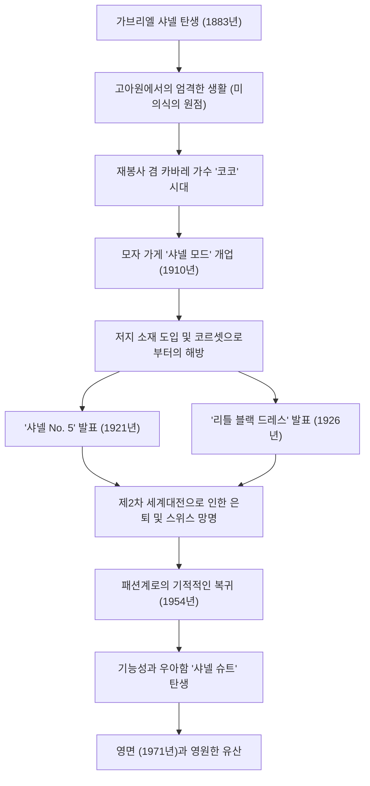

# 코코 샤넬: 여성을 해방시킨 혁명가의 생애와 철학

20세기 패션계에서 가브리엘 "코코" 샤넬만큼 여성의 라이프스타일 자체를 근본적으로 뒤바꾼 인물은 없을 것입니다. 그녀는 단순한 의상 디자이너가 아니라, 인습에 얽매인 여성들에게 "자유"라는 이름의 새로운 가치관을 제공한 사상가이자 기업가였습니다. 이 글에서는 가난한 어린 시절에서 세계의 정점에 오른 코코 샤넬의 생애, 그 기저에 흐르는 철학, 그리고 현대에까지 이어지는 막대한 영향력에 대해 깊이 파헤쳐 봅니다.

## 고아원에서 카바레로: 역경의 소녀 시대

1883년 프랑스 남서부의 소뮈르에서 태어난 가브리엘 샤넬의 어린 시절은 결코 화려하지 않았습니다. 12살 때 어머니가 병으로 세상을 떠났고, 행상인이었던 아버지에 의해 수녀원 부속 고아원에 맡겨졌습니다. 이 수녀원에서의 엄격한 규율과 흑백을 기조로 한 수녀복, 그리고 금욕적인 건축 양식은 훗날 샤넬의 미의식의 원점이 되었습니다.

고아원을 나온 후, 그녀는 재봉사로 일하면서 기병 장교들이 모이는 카바레에서 노래를 부르게 됩니다. 이때 불렀던 "코코리코(Ko Ko Ri Ko)"나 "트로카데로에서 코코를 본 건 누구"라는 곡명에서 유래하여 "코코"라는 애칭으로 불리게 되었습니다. 가수로서 성공하지는 못했지만, 이곳에서 만난 부유한 장교 에티엔 발상과 평생의 연인이 되는 영국인 실업가 아서 "보이" 카펠과의 관계가 그녀의 운명을 크게 바꾸게 됩니다.

## 패션 제국의 막이 오르다 그리고 "자유"를 향한 도전

보이 카펠의 자금 지원을 받아, 1910년 파리 캉봉 거리에 모자 가게 "샤넬 모드"를 개업합니다. 당시 여성들은 숨막히는 코르셋으로 몸을 조이고 깃털과 꽃으로 과도하게 장식된 거대한 모자를 쓰는 것이 상식이었습니다. 하지만 샤넬이 디자인한 심플하고 실용적인 모자는 진보적인 귀족과 여배우들 사이에서 순식간에 평판을 얻게 됩니다.

그녀의 혁신성은 모자에만 머물지 않았습니다. 당시 남성용 속옷 소재로만 사용되던 저지 소재에 주목하여, 신축성이 있고 움직이기 편한 드레스를 발표합니다. 이는 여성의 몸을 코르셋에서 해방시키고 활동적이고 자립적인 현대 여성을 위한 의복이 탄생했음을 의미했습니다. 샤넬은 자신의 라이프스타일인 "승마를 즐기고, 스포츠를 하며, 일하는 여성"의 모습을 그대로 패션에 투영한 것입니다.

## 혁명적 아이콘: No.5와 리틀 블랙 드레스

1920년대에 샤넬은 패션의 역사를 바꾸는 두 가지 전설을 탄생시킵니다.

하나는 1921년에 발표된 향수 "샤넬 No. 5"입니다. 당시 향수는 단일 꽃향기가 주류였으나, 천재 조향사 에르네스트 보와 함께 천연 향료에 합성 향료(알데하이드)를 대담하게 조합하여, 지금까지 없었던 추상적이고 모던한 향을 만들어 냈습니다. "여성의 향기가 나는, 여성을 위한 향수"라는 그녀의 철학은 멋지게 결실을 맺은 것입니다.

또 다른 하나는 1926년에 발표된 "리틀 블랙 드레스(LBD)"입니다. 당시 상복으로만 사용되던 검은색을 일상적이고 시크한 패션의 색상으로 승화시켰습니다. 미국의 "보그" 지는 이 심플하고 우아한 검은 드레스를 "샤넬의 포드(포드 모델 T처럼 널리 보급되어 누구나 입는 옷)"라고 극찬했습니다.

## 극적인 복귀와 영원한 유산

1939년 제2차 세계대전의 발발과 함께, 샤넬은 향수와 액세서리 부티크만을 남기고 쿠튀르 하우스를 폐쇄합니다. 전시 중의 행동에 대해서는 지금도 논란의 여지가 있지만, 전후에는 스위스에서 망명 생활을 어쩔 수 없이 해야만 했습니다.

하지만 1954년, 70세가 넘은 샤넬은 돌연 파리 패션계에 복귀합니다. 당시 주류였던, 크리스찬 디올의 허리를 극단적으로 졸라맨 "뉴 룩"에 대해 그녀는 "여성을 비좁은 옷에 억지로 밀어 넣고 있다"고 반발했습니다. 그래서 그녀가 제시한 것이, 움직이기 편하고 기능적이면서도 최고급 트위드 소재를 사용한 "샤넬 슈트"입니다. 이 슈트는 사회 진출을 이루는 현대 여성들의 전투복으로서, 특히 미국에서 열광적인 지지를 모았습니다.

1971년 파리의 리츠 호텔에서 87년의 생애를 마감하는 그날까지, 그녀는 가위를 쥐고 디자인에 열정을 계속 쏟았습니다.

## 공적의 궤적 (Mermaid 도해)

## 결론: 샤넬이 우리에게 남긴 것

코코 샤넬의 철학은 "불필요한 것은 모두 덜어낸다"라는 뺄셈의 미학에 있습니다. "날개 없이 태어났다면, 날개를 돋아나게 하기 위해 무슨 짓이든 하라." "대체 불가능한 인간이 되기 위해서는, 늘 남과 달라야 한다." 그녀가 남긴 수많은 명언은 그녀 자신의 삶의 방식 그 자체입니다.

샤넬이 디자인한 것은 단순한 의복이 아니라, "여성이 어떻게 살아야 하는가"라는 새로운 삶의 방식의 제안이었습니다. 자신의 발로 걷고, 자신의 의지로 선택하는 것. 현대를 살아가는 우리가 당연한 듯이 누리고 있는 자유와 쾌적함의 이면에는, 인습과 계속 싸웠던 한 위대한 여성의 존재가 있는 것입니다.
