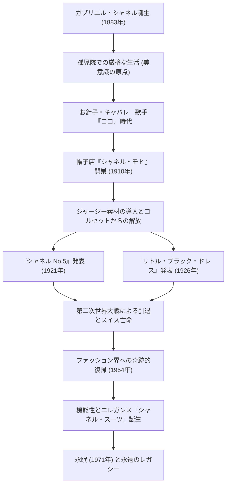

# ココ・シャネル：女性を解放した革命児の生涯と哲学

20世紀のファッション界において、ガブリエル・“ココ”・シャネルほど、女性のライフスタイルそのものを根底から覆した人物は他にいないでしょう。彼女は単なる衣服のデザイナーではなく、因習に縛られた女性たちに「自由」という名の新たな価値観を提供した思想家であり、起業家でした。本記事では、貧しい生い立ちから世界の頂点に上り詰めたココ・シャネルの生涯、その根底に流れる哲学、そして現代にまで続く多大な影響力について深く掘り下げます。

## 孤児院からキャバレーへ：逆境の少女時代

1883年、フランス南西部のソミュールで生まれたガブリエル・シャネルの幼少期は、決して華やかなものではありませんでした。12歳の時に母親が病死し、行商人の父親によって修道院付属の孤児院に預けられます。この修道院での厳格な規律と、白と黒を基調とした修道服、そして禁欲的な建築様式は、後のシャネルの美意識の原点となりました。

孤児院を出た後、彼女はお針子として働きながら、騎兵将校たちが集うキャバレーで歌を歌うようになります。この時に歌った「ココリコ（Ko Ko Ri Ko）」や「トロカデロでココを見たのは誰」という曲名から、「ココ」という愛称で呼ばれるようになりました。歌手としての成功には至りませんでしたが、ここで出会った裕福な将校エティエンヌ・バルサンや、生涯の恋人となるイギリス人実業家アーサー・“ボーイ”・カペルとの関係が、彼女の運命を大きく変えることになります。

## ファッション帝国の幕開けと「自由」への挑戦

ボーイ・カペルの資金援助を受け、1910年にパリのカンボン通りに帽子店「シャネル・モド」を開業します。当時の女性たちは、息苦しいコルセットで身体を締め付け、羽や花で過剰に装飾された巨大な帽子を被るのが常識でした。しかし、シャネルがデザインしたシンプルで実用的な帽子は、進歩的な貴族や女優たちの間で瞬く間に評判となります。

彼女の革新性は帽子に留まりませんでした。当時、男性用の下着素材としてしか使われていなかったジャージー素材に目をつけ、伸縮性があり動きやすいドレスを発表します。これは、女性の身体をコルセットから解放し、活動的で自立した現代女性のための衣服の誕生を意味しました。シャネルは自らのライフスタイルである「乗馬を楽しみ、スポーツをし、仕事をする女性」の姿を、そのままファッションへと投影したのです。

## 革命的アイコン：No.5とリトル・ブラック・ドレス

1920年代、シャネルはファッションの歴史を変える2つの伝説を生み出します。

一つは1921年に発表された香水「シャネル No.5」です。当時の香水は単一の花の香りが主流でしたが、天才調香師エルネスト・ボーと共に、天然香料に合成香料（アルデヒド）を大胆に組み合わせることで、これまでにない抽象的でモダンな香りを創り出しました。「女性の香りがする、女性のための香水」という彼女の哲学は、見事なまでに結実したのです。

もう一つは1926年に発表された「リトル・ブラック・ドレス（LBD）」です。当時、喪服としてのみ使われていた黒という色を、日常的でシックなファッションの色へと昇華させました。アメリカの『ヴォーグ』誌は、このシンプルでエレガントな黒いドレスを「シャネルのフォード（T型フォードのように広く普及し、誰もが着る服）」と絶賛しました。

## 劇的な復帰と永遠のレガシー

1939年、第二次世界大戦の勃発と共に、シャネルは香水とアクセサリーのブティックを残してクチュールハウスを閉鎖します。戦時中の行動については今なお議論の的となっていますが、戦後はスイスでの亡命生活を余儀なくされました。

しかし1954年、70歳を超えたシャネルは突如としてパリ・ファッション界に復帰します。当時の主流であった、クリスチャン・ディオールによるウエストを極端に絞った「ニュールック」に対し、彼女は「女性を窮屈な服に押し込めている」と反発しました。そこで彼女が提示したのが、動きやすく機能的でありながら、最高級のツイード素材を用いた「シャネル・スーツ」です。このスーツは、社会進出を果たす現代女性たちの戦闘服として、特にアメリカで熱狂的な支持を集めました。

1971年にパリのホテル・リッツで87年の生涯を閉じるその日まで、彼女はハサミを握り、デザインに情熱を注ぎ続けました。

## 功績の軌跡（Mermaid図解）

## 結論：シャネルが私たちに遺したもの

ココ・シャネルの哲学は「不要なものはすべて削ぎ落とす」という引き算の美学にあります。「翼を持たずに生まれてきたのなら、翼を生やすためにどんなことでもしなさい」「かけがえのない人間になるためには、常に他の人とは違っていなければならない」。彼女の残した数々の名言は、彼女自身の生き様そのものです。

シャネルがデザインしたのは、単なる衣服ではなく、「女性がどう生きるべきか」という新しい生き方の提案でした。自分の足で歩き、自分の意志で選択する。現代を生きる私たちが当たり前のように享受している自由と快適さの裏には、因習と闘い続けた一人の偉大な女性の存在があるのです。
