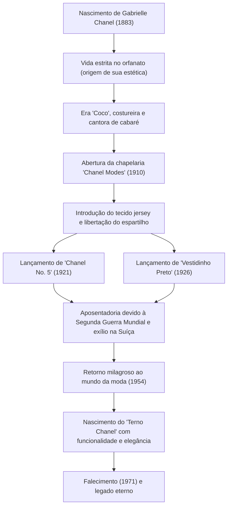

# Coco Chanel: A Vida e Filosofia da Revolucionária que Libertou as Mulheres

No mundo da moda do século XX, talvez não haja outra figura que tenha revolucionado o próprio estilo de vida das mulheres de forma tão profunda quanto Gabrielle "Coco" Chanel. Ela não era apenas uma estilista de roupas, mas sim uma pensadora e empreendedora que ofereceu um novo conjunto de valores chamado "liberdade" para mulheres limitadas por convenções. Neste artigo, vamos explorar a vida de Coco Chanel, de sua infância pobre ao topo do mundo, a filosofia subjacente a isso e sua profunda influência que perdura até hoje.

## Do Orfanato ao Cabaré: Uma Infância de Adversidades

Nascida em 1883 em Saumur, no sudoeste da França, a infância de Gabrielle Chanel não foi nada glamorosa. Aos 12 anos, sua mãe morreu de doença, e ela foi deixada por seu pai, um vendedor ambulante, em um orfanato anexo a um convento. A disciplina estrita deste convento, com seus hábitos em preto e branco e arquitetura ascética, tornou-se a origem da estética de Chanel mais tarde.

Depois de deixar o orfanato, ela trabalhou como costureira enquanto cantava em um cabaré frequentado por oficiais da cavalaria. Ela passou a ser chamada de "Coco" pelas músicas que cantava na época, como "Ko Ko Ri Ko" e "Qui qu'a vu Coco dans l'Trocadéro?". Embora não tenha tido sucesso como cantora, seus relacionamentos aqui com o rico oficial Étienne Balsan e com o industrial inglês Arthur "Boy" Capel, que se tornaria o amor de sua vida, mudariam enormemente o seu destino.

## O Início do Império da Moda e o Desafio pela "Liberdade"

Com o apoio financeiro de Boy Capel, ela abriu uma chapelaria chamada "Chanel Modes" na Rue Cambon em Paris em 1910. Era comum naquela época que as mulheres usassem espartilhos sufocantes para apertar seus corpos e chapéus gigantescos excessivamente decorados com penas e flores. No entanto, os chapéus simples e práticos projetados por Chanel rapidamente se tornaram populares entre as aristocratas progressistas e atrizes.

Sua inovação não parou nos chapéus. Ela se concentrou no tecido jersey, que na época era usado apenas para roupas íntimas masculinas, e lançou vestidos elásticos e fáceis de se mover. Isso significava a libertação do corpo da mulher do espartilho e o nascimento de roupas para a mulher moderna, ativa e independente. Chanel projetou seu próprio estilo de vida, "uma mulher que gosta de andar a cavalo, praticar esportes e trabalhar", diretamente na moda.

## Ícones Revolucionários: No. 5 e o Vestidinho Preto

Na década de 1920, Chanel criou duas lendas que mudariam a história da moda.

Uma delas foi o perfume "Chanel No. 5", lançado em 1921. O perfume predominante da época era de aroma floral único, mas junto com o genial perfumista Ernest Beaux, ela combinou audaciosamente ingredientes naturais com fragrâncias sintéticas (aldeídos) para criar um perfume moderno e abstrato sem precedentes. Sua filosofia de "um perfume para mulheres com cheiro de mulher" deu frutos de forma magnífica.

O outro foi o "Vestidinho Preto (LBD)", lançado em 1926. Ela elevou a cor preta, que era usada apenas como roupa de luto na época, a uma cor de moda cotidiana e chique. A revista americana Vogue elogiou muito este vestido preto simples e elegante como "O Ford de Chanel" (uma peça de roupa que seria tão popular quanto o Modelo T da Ford e seria usada por todas).

## Retorno Dramático e Legado Eterno

Em 1939, com a eclosão da Segunda Guerra Mundial, Chanel fechou sua casa de alta-costura, deixando apenas suas butiques de perfumes e acessórios. Embora suas ações durante a guerra continuem sendo um assunto de debate, após a guerra ela foi forçada ao exílio na Suíça.

No entanto, em 1954, Chanel, com mais de 70 anos de idade, de repente retornou ao mundo da moda parisiense. Ela se rebelou contra o "New Look" de Christian Dior, que apertava a cintura de forma extrema, a tendência dominante da época, dizendo: "Ele está forçando as mulheres a usar roupas apertadas." Então, ela introduziu o "Terno Chanel", que era fácil de se mover e funcional, mas feito com tecido tweed da mais alta qualidade. Este terno ganhou um tremendo apoio, especialmente na América, como o uniforme de combate para mulheres modernas avançando na sociedade.

Até o dia de sua morte aos 87 anos no Hotel Ritz em Paris, em 1971, ela continuou a segurar tesouras e colocar sua paixão no design.

## Trajetória de Conquistas (Diagrama Mermaid)

## Conclusão: O Que Chanel Nos Deixou

A filosofia de Coco Chanel reside na estética da subtração: "Remova tudo o que for desnecessário". "Se você nasceu sem asas, não faça nada para impedi-las de crescer." "Para ser insubstituível, deve-se sempre ser diferente." As muitas citações que ela deixou são o próprio reflexo do seu jeito de viver.

O que Chanel projetou não foram apenas roupas, mas uma nova proposta de vida sobre "como as mulheres devem viver". Andar com as próprias pernas e fazer escolhas por vontade própria. Por trás da liberdade e do conforto que nós que vivemos nos tempos modernos desfrutamos como algo natural, está a presença de uma grande mulher que continuou a lutar contra as convenções.
