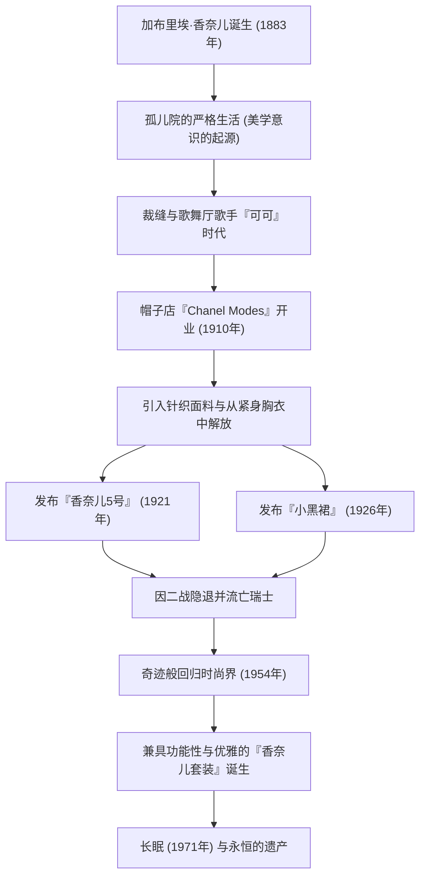

# 可可·香奈儿：解放女性的革命者的生平与哲学

在20世纪的时尚界，也许没有人能像加布里埃·“可可”·香奈儿那样从根本上颠覆了女性的生活方式。她不仅仅是一位服装设计师，更是一位思想家和企业家，为受传统束缚的女性提供了一种名为“自由”的全新价值观。在本文中，我们将深入探讨可可·香奈儿从贫困走向世界巅峰的一生、其作品背后的哲学，以及她至今仍具有的巨大影响力。

## 从孤儿院到歌舞厅：逆境中的童年

1883年出生于法国西南部索米尔的加布里埃·香奈儿，她的童年绝不光鲜。12岁时，母亲病逝，她被做小贩的父亲送进了修道院附属的孤儿院。修道院里严格的纪律、以黑白为主色调的修女服饰，以及禁欲主义的建筑风格，成为了香奈儿美学意识的起源。

离开孤儿院后，她一边做裁缝，一边在骑兵军官经常光顾的歌舞厅唱歌。从她当时演唱的《Ko Ko Ri Ko》和《谁在特罗卡德罗见过可可？》等歌曲名中，人们开始用“可可”这个昵称来称呼她。虽然她作为歌手并没有取得成功，但在这里她遇到了富有的军官艾蒂安·巴尔桑，以及她一生的挚爱——英国实业家亚瑟·“男孩”·卡佩尔，这些关系彻底改变了她的命运。

## 时尚帝国的黎明与对“自由”的挑战

在男孩·卡佩尔的资金支持下，她于1910年在巴黎康朋街开设了一家名为“Chanel Modes”的帽子店。当时的女性习惯用令人窒息的紧身胸衣束缚身体，并戴着装饰着过量羽毛和花朵的巨大帽子，这在当时是常识。然而，香奈儿设计得简单而实用的帽子，很快在进步的贵族和女演员中赢得了声誉。

她的创新并没有止步于帽子。她注意到当时仅用于男士内衣的针织面料，并推出了富有弹性、便于活动的连衣裙。这意味着女性身体从紧身胸衣中解放出来，也是为积极、独立的现代女性而生的服装的诞生。香奈儿直接将她自己的生活方式——一个“喜欢骑马、运动和工作的女性”——投射到了时尚中。

## 革命性的标志：5号香水与小黑裙

在20世纪20年代，香奈儿创造了改变时尚历史的两大传奇。

一个是1921年发布的“香奈儿5号”香水。虽然当时以单一花香为主流，但她与天才调香师恩尼斯·鲍合作，大胆地将天然香料与合成香料（醛类）结合在一起，创造出一种前所未有的抽象而现代的香味。她“带有女人味的女性香水”的哲学，结出了绚丽的果实。

另一个是1926年发布的“小黑裙（LBD）”。她将当时仅用于丧服的黑色，提升为日常别致时尚的颜色。美国《Vogue》杂志称赞这款简单而优雅的黑色连衣裙为“香奈儿的福特”（像T型福特汽车一样被广泛普及、每个人都会穿的服装）。

## 戏剧性的回归与永恒的遗产

1939年，随着第二次世界大战的爆发，香奈儿关闭了她的高级定制时装屋，只留下了香水和配饰精品店。尽管她在战争期间的行为至今仍是一个争议的话题，但战后她被迫流亡瑞士。

然而，在1954年，年逾70的香奈儿突然回到了巴黎时尚界。与当时克里斯汀·迪奥极度收紧腰部的“新风貌”主流相反，她反驳说这是“把女性塞进狭窄的衣服里”。她所呈现的是“香奈儿套装”，它不仅易于活动且功能齐全，还使用了顶级的粗花呢面料。这款套装作为步入社会的现代女性的战袍，尤其在美国获得了狂热的支持。

直到1971年她在巴黎丽兹酒店结束了87岁的生命那一天，她依然手握剪刀，将热情倾注于设计之中。

## 功绩轨迹（Mermaid图解）

## 结论：香奈儿留给了我们什么

可可·香奈儿的哲学在于做减法的美学：“去掉所有不必要的东西。”“如果你生来就没有翅膀，那就不要阻止它们长出来，”以及“要成为不可替代的人，必须始终与众不同。”她留下的许多名言正是她自己生活方式的真实写照。

香奈儿设计的不仅仅是衣服，更是一种全新生活方式的提议：“女性应该如何生活。”用自己的双脚走路，按照自己的意志做出选择。在我们现代女性理所当然地享受着的自由与舒适背后，有着一位不断与传统抗争的伟大女性的存在。
