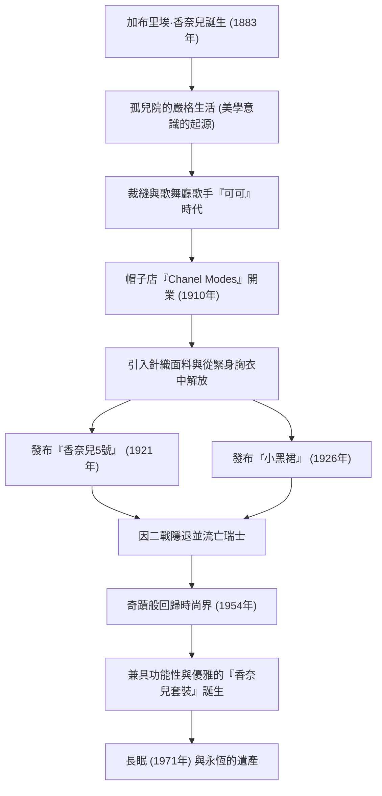

# 可可·香奈兒：解放女性的革命者的生平與哲學

在20世紀的時尚界，也許沒有人能像加布里埃·「可可」·香奈兒那樣從根本上顛覆了女性的生活方式。她不僅僅是一位服裝設計師，更是一位思想家和企業家，為受傳統束縛的女性提供了一種名為「自由」的全新價值觀。在本文中，我們將深入探討可可·香奈兒從貧困走向世界巔峰的一生、其作品背後的哲學，以及她至今仍具有的巨大影響力。

## 從孤兒院到歌舞廳：逆境中的童年

1883年出生於法國西南部索米爾的加布里埃·香奈兒，她的童年絕不光鮮。12歲時，母親病逝，她被做小販的父親送進了修道院附屬的孤兒院。修道院裡嚴格的紀律、以黑白為主色調的修女服飾，以及禁慾主義的建築風格，成為了香奈兒美學意識的起源。

離開孤兒院後，她一邊做裁縫，一邊在騎兵軍官經常光顧的歌舞廳唱歌。從她當時演唱的《Ko Ko Ri Ko》和《誰在特羅卡德羅見過可可？》等歌曲名中，人們開始用「可可」這個暱稱來稱呼她。雖然她作為歌手並沒有取得成功，但在這裡她遇到了富有的軍官艾蒂安·巴爾桑，以及她一生的摯愛——英國實業家亞瑟·「男孩」·卡佩爾，這些關係徹底改變了她的命運。

## 時尚帝國的黎明與對「自由」的挑戰

在男孩·卡佩爾的資金支持下，她於1910年在巴黎康朋街開設了一家名為「Chanel Modes」的帽子店。當時的女性習慣用令人窒息的緊身胸衣束縛身體，並戴著裝飾著過量羽毛和花朵的巨大帽子，這在當時是常識。然而，香奈兒設計得簡單而實用的帽子，很快在進步的貴族和女演員中贏得了聲譽。

她的創新並沒有止步於帽子。她注意到當時僅用於男士內衣的針織面料，並推出了富有彈性、便於活動的連衣裙。這意味著女性身體從緊身胸衣中解放出來，也是為積極、獨立的現代女性而生的服裝的誕生。香奈兒直接將她自己的生活方式——一個「喜歡騎馬、運動和工作的女性」——投射到了時尚中。

## 革命性的標誌：5號香水與小黑裙

在20世紀20年代，香奈兒創造了改變時尚歷史的兩大傳奇。

一個是1921年發布的「香奈兒5號」香水。雖然當時以單一花香為主流，但她與天才調香師恩尼斯·鮑合作，大膽地將天然香料與合成香料（醛類）結合在一起，創造出一種前所未有的抽象而現代的香味。她「帶有女人味的女性香水」的哲學，結出了絢麗的果實。

另一個是1926年發布的「小黑裙（LBD）」。她將當時僅用於喪服的黑色，提升為日常別緻時尚的顏色。美國《Vogue》雜誌稱讚這款簡單而優雅的黑色連衣裙為「香奈兒的福特」（像T型福特汽車一樣被廣泛普及、每個人都會穿的服裝）。

## 戲劇性的回歸與永恆的遺產

1939年，隨著第二次世界大戰的爆發，香奈兒關閉了她的高級定制時裝屋，只留下了香水和配飾精品店。儘管她在戰爭期間的行為至今仍是一個爭議的話題，但戰後她被迫流亡瑞士。

然而，在1954年，年逾70的香奈兒突然回到了巴黎時尚界。與當時克里斯汀·迪奧極度收緊腰部的「新風貌」主流相反，她反駁說這是「把女性塞進狹窄的衣服裡」。她所呈現的是「香奈兒套裝」，它不僅易於活動且功能齊全，還使用了頂級的粗花呢面料。這款套裝作為步入社會的現代女性的戰袍，尤其在美國獲得了狂熱的支持。

直到1971年她在巴黎麗茲酒店結束了87歲的生命那一天，她依然手握剪刀，將熱情傾注於設計之中。

## 功績軌跡（Mermaid圖解）

## 結論：香奈兒留給了我們什麼

可可·香奈兒的哲學在於做減法的美學：「去掉所有不必要的東西。」「如果你生來就沒有翅膀，那就不要阻止它們長出來，」以及「要成為不可替代的人，必須始終與眾不同。」她留下的許多名言正是她自己生活方式的真實寫照。

香奈兒設計的不僅僅是衣服，更是一種全新生活方式的提議：「女性應該如何生活。」用自己的雙腳走路，按照自己的意志做出選擇。在我們現代女性理所當然地享受著的自由與舒適背後，有著一位不斷與傳統抗爭的偉大女性的存在。
