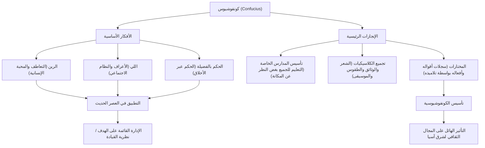

من هو المؤثر الأكبر في التاريخ؟ في عصرنا الحالي قد يتبادر إلى الذهن [ستيف جوبز](/ar/p/biography-steve-jobs/) أو إيلون ماسك، ولكن هناك شخصية اجتاحت شرق آسيا بأكملها قبل أكثر من 2500 عام وما زالت أفكارها حية حتى اليوم. إنه "كونفوشيوس".

في هذا المقال، ومن منظور كاتب تاريخي محترف، سنتعمق في الحياة المليئة بالأحداث لشخصية كونفوشيوس، والفلسفة المبتكرة التي نادى بها، وتأثيره الهائل الذي يمتد إلى المجتمع الحديث والأعمال.

## من هو كونفوشيوس؟: مبتكر في عصر الربيع والخريف

كان كونفوشيوس (551 ق.م - 479 ق.م) مفكراً ومربياً وفيلسوفاً نشطاً خلال فترة الربيع والخريف في الصين. اسمه الحقيقي كونغ تشيو، واسمه الشرفي تشونغ ني. أما "كونفوشيوس" فهو لقب احترام يعني "المعلم كونغ".

في ذلك الوقت، كانت الصين تعيش فترة من الفوضى حيث فقدت سلالة تشو سلطتها وتنافست الدول الإقطاعية على الهيمنة. في عصر ساد فيه التمرد وانحطت فيه الأخلاق، واجه كونفوشيوس التحدي العظيم المتمثل في "كيفية بناء مجتمع سلمي ومنظم". يمكن القول إن أفكاره لم تكن مجرد نظريات أكاديمية، بل كانت اقتراحاً لنظام اجتماعي عملي (نظام تشغيل) للبقاء في أوقات الفوضى.

## حياة مليئة بالأحداث: رحلة الإحباط والاستكشاف

### شباب محبط وصحوة نحو التعلم
ولد كونفوشيوس في عائلة نبيلة فقيرة في ولاية لو (مقاطعة شاندونغ الحالية). فقد والده في سن مبكرة ونشأ في بيئة فقيرة، لكنه حول المحن إلى دافع للدراسة بجد. مقولته الشهيرة في "مختارات كونفوشيوس": "في الخامسة عشرة من عمري وجهت قلبي نحو التعلم" معروفة جداً. لقد درس التاريخ الماضي وآداب السلوك (الطقوس) بدقة، وبنى نظامه الفكري الخاص.

### التحديات والإحباطات كسياسي
بعد تجاوزه الخمسين من عمره، تولى كونفوشيوس أخيراً مناصب مهمة (مثل وزير العدل) في ولاية لو، وحصل على فرصة لتطبيق سياسته المثالية. وبفضل مهاراته الاستثنائية، استقرت البلاد مؤقتاً، لكن بسبب الصراعات مع أصحاب المصالح الخاصة ومؤامرات الدول الأخرى، فقد منصبه في غضون سنوات قليلة. لقد كانت لحظة اصطدام بين المثل الأعلى والواقع.

### السفر بين الدول والتفرغ للتعليم
طُرد كونفوشيوس من وطنه، وانطلق في رحلة استمرت 13 عاماً متجولاً بين الدول مع تلاميذه بحثاً عن حاكم يتبنى أفكاره (نظام التشغيل المحدث). ومع ذلك، في عصر كانت فيه الأولوية للتوسع العسكري والهيمنة، لم تلق أفكار كونفوشيوس التي تدعو إلى الحكم بالأخلاق قبولاً، وتعرضت حياته للخطر عدة مرات.

في سنواته الأخيرة، عاد كونفوشيوس أخيراً إلى وطنه لو، وانسحب من عالم السياسة ليتفرغ لتربية الأجيال القادمة وتجميع الكتب الكلاسيكية. يُقال إن مدرسته الخاصة جذبت العديد من الشباب بغض النظر عن مكانتهم الاجتماعية، وبلغ عددهم حوالي 3000 طالب.

## فلسفة كونفوشيوس: نظام تشغيل للقيادة يصلح للعصر الحديث

تتمحور فلسفة كونفوشيوس حول مفاهيم "الرين" (الإنسانية) و"اللي" (الطقوس)، وما يُبنى عليهما من "حكم بالفضيلة".

### "الرين": روح المحبة والتعاطف الإنساني
"الرين" هي التعاطف، والرحمة، ومراعاة الآخرين. قال كونفوشيوس: "ما لا ترضاه لنفسك، لا تفعله بغيرك". هذا مبدأ عالمي ينطبق على مراعاة أصحاب المصلحة في الأعمال الحديثة والسلامة النفسية في بناء فرق العمل.

### "اللي": النظام الاجتماعي والقواعد
تشير "اللي" إلى القواعد واللوائح اللازمة للتعبير عن "الرين" كأفعال ملموسة. مهما كان المبدأ (الرين) رائعاً، فلن يعمل المجتمع إذا لم تكن هناك واجهة (اللي) للتعبير عنه بشكل مناسب. أكد كونفوشيوس على أهمية التوازن بين الأخلاق الداخلية والأعراف الاجتماعية الخارجية.

### "الحكم بالفضيلة": الحوكمة عبر الأخلاق
بدلاً من إجبار الناس على الطاعة من خلال القوانين والعقوبات (حكم القانون)، يُطلق على الأسلوب السياسي الذي يلهم الناس ويجعلهم يتصرفون بشكل صحيح طواعية من خلال الأخلاق العالية للقائد (الفضيلة) اسم "الحكم بالفضيلة". قد يُعتبر هذا سلفاً لمفهوم "الإدارة القائمة على الهدف" في إدارة الشركات الحديثة، حيث تُقاد المنظمة برؤية وهدف.

## التأثير على الأجيال القادمة: القيم الأساسية لشرق آسيا

بعد وفاة كونفوشيوس، جمع تلاميذه تعاليمه في كتاب "المختارات"، وتطورت لاحقاً إلى نظام فكري قوي يُعرف باسم "الكونفوشيوسية".

تم اعتمادها كدراسة رسمية للدولة (دين الدولة) خلال عهد أسرة هان، وأصبحت منذ ذلك الحين أساساً للسياسة والمجتمع والتعليم في الصين لأكثر من 2000 عام. أصبح تأثيرها مطلقاً عندما أصبحت الكونفوشيوسية مادة إلزامية في امتحانات الخدمة المدنية الإمبراطورية.

علاوة على ذلك، انتشرت تعاليم الكونفوشيوسية إلى الدول المجاورة مثل شبه الجزيرة الكورية واليابان، وتركت بصمة عميقة على الأخلاق والثقافة في شرق آسيا بأسرها. ولا تزال أفكار كونفوشيوس تنبض بالحياة في جذور بوشيدو (طريق المحارب) في اليابان خلال فترة إيدو، وفي الثقافة التنظيمية للشركات اليابانية الحديثة (الأقدمية والولاء وروح احترام الانسجام).

## الخلاصة: تعاليم كونفوشيوس لا تبلى

لم تكن حياة كونفوشيوس خالية من الصعوبات. فقد واجه إحباطات كسياسي، ولم تتحقق مثله العليا بالكامل خلال حياته. ومع ذلك، فإن بذرة "التعليم" التي زرعها نمت لتصبح شجرة عظيمة تتجاوز الزمان والمكان.

في عصرنا الحالي الذي يتساءل فيه الناس عن ماهية الإنسان وكيف يجب أن يكون المجتمع بسبب التطور التكنولوجي السريع، فإن فلسفة كونفوشيوس التي تدعو إلى "الرين" و"اللي" يجب أن تكون بوصلة قوية نعود إليها.

### هيكل أفكار كونفوشيوس وإنجازاته (رسم توضيحي Mermaid)

