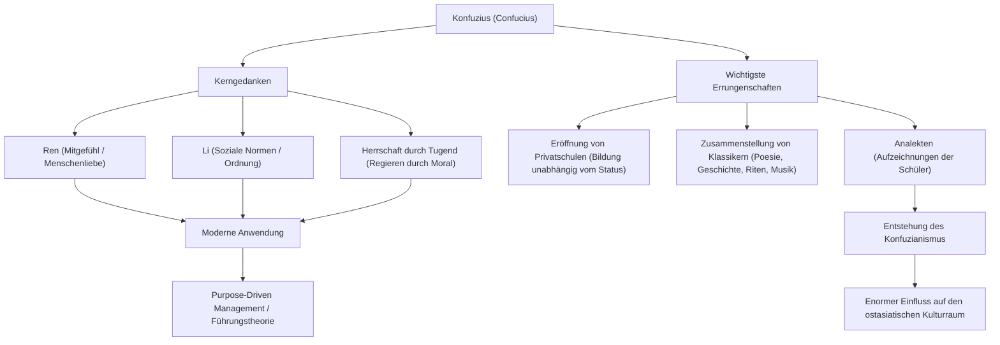

Wer war der einflussreichste Influencer der Geschichte? In der heutigen Zeit denken Sie vielleicht an Steve Jobs oder Elon Musk, aber es gibt eine Person, die vor über 2500 Jahren ganz Ostasien im Sturm eroberte und deren Ideen noch heute weiterleben. Das ist „Konfuzius“.

In diesem Artikel werden wir aus der Perspektive eines professionellen Historikers tief in das turbulente Leben von Konfuzius, seine innovative Philosophie und seinen enormen Einfluss eintauchen, der auch in der modernen Gesellschaft und Wirtschaft noch nachwirkt.

## Wer war Konfuzius?: Ein Innovator der Frühlings- und Herbstperiode

Konfuzius (551 v. Chr. – 479 v. Chr.) war ein Denker, Pädagoge und Philosoph, der während der Frühlings- und Herbstperiode in China wirkte. Sein richtiger Name war Kong Qiu (Kǒng Qiū) und sein Höflichkeitsname war Zhongni (Zhòngní). „Konfuzius“ (Kongzi) ist ein Ehrentitel, der „Meister Kong“ bedeutet.

Das China jener Zeit war eine turbulente Welt, in der die Autorität der Zhou-Dynastie gesunken war und Feudalherren um die Vorherrschaft kämpften. In einer Ära, in der Untergebene ihre Vorgesetzten stürzten und die Moral am Boden lag, stellte sich Konfuzius der monumentalen Aufgabe: „Wie können wir eine friedliche und geordnete Gesellschaft aufbauen?“ Man kann sagen, dass seine Ideen keine bloße Theorie waren, sondern der Vorschlag eines praktischen sozialen Systems (OS), um in unruhigen Zeiten zu überleben.

## Ein turbulentes Leben: Eine Reise voller Rückschläge und Entdeckungen

### Eine unglückliche Jugend und das Erwachen zum Lernen
Konfuzius wurde in einer verarmten Adelsfamilie im Staat Lu (in der heutigen Provinz Shandong) geboren. Er verlor seinen Vater in jungen Jahren und wuchs in armen Verhältnissen auf, nutzte jedoch diese Widrigkeiten als Ansporn für intensives Studium. Berühmt sind seine Worte aus den *Analekten*: „Mit fünfzehn richtete ich meinen Geist auf das Lernen.“ Er studierte die Geschichte und die Etikette (Li) gründlich und baute sein eigenes philosophisches System auf.

### Herausforderungen und Rückschläge als Politiker
Im Alter von über 50 Jahren übernahm Konfuzius schließlich wichtige Ämter (wie das des Justizministers) im Staat Lu und erhielt die Gelegenheit, seine politischen Ideale in die Praxis umzusetzen. Dank seiner außergewöhnlichen Fähigkeiten stabilisierte sich das Land vorübergehend, aber aufgrund von Konflikten mit etablierten Interessen und den Intrigen anderer Staaten verlor er nach nur wenigen Jahren seine Position. Es war der Moment, in dem er mit der Realität kollidierte.

### Wanderungen durch die Staaten und Hingabe an die Bildung
Aus seinem Heimatland vertrieben, begab sich Konfuzius mit seinen Schülern auf eine 13-jährige Reise durch verschiedene Staaten, auf der Suche nach einem Herrscher, der seine Ideen (das aktualisierte OS) übernehmen würde. In einer Zeit, in der die Ausweitung der Hegemonie durch militärische Gewalt (der Weg des Hegemons) im Vordergrund stand, wurden Konfuzius' Ideen der Herrschaft durch Moral (der Königsweg) jedoch nicht akzeptiert, und sein Leben war mehrfach in Gefahr.

In seinen späten Jahren kehrte Konfuzius schließlich in seine Heimat Lu zurück, zog sich aus der Politik zurück und widmete sich der Ausbildung der nächsten Generation sowie der Zusammenstellung der Klassiker. In seiner Privatschule versammelten sich viele junge Menschen unabhängig von ihrem sozialen Status; man sagt, es seien bis zu 3000 Schüler gewesen.

## Die Philosophie des Konfuzius: Ein OS für Führung, das auch heute noch relevant ist

Der Kern der Philosophie des Konfuzius liegt in „Ren“ (Mitmenschlichkeit) und „Li“ (Riten/Etikette) und der darauf basierenden „Herrschaft durch Tugend“.

### „Ren“: Der Geist der Menschenliebe und Empathie
„Ren“ ist Mitgefühl, Liebe und Empathie gegenüber anderen. Konfuzius lehrte: „Was du selbst nicht wünschst, das tue auch anderen nicht an.“ Dies ist ein universelles Prinzip, das sich auf die Rücksichtnahme auf Stakeholder in der modernen Geschäftswelt und auf psychologische Sicherheit beim Teambuilding übertragen lässt.

### „Li“: Gesellschaftliche Ordnung und Normen
„Li“ bezieht sich auf die Normen und Regeln, um „Ren“ in konkrete Handlungen umzusetzen. Egal wie wunderbar ein Ideal (Ren) ist, ohne eine Schnittstelle (Li), um es angemessen auszudrücken, kann die Gesellschaft nicht funktionieren. Konfuzius betonte das Gleichgewicht zwischen innerer Moral und äußeren sozialen Normen.

### „Herrschaft durch Tugend“: Governance durch Ethik
Die politische Methode, Menschen nicht durch Gesetze und Strafen (Legalismus) zum Gehorsam zu zwingen, sondern sie durch die hohe Moral (Tugend) des Führers zu inspirieren, aus freien Stücken richtig zu handeln, wird als „Herrschaft durch Tugend“ bezeichnet. In der modernen Unternehmensführung könnte man dies als Vorläufer des „Purpose-Driven Managements“ bezeichnen, bei dem eine Organisation durch Visionen und Ziele geleitet wird.

## Einfluss auf die Nachwelt: Ein grundlegendes Wertesystem für Ostasien

Nach dem Tod des Konfuzius wurden seine Lehren von seinen Schülern in den *Analekten* zusammengefasst und entwickelten sich später zu einem mächtigen philosophischen System namens „Konfuzianismus“.

Während der Han-Dynastie wurde er als orthodoxe Staatslehre (Staatsreligion) übernommen und bildete über 2000 Jahre lang die Grundlage für Politik, Gesellschaft und Bildung in China. Da der Konfuzianismus als Hauptfach für die kaiserlichen Beamtenprüfungen (Keju) obligatorisch gemacht wurde, wurde sein Einfluss absolut.

Darüber hinaus verbreiteten sich die Lehren des Konfuzianismus in benachbarten Ländern wie der koreanischen Halbinsel und Japan und hinterließen tiefe Spuren in den ethischen Werten und der Kultur ganz Ostasiens. Auch die Grundlagen des Bushido im Japan der Edo-Zeit und die Unternehmenskultur moderner japanischer Firmen (Senioritätsprinzip, Loyalität, Wertschätzung der Harmonie) sind stark von den Ideen des Konfuzius geprägt.

## Fazit: Die Lehren des Konfuzius veralten nicht

Das Leben von Konfuzius verlief keineswegs reibungslos. Als Politiker scheiterte er, und seine Ideale wurden zu seinen Lebzeiten nie vollständig verwirklicht. Doch der Same der „Bildung“, den er pflanzte, wuchs über Raum und Zeit hinweg zu einem großen Baum heran.

In der modernen Welt, in der die rasante technologische Entwicklung Fragen darüber aufwirft, was es bedeutet, menschlich zu sein und wie die Gesellschaft sein sollte, kann die Philosophie des Konfuzius, die „Ren“ und „Li“ lehrt, ein starker Kompass sein, zu dem wir zurückkehren sollten.

### Die Struktur von Konfuzius' Gedanken und Errungenschaften (Mermaid-Diagramm)

