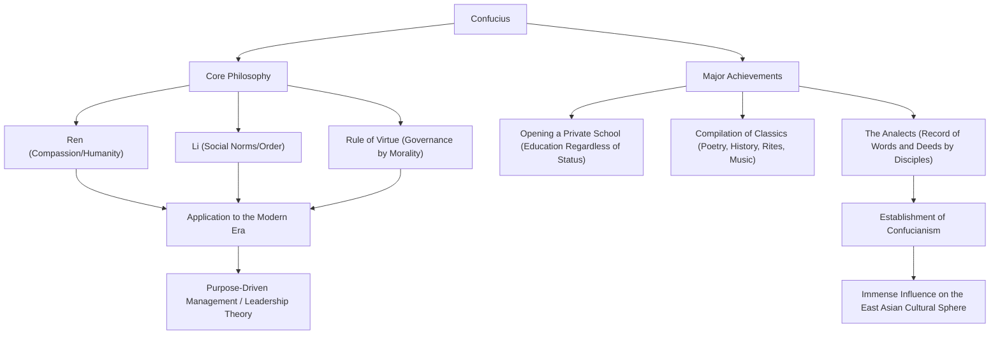

Who is the most influential influencer in history? In the modern era, you might think of Steve Jobs or Elon Musk, but there is a figure who swept across East Asia over 2,500 years ago and whose ideas are still passed down today. That is "Confucius."

In this article, from the perspective of a professional history writer, we will delve deeply into the turbulent life of Confucius, the innovative philosophy he advocated, and his profound influence that still applies to modern society and business.

## Who is Confucius?: An Innovator of the Spring and Autumn Period

Confucius (551 BC - 479 BC) was a thinker, educator, and philosopher who flourished during the Spring and Autumn period in China. His real name was Kong Qiu, and his courtesy name was Zhong Ni. "Confucius" is an honorific title meaning "Master Kong."

At that time, China was in a turbulent era where the authority of the Zhou dynasty had fallen, and feudal lords vied for supremacy. In an age where insubordination was rampant and morals had plummeted to the ground, Confucius took on the grand challenge of "how to build a peaceful and orderly society." His philosophy was not merely empty theory; it can be said that it was a proposal for a practical social system (OS) to survive turbulent times.

## A Turbulent Life: A Journey of Setbacks and Exploration

### An Unfortunate Youth and an Awakening to Learning
Confucius was born into a ruined aristocratic family in the state of Lu (modern-day Shandong province). He lost his father at a young age and grew up in poverty, but he used adversity as a springboard to study furiously. The saying from the Analects, "At fifteen, I set my heart on learning," is extremely famous. He thoroughly studied past history and etiquette (Li), building his own philosophical system.

### Challenges and Setbacks as a Politician
After turning 50, Confucius finally took a key position (such as Minister of Crime) in the state of Lu and gained the opportunity to put his ideal politics into practice. Under his outstanding leadership, the state temporarily stabilized, but due to conflicts with vested interests and the conspiracies of other states, he lost his position in just a few years. It was the moment he hit the wall between ideals and reality.

### Wandering Through States and Devotion to Education
Driven from his homeland, Confucius, together with his disciples, set out on a journey wandering through various states for 13 years in search of a lord who would adopt his ideas (an updated OS). However, in an era that emphasized the expansion of hegemony through military force (the Way of the Hegemon), Confucius's philosophy of rule by morality (the Kingly Way) was not accepted, and his life was threatened on several occasions.

In his later years, Confucius finally returned to his homeland of Lu, stepped away from the political world, and devoted himself to educating the younger generation and compiling classics. It is said that many young people gathered at the private school he opened, regardless of their social status, and their number reached up to 3,000.

## The Philosophy of Confucius: An OS for Leadership in the Modern World

The core of Confucius's philosophy lies in "Ren" (benevolence or humanity) and "Li" (propriety or rites), and the "Rule of Virtue" based on them.

### "Ren": The Spirit of Humanity and Empathy
"Ren" is consideration for others, compassion, and a heart of empathy. Confucius preached, "Do not do to others what you do not want done to yourself." This is a universal principle that also applies to consideration for stakeholders in modern business and psychological safety in team building.

### "Li": Social Order and Norms
"Li" refers to the norms and rules for expressing "Ren" as concrete actions. No matter how wonderful the ideal (Ren) is, society will not function without an interface (Li) to appropriately express it. Confucius emphasized the balance between inner morality and outer social norms.

### "Rule of Virtue": Governance through Ethics
Rather than forcing people to obey through laws and punishments (Legalism), the political method of inspiring people through the leader's high morality (virtue) and having them voluntarily take correct action is called the "Rule of Virtue." It could be called the forerunner of "purpose-driven management" that guides an organization by vision and purpose in modern corporate management.

## Influence on Later Generations: To the Foundational Values of East Asia

After Confucius's death, his teachings were compiled by his disciples into the Analects, which later developed into a powerful philosophical system known as "Confucianism."

During the Han dynasty, it was adopted as the orthodox learning of the state (state religion), and thereafter served as the foundation of politics, society, and education in China for over 2,000 years. As Confucianism was made a compulsory subject for the imperial civil service examinations (Keju), its influence became absolute.

Furthermore, the teachings of Confucianism spread to neighboring countries such as the Korean Peninsula and Japan, leaving a deep mark on the ethics and culture of East Asia as a whole. Confucius's ideas continue to breathe at the root of Bushido in Edo-period Japan and the organizational culture of modern Japanese companies (such as the seniority system, loyalty, and the spirit of valuing harmony).

## Conclusion: The Teachings of Confucius Never Age

Confucius's life was by no means entirely smooth sailing. He suffered setbacks as a politician, and his ideals were never fully realized during his lifetime. However, the seed of "education" he planted grew into a great tree across time and space.

In the modern age, where rapid technological advancement makes us question what it means to be human and how society should be, the philosophy of Confucius, who preached "Ren" and "Li," should serve as a powerful compass that we should return to.

### The Structure of Confucius's Thoughts and Achievements (Mermaid Diagram)

