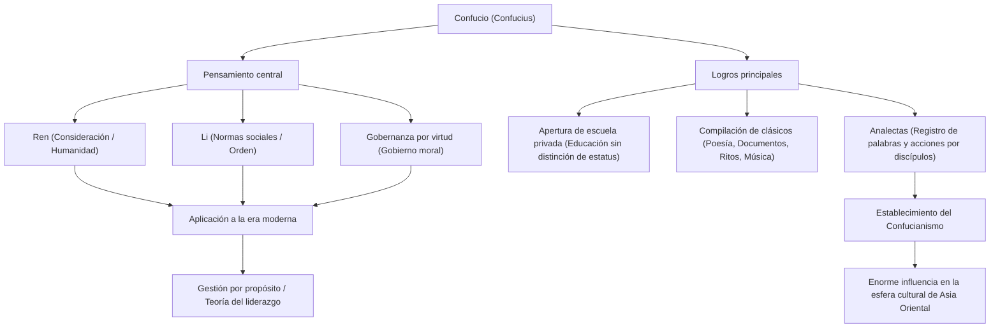

¿Quién es el influencer más influyente de la historia? En la actualidad, uno podría pensar en Steve Jobs o Elon Musk, pero hay una figura que arrasó en toda Asia Oriental hace más de 2500 años y cuya filosofía todavía se transmite hoy. Ese es "Confucio".

En este artículo, desde la perspectiva de un escritor histórico profesional, profundizaremos en la turbulenta vida de Confucio, la filosofía innovadora que defendió y su tremenda influencia, que se extiende a la sociedad y los negocios modernos.

## ¿Quién era Confucio?: Un innovador del período de Primaveras y Otoños

Confucio (551 a.C. - 479 a.C.) fue un pensador, educador y filósofo activo durante el período de Primaveras y Otoños en China. Su verdadero nombre era Kong Qiu, y su nombre de cortesía era Zhongni. "Confucio" (Kongzi) es un título honorífico que significa "Maestro Kong".

La China de esa época era un mundo caótico donde la autoridad de la dinastía Zhou había caído y los señores feudales luchaban por la hegemonía. En una era en la que la usurpación era desenfrenada y la moralidad había caído por los suelos, Confucio abordó el grandioso desafío de "cómo construir una sociedad pacífica y ordenada". Se puede decir que su pensamiento no era una simple teoría de escritorio, sino la propuesta de un sistema social práctico (OS) para sobrevivir en tiempos turbulentos.

## Una vida turbulenta: Un viaje de reveses y exploración

### Una juventud desafortunada y el despertar académico
Confucio nació en una familia aristocrática arruinada en el estado de Lu (actual provincia de Shandong). Perdió a su padre a una edad temprana y creció en un ambiente pobre, pero usó la adversidad como trampolín para estudiar intensamente. La frase de las "Analectas", "A los quince años puse mi corazón en el aprendizaje", es muy famosa. Estudió a fondo la historia pasada y la etiqueta (Li) y construyó su propio sistema de pensamiento original.

### Desafíos y reveses como político
Al pasar de los 50 años, Confucio finalmente asumió un cargo importante en el estado de Lu (como Ministro de Justicia) y obtuvo la oportunidad de poner en práctica su política ideal. Gracias a su destacada habilidad, el estado se estabilizó temporalmente, pero debido a conflictos con grupos de intereses creados y conspiraciones de otros estados, perdió su puesto en unos pocos años. Fue el momento en que chocó contra el muro entre el ideal y la realidad.

### Vagando por varios estados y dedicación a la educación
Obligado a abandonar su tierra natal, Confucio emprendió un viaje de 13 años por varios estados con sus discípulos, en busca de un gobernante que adoptara sus ideas (su OS actualizado). Sin embargo, en una época en que se enfatizaba la expansión de la hegemonía a través de la fuerza militar (el camino del hegemón), la filosofía de Confucio que predicaba el gobierno a través de la moralidad (el camino del rey) no fue aceptada y su vida estuvo en peligro muchas veces.

En sus últimos años, Confucio finalmente regresó a su tierra natal, Lu, se retiró del mundo de la política y se dedicó a educar a la generación más joven y a compilar clásicos. Se dice que en la escuela privada que abrió se reunieron muchos jóvenes sin importar su estatus social, y que su número llegó a 3000.

## La filosofía de Confucio: Un sistema operativo de liderazgo relevante hoy en día

El núcleo del pensamiento de Confucio radica en "Ren" (benevolencia) y "Li" (rito/etiqueta), y en la "gobernanza por virtud" basada en ellos.

### "Ren": El espíritu de la humanidad y la empatía
"Ren" es la consideración, el amor compasivo y la empatía hacia los demás. Confucio enseñó: "Lo que no desees para ti, no se lo hagas a los demás". Este es un principio universal que también se aplica a la consideración por las partes interesadas (stakeholders) en los negocios modernos y la seguridad psicológica en la formación de equipos.

### "Li": Orden social y normas
"Li" se refiere a las normas y reglas para expresar el "Ren" como acciones concretas. No importa cuán maravillosa sea una idea (Ren), la sociedad no puede funcionar si no hay una interfaz adecuada (Li) para expresarla. Confucio enfatizó el equilibrio entre la moralidad interna y las normas sociales externas.

### "Gobernanza por virtud": Gobernabilidad a través de la ética
El método político de no obligar a la gente a obedecer mediante leyes o castigos (legalismo), sino de inspirar a las personas a través de la alta moralidad (virtud) del propio líder y hacer que tomen acciones correctas voluntariamente, se llama "gobernanza por virtud". En la gestión empresarial moderna, se podría decir que es el precursor de la "gestión por propósito" (purpose management) que guía a la organización por medio de una visión o propósito.

## Impacto en las generaciones posteriores: Los valores fundamentales de Asia Oriental

Después de la muerte de Confucio, sus enseñanzas fueron compiladas por sus discípulos en las "Analectas", que luego se convirtieron en un poderoso sistema de pensamiento llamado "Confucianismo".

Durante la dinastía Han, fue adoptado como el aprendizaje ortodoxo (religión de estado) de la nación, y desde entonces se convirtió en la base de la política, la sociedad y la educación chinas durante más de 2000 años. Al hacerse obligatorio el Confucianismo como materia principal en los exámenes imperiales (Keju), su influencia se volvió absoluta.

Además, las enseñanzas del Confucianismo se extendieron a los países vecinos, como la península de Corea y Japón, dejando una profunda huella en la ética y la cultura de toda Asia Oriental. La filosofía de Confucio sigue viva en el Bushido del período Edo en Japón y en la base de la cultura organizacional de las empresas japonesas modernas (sistema de antigüedad, lealtad, espíritu de valorar la armonía).

## Conclusión: Las enseñanzas de Confucio no envejecen

La vida de Confucio no fue viento en popa de ninguna manera. Como político, fracasó, y sus ideales nunca se hicieron realidad por completo durante su vida. Sin embargo, la semilla de la "educación" que plantó se convirtió en un gran árbol a través del espacio y el tiempo.

En esta era moderna, donde la rápida evolución de la tecnología nos hace cuestionarnos qué es el ser humano y cómo debería ser la sociedad, la filosofía de Confucio que predicaba el "Ren" y el "Li" debería servir como una poderosa brújula a la que debemos regresar.

### Estructura del pensamiento y los logros de Confucio (Diagrama Mermaid)

