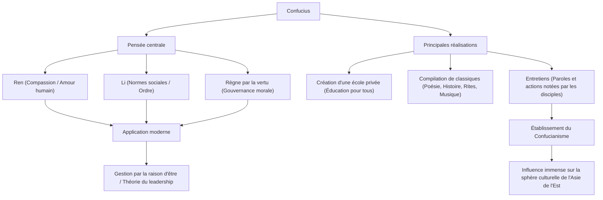

Qui est l'influenceur le plus influent de l'histoire ? À l'ère moderne, on pourrait penser à [Steve Jobs](/fr/p/biography-steve-jobs/) ou Elon Musk, mais il y a un homme qui a balayé toute l'Asie de l'Est il y a plus de 2500 ans et dont les pensées sont encore transmises aujourd'hui. C'est « Confucius ».

Dans cet article, du point de vue d'un écrivain historique professionnel, nous approfondirons la vie mouvementée de Confucius, la philosophie novatrice qu'il a prêchée et son immense influence qui résonne encore dans la société et les affaires modernes.

## Qui était Confucius ? : L'innovateur de la période des Printemps et Automnes

Confucius (551 av. J.-C. - 479 av. J.-C.) était un penseur, éducateur et philosophe actif durant la période des Printemps et Automnes en Chine. Son vrai nom était Kong Qiu, et son prénom de courtoisie était Zhongni. « Confucius » est un titre honorifique signifiant « Maître Kong ».

À l'époque, l'autorité de la dynastie Zhou était tombée, et la Chine était dans une période de turbulences où les seigneurs féodaux luttaient pour l'hégémonie. À une époque où les inférieurs renversaient leurs supérieurs et où la morale était tombée au plus bas, Confucius a relevé le grand défi de « comment construire une société pacifique et ordonnée ». Ses idées ne faisaient pas qu'effleurer la théorie, mais proposaient un système social pratique (OS) pour survivre à des temps troublés.

## Une vie mouvementée : Un voyage de revers et de découvertes

### Jeunesse difficile et éveil académique
Confucius est né dans une famille aristocratique déchue de l'État de Lu (actuelle province du Shandong). Ayant perdu son père très jeune et grandi dans la pauvreté, il s'est servi de l'adversité comme tremplin pour étudier avec acharnement. Ses mots dans les Entretiens, « À quinze ans, je me suis engagé dans l'étude », sont extrêmement célèbres. Il a étudié l'histoire et l'étiquette (Li) de manière exhaustive pour construire son propre système de pensée.

### Défis et échecs en tant que politicien
Passé 50 ans, Confucius a finalement obtenu des postes clés (comme Ministre de la Justice) dans l'État de Lu, ayant ainsi l'opportunité de mettre en pratique son idéal politique. Grâce à ses compétences exceptionnelles, le pays s'est temporairement stabilisé, mais en raison de conflits avec des groupes d'intérêts établis et de complots d'autres pays, il a perdu son poste en quelques années seulement. Ce fut le moment où il a percuté le mur entre l'idéal et la réalité.

### Voyages à travers les États et dévouement à l'éducation
Chassé de sa patrie, Confucius s'est embarqué dans un voyage de 13 ans avec ses disciples, cherchant un seigneur qui adopterait ses idées (son OS mis à jour). Cependant, à une époque où l'expansion hégémonique par la force militaire (la voie de l'hégémon) était privilégiée, l'idée de Confucius de gouverner par la morale (la voie royale) n'était pas acceptée, et sa vie fut mise en danger à de nombreuses reprises.

Dans ses dernières années, Confucius est finalement retourné dans sa patrie, Lu, s'est retiré du monde politique et s'est consacré à l'éducation de la jeune génération et à la compilation de textes classiques. On dit que 3000 jeunes hommes de tous les horizons sociaux se sont rassemblés dans l'école privée qu'il a fondée.

## La philosophie de Confucius : Un OS de leadership pour l'ère moderne

Le cœur de la philosophie de Confucius réside dans « Ren » (la bienveillance) et « Li » (les rites), ainsi que dans le « règne par la vertu » qui en découle.

### « Ren » : L'esprit d'amour humain et d'empathie
Le « Ren » désigne la considération, la compassion et l'empathie envers les autres. Confucius prêchait : « Ne fais pas à autrui ce que tu ne voudrais pas qu'on te fasse ». C'est un principe universel qui s'applique à la considération des parties prenantes dans les affaires modernes et à la sécurité psychologique dans la constitution d'une équipe.

### « Li » : Ordre social et normes
Le « Li » fait référence aux normes et règles permettant d'exprimer le « Ren » par des actions concrètes. Aussi merveilleux que soit un idéal (Ren), la société ne peut pas fonctionner sans une interface (Li) pour l'exprimer correctement. Confucius mettait l'accent sur l'équilibre entre la moralité intérieure et les normes sociales extérieures.

### « Règne par la vertu » : La gouvernance par l'éthique
Plutôt que de forcer les gens à obéir par les lois et les punitions (légalisme), le « règne par la vertu » est une méthode politique qui inspire les gens par la haute moralité (vertu) du leader lui-même, les amenant à agir correctement de leur propre gré. Dans la gestion d'entreprise moderne, cela peut être considéré comme le précurseur de la « gestion par la raison d'être », qui guide les organisations par une vision et une mission.

## Influence sur les générations futures : Les valeurs fondamentales de l'Asie de l'Est

Après la mort de Confucius, ses enseignements ont été compilés par ses disciples dans les « Entretiens », qui se sont ensuite développés en un puissant système de pensée appelé « Confucianisme ».

Sous la dynastie Han, il a été adopté comme étude officielle (religion d'État) de la nation et est depuis lors la fondation de la politique, de la société et de l'éducation chinoises depuis plus de 2000 ans. L'influence du Confucianisme est devenue absolue lorsqu'il a été rendu obligatoire comme matière principale dans les examens impériaux pour sélectionner les fonctionnaires.

De plus, les enseignements du Confucianisme se sont répandus dans les pays voisins comme la péninsule coréenne et le Japon, laissant une profonde empreinte sur l'éthique et la culture de toute l'Asie de l'Est. La philosophie de Confucius vit également dans le Bushido du Japon de la période Edo et dans la culture organisationnelle des entreprises japonaises modernes (système d'ancienneté, loyauté et esprit de valorisation de l'harmonie).

## Conclusion : Les enseignements de Confucius ne vieillissent jamais

La vie de Confucius n'a certainement pas été un long fleuve tranquille. En tant qu'homme politique, il a connu l'échec et ses idéaux n'ont jamais été pleinement réalisés de son vivant. Cependant, la graine de « l'éducation » qu'il a semée a traversé l'espace et le temps pour devenir un grand arbre.

À l'ère moderne, où l'évolution rapide de la technologie nous amène à nous demander ce que signifie être humain et comment la société devrait être, la philosophie de Confucius sur le « Ren » et le « Li » devrait être une boussole puissante vers laquelle nous devrions retourner.

### Structure de la pensée et des réalisations de Confucius (Diagramme Mermaid)

