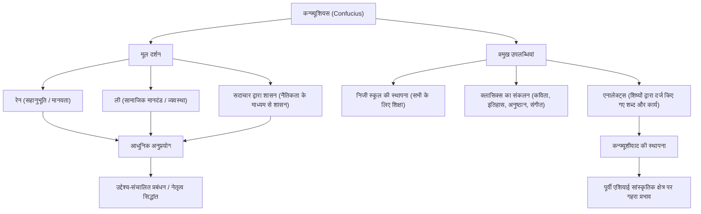

इतिहास में सबसे प्रभावशाली इन्फ्लुएंसर कौन है? आधुनिक युग में, आप स्टीव जॉब्स या एलन मस्क के बारे में सोच सकते हैं, लेकिन एक व्यक्ति है जिसने 2500 से अधिक साल पहले पूरे पूर्वी एशिया में क्रांति ला दी थी, और जिनके विचार आज भी जीवित हैं। वह व्यक्ति "कन्फ्यूशियस" है।

इस लेख में, हम एक पेशेवर इतिहास लेखक के दृष्टिकोण से कन्फ्यूशियस के उतार-चढ़ाव भरे जीवन, उनके द्वारा प्रस्तावित अभिनव दर्शन, और आधुनिक समाज तथा व्यापार पर उनके गहरे प्रभाव की गहराई से जांच करेंगे।

## कन्फ्यूशियस कौन थे?: स्प्रिंग एंड ऑटम काल के इनोवेटर

कन्फ्यूशियस (551 ईसा पूर्व - 479 ईसा पूर्व) चीन के स्प्रिंग एंड ऑटम काल के एक विचारक, शिक्षक और दार्शनिक थे। उनका असली नाम कोंग किउ (Kong Qiu) था और उनकी उपाधि झोंगनी (Zhongni) थी। "कन्फ्यूशियस" एक सम्मानजनक उपाधि है जिसका अर्थ है "मास्टर कोंग"।

उस समय का चीन उथल-पुथल के दौर से गुजर रहा था, जहाँ झोउ राजवंश ने अपना अधिकार खो दिया था और क्षेत्रीय शासक वर्चस्व के लिए लड़ रहे थे। एक ऐसे युग में जहाँ निचला वर्ग उच्च वर्ग को उखाड़ फेंक रहा था और नैतिकता का पतन हो चुका था, कन्फ्यूशियस ने "एक शांतिपूर्ण और व्यवस्थित समाज का निर्माण कैसे करें" की भव्य चुनौती का सामना किया। उनके दर्शन को केवल एक अमूर्त सिद्धांत नहीं, बल्कि एक उथल-पुथल वाले युग में जीवित रहने के लिए एक व्यावहारिक सामाजिक प्रणाली (OS) का प्रस्ताव माना जा सकता है।

## उतार-चढ़ाव से भरा जीवन: असफलताओं और खोज की यात्रा

### दुर्भाग्यपूर्ण युवावस्था और शिक्षा के प्रति जागृति
कन्फ्यूशियस का जन्म लू राज्य (वर्तमान शेडोंग प्रांत) में एक पतनशील कुलीन परिवार में हुआ था। कम उम्र में अपने पिता को खोने के बाद, वे गरीबी में पले-बढ़े, लेकिन उन्होंने विपरीत परिस्थितियों का सामना करते हुए कड़ी मेहनत की। 'एनालेक्ट्स' के उनके शब्द, "पंद्रह वर्ष की आयु में, मैंने अपना मन सीखने पर लगाया," बहुत प्रसिद्ध हैं। उन्होंने पिछले इतिहास और शिष्टाचार (ली) का गहन अध्ययन किया और अपनी अनूठी वैचारिक प्रणाली का निर्माण किया।

### एक राजनेता के रूप में चुनौतियाँ और असफलताएँ
50 वर्ष की आयु पार करने के बाद, कन्फ्यूशियस को अंततः लू राज्य में महत्वपूर्ण पद प्राप्त हुए, जिससे उन्हें अपने आदर्शों के अनुसार राजनीति का अभ्यास करने का अवसर मिला। उनके उत्कृष्ट कौशल के कारण देश अस्थायी रूप से स्थिर हो गया, लेकिन निहित स्वार्थ वाले गुटों के साथ संघर्ष और अन्य देशों की साजिशों के कारण, कुछ ही वर्षों में उनका पतन हो गया। यह वह क्षण था जब उनके आदर्शों का सामना वास्तविकता की दीवार से हुआ।

### राज्यों का भ्रमण और शिक्षा के प्रति समर्पण
अपनी मातृभूमि से निर्वासित होने के बाद, कन्फ्यूशियस ने अपने शिष्यों के साथ 13 साल तक विभिन्न राज्यों की यात्रा की, ऐसे शासक की तलाश में जो उनके दर्शन (अद्यतन OS) को अपना सके। हालांकि, ऐसे युग में जहाँ सैन्य बल के माध्यम से वर्चस्व के विस्तार को महत्व दिया जाता था, कन्फ्यूशियस का नैतिकता आधारित शासन का दर्शन स्वीकार नहीं किया गया, और उन्हें कई बार जीवन-खतरे की स्थितियों का सामना करना पड़ा।

अपने बाद के वर्षों में, अंततः अपनी मातृभूमि लू लौटने के बाद, कन्फ्यूशियस ने राजनीति से संन्यास ले लिया और अपना ध्यान युवा पीढ़ी को शिक्षित करने और क्लासिक्स के संकलन पर केंद्रित किया। उनके द्वारा स्थापित निजी स्कूल में सामाजिक स्थिति की परवाह किए बिना कई युवा आकर्षित हुए, और कहा जाता है कि उनके शिष्यों की संख्या 3000 तक पहुंच गई थी।

## कन्फ्यूशियस का दर्शन: आधुनिक युग के लिए लीडरशिप OS

कन्फ्यूशियस के दर्शन का मूल "रेन" (मानवता) और "ली" (शिष्टाचार), और इन पर आधारित "सदाचार द्वारा शासन" है।

### "रेन": मानवता और सहानुभूति की भावना
"रेन" दूसरों के प्रति विचारशीलता, स्नेह और सहानुभूति की भावना है। कन्फ्यूशियस ने सिखाया, "जो आप स्वयं नहीं चाहते, वह दूसरों के साथ न करें।" यह एक सार्वभौमिक सिद्धांत है जो आधुनिक व्यवसाय में हितधारकों के लिए विचार और टीम निर्माण में मनोवैज्ञानिक सुरक्षा पर भी लागू होता है।

### "ली": सामाजिक व्यवस्था और मानदंड
"ली" उन मानदंडों और नियमों को संदर्भित करता है जो "रेन" को ठोस कार्यों के रूप में व्यक्त करते हैं। भले ही आपके पास कितने ही महान आदर्श (रेन) हों, अगर उन्हें उचित रूप से व्यक्त करने के लिए कोई इंटरफ़ेस (ली) नहीं है, तो समाज कार्य नहीं करेगा। कन्फ्यूशियस ने आंतरिक नैतिकता और बाहरी सामाजिक मानदंडों के बीच संतुलन पर जोर दिया।

### "सदाचार द्वारा शासन": नैतिकता के माध्यम से शासन
लोगों को कानूनों और दंडों के माध्यम से जबरन आज्ञा मानने के बजाय, "सदाचार द्वारा शासन" एक राजनीतिक तरीका है जो नेता की अपनी उच्च नैतिकता (सदाचार) के माध्यम से लोगों को प्रेरित करता है, जिससे वे स्वेच्छा से सही कार्रवाई करते हैं। इसे आधुनिक कॉर्पोरेट प्रबंधन में विजन और उद्देश्य द्वारा संगठन का मार्गदर्शन करने वाले "उद्देश्य-संचालित प्रबंधन" का अग्रदूत कहा जा सकता है।

## भावी पीढ़ियों पर प्रभाव: पूर्वी एशिया के मूलभूत मूल्यों की ओर

कन्फ्यूशियस की मृत्यु के बाद, उनकी शिक्षाओं को उनके शिष्यों द्वारा 'एनालेक्ट्स' में संकलित किया गया, जो बाद में "कन्फ्यूशीवाद" नामक एक शक्तिशाली दार्शनिक प्रणाली में विकसित हुई।

हान राजवंश के दौरान, इसे राज्य के आधिकारिक अध्ययन के रूप में अपनाया गया था, और यह 2000 से अधिक वर्षों तक चीन की राजनीति, समाज और शिक्षा की नींव बन गया। जब कन्फ्यूशीवाद को शाही परीक्षाओं के लिए एक अनिवार्य विषय बना दिया गया, तो इसका प्रभाव पूर्ण हो गया।

इसके अलावा, कन्फ्यूशीवाद की शिक्षाएँ कोरियाई प्रायद्वीप और जापान जैसे पड़ोसी देशों में भी फैल गईं, जिससे पूरे पूर्वी एशिया के नैतिक मूल्यों और संस्कृति पर गहरी छाप पड़ी। ईदो काल के दौरान जापान में बुशिडो और आधुनिक जापानी कॉर्पोरेट संस्कृति की जड़ों में कन्फ्यूशियस के दर्शन जीवित हैं।

## निष्कर्ष: कन्फ्यूशियस की शिक्षाएँ कभी पुरानी नहीं होतीं

कन्फ्यूशियस का जीवन कभी आसान नहीं था। एक राजनेता के रूप में वे असफल रहे, और उनके जीवनकाल में उनके आदर्श पूरी तरह से कभी साकार नहीं हुए। हालाँकि, उन्होंने "शिक्षा" का जो बीज बोया था, वह समय और स्थान को पार करते हुए एक विशाल वृक्ष में विकसित हुआ।

एक ऐसे आधुनिक युग में जहाँ तेजी से हो रहे तकनीकी विकास के कारण यह सवाल उठाया जा रहा है कि मनुष्य क्या है और समाज कैसा होना चाहिए, "रेन" और "ली" की वकालत करने वाले कन्फ्यूशियस का दर्शन एक शक्तिशाली कंपास के रूप में काम करेगा जिस पर हमें वापस लौटना चाहिए।

### कन्फ्यूशियस के दर्शन और उपलब्धियों की संरचना (Mermaid आरेख)

