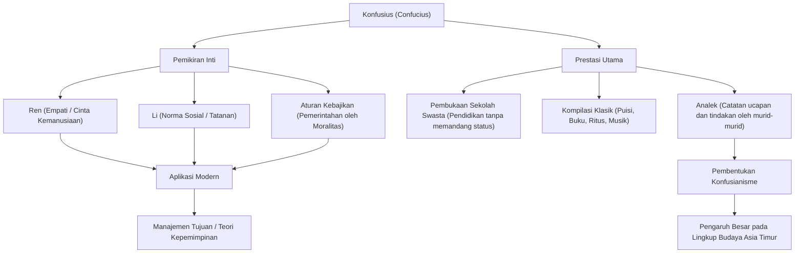

Siapakah influencer paling berpengaruh dalam sejarah? Di zaman modern, Anda mungkin memikirkan [Steve Jobs](/id/p/biography-steve-jobs/) atau Elon Musk, tetapi ada seorang tokoh yang menyapu bersih seluruh Asia Timur lebih dari 2500 tahun yang lalu, dan pemikirannya masih diwariskan hingga saat ini. Dialah "Konfusius".

Dalam artikel ini, dari sudut pandang seorang penulis sejarah profesional, kita akan menggali lebih dalam tentang kehidupan Konfusius yang penuh gejolak, filosofi inovatif yang ia anjurkan, dan pengaruhnya yang sangat besar yang masih relevan dengan masyarakat modern dan bisnis.

## Siapakah Konfusius?: Inovator di Zaman Musim Semi dan Gugur

Konfusius (551 SM - 479 SM) adalah seorang pemikir, pendidik, dan filsuf yang aktif di Tiongkok selama Zaman Musim Semi dan Gugur. Nama aslinya adalah Kong Qiu, dan nama kehormatannya adalah Zhongni. "Konfusius" (Kongzi) adalah gelar kehormatan yang berarti "Guru Kong".

Pada saat itu, Tiongkok adalah dunia yang kacau di mana otoritas Dinasti Zhou telah jatuh, dan para penguasa feodal bersaing memperebutkan hegemoni. Di era di mana bawahan menumbangkan atasan dan moralitas telah jatuh ke tanah, Konfusius menghadapi tantangan besar: "bagaimana membangun masyarakat yang damai dan tertib". Pemikirannya bukan sekadar teori di atas kertas, tetapi dapat dikatakan sebagai usulan untuk sistem sosial (OS) praktis untuk bertahan hidup di dunia yang kacau.

## Kehidupan yang Penuh Gejolak: Perjalanan Frustrasi dan Eksplorasi

### Masa Muda yang Malang dan Kebangkitan terhadap Pembelajaran
Konfusius lahir dalam keluarga bangsawan yang jatuh miskin di Negara Lu (sekarang Provinsi Shandong). Ia kehilangan ayahnya di usia muda dan tumbuh dalam lingkungan yang miskin, tetapi ia menggunakan kesulitan tersebut sebagai batu loncatan untuk belajar dengan giat. Kata-kata dalam "Analek", "Pada usia lima belas tahun, aku memusatkan pikiranku pada pembelajaran," sangatlah terkenal. Ia mempelajari sejarah masa lalu dan etiket (Li) secara menyeluruh, serta membangun sistem pemikirannya sendiri.

### Tantangan dan Frustrasi sebagai Politisi
Setelah berusia 50 tahun, Konfusius akhirnya mengambil posisi penting (seperti Menteri Kehakiman) di Negara Lu, dan mendapatkan kesempatan untuk mempraktikkan politik idealnya. Negara untuk sementara stabil karena kemampuannya yang luar biasa, tetapi karena konflik dengan kelompok kepentingan dan konspirasi negara lain, ia kehilangan posisinya hanya dalam beberapa tahun. Itu adalah saat ketika ia menabrak tembok antara ideal dan kenyataan.

### Mengembara Melalui Berbagai Negara dan Dedikasi pada Pendidikan
Diusir dari tanah airnya, Konfusius memulai perjalanan 13 tahun melalui berbagai negara bersama murid-muridnya, mencari seorang penguasa yang akan mengadopsi ide-idenya (OS yang diperbarui). Namun, di era di mana perluasan hegemoni melalui kekuatan militer (Jalan Hegemon) ditekankan, pemikiran Konfusius tentang pemerintahan berdasarkan moralitas (Jalan Raja) tidak diterima, dan ia berulang kali menghadapi bahaya yang mengancam nyawanya.

Di tahun-tahun terakhirnya, Konfusius akhirnya kembali ke tanah airnya, Lu, menarik diri dari dunia politik, dan mengabdikan dirinya untuk mendidik generasi muda dan mengkompilasi karya klasik. Dikatakan bahwa banyak orang muda berkumpul di sekolah swasta yang ia buka, tanpa memandang status sosial mereka, dan jumlahnya mencapai 3000 orang.

## Filosofi Konfusius: OS Kepemimpinan yang Relevan di Era Modern

Inti dari pemikiran Konfusius terletak pada "Ren" (Kemanusiaan) dan "Li" (Ritus/Kesusilaan), serta "Aturan Kebajikan" yang didasarkan padanya.

### "Ren": Semangat Cinta Kemanusiaan dan Empati
"Ren" adalah hati yang penuh pertimbangan, kasih sayang, dan empati terhadap orang lain. Konfusius mengajarkan, "Apa yang tidak kau inginkan bagi dirimu sendiri, jangan lakukan pada orang lain." Ini adalah prinsip universal yang juga berlaku untuk pertimbangan terhadap pemangku kepentingan dalam bisnis modern dan keamanan psikologis dalam membangun tim.

### "Li": Tatanan dan Norma Sosial
"Li" merujuk pada norma dan aturan untuk mengekspresikan "Ren" sebagai tindakan nyata. Tidak peduli seberapa indah sebuah filosofi (Ren), tanpa antarmuka (Li) untuk mengekspresikannya dengan tepat, masyarakat tidak akan berfungsi. Konfusius menekankan keseimbangan antara moralitas internal dan norma sosial eksternal.

### "Aturan Kebajikan": Tata Kelola Berdasarkan Etika
Metode politik di mana orang tidak dipaksa untuk patuh melalui hukum dan hukuman (legalisme), tetapi dipengaruhi oleh moralitas (kebajikan) pemimpin yang tinggi untuk mengambil tindakan yang benar secara sukarela, disebut "Aturan Kebajikan". Dalam manajemen perusahaan modern, ini dapat dikatakan sebagai pelopor "manajemen tujuan" yang memandu organisasi berdasarkan visi dan tujuan.

## Pengaruh pada Generasi Berikutnya: Menjadi Nilai Dasar Asia Timur

Setelah kematian Konfusius, ajaran-ajarannya dikumpulkan oleh murid-muridnya ke dalam "Analek", yang kemudian berkembang menjadi sistem pemikiran yang kuat yang disebut "Konfusianisme".

Selama Dinasti Han, ini diadopsi sebagai ajaran resmi negara (agama negara), dan menjadi dasar bagi politik, masyarakat, dan pendidikan Tiongkok selama lebih dari 2000 tahun sesudahnya. Karena Konfusianisme diwajibkan sebagai mata pelajaran utama dalam ujian pegawai negeri kekaisaran (Keju), pengaruhnya menjadi mutlak.

Selain itu, ajaran Konfusianisme menyebar ke negara-negara tetangga seperti Semenanjung Korea dan Jepang, meninggalkan jejak yang mendalam pada etika dan budaya seluruh Asia Timur. Bahkan di dasar Bushido di Jepang selama periode Edo dan budaya organisasi perusahaan Jepang modern (sistem senioritas, kesetiaan, dan semangat menghargai harmoni), pemikiran Konfusius terus hidup dan bernapas.

## Kesimpulan: Ajaran Konfusius Tidak Pernah Usang

Kehidupan Konfusius sama sekali tidak berjalan mulus. Sebagai seorang politisi, ia mengalami kegagalan, dan cita-citanya tidak pernah sepenuhnya terwujud semasa hidupnya. Namun, benih "pendidikan" yang ia tabur tumbuh menjadi pohon besar melintasi ruang dan waktu.

Di era modern di mana kita mempertanyakan apa artinya menjadi manusia dan bagaimana masyarakat seharusnya berjalan karena kemajuan teknologi yang cepat, filosofi Konfusius yang mengajarkan "Ren" dan "Li" akan menjadi kompas yang kuat bagi kita untuk kembali.

### Struktur Pemikiran dan Prestasi Konfusius (Diagram Mermaid)

