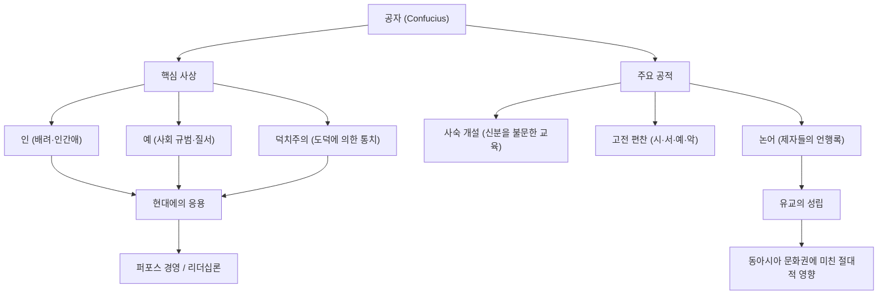

역사상 가장 큰 영향력을 가진 인플루언서는 누구일까요? 현대라면 스티브 잡스나 일론 머스크를 떠올릴지도 모르지만, 2500년 이상 전에 동아시아 전체를 휩쓸고 지금도 그 사상이 이어지고 있는 인물이 있습니다. 바로 '공자'입니다.

본 기사에서는 전문 역사 작가의 관점에서 공자라는 인물의 파란만장한 생애, 그가 주창한 혁신적인 철학, 그리고 현대 사회나 비즈니스에도 통하는 그 막대한 영향력에 대해 깊이 파헤쳐 보겠습니다.

## 공자란 누구인가?: 춘추 시대의 이노베이터

공자(기원전 551년~기원전 479년)는 중국 춘추 시대에 활약한 사상가이자 교육자이며 철학자입니다. 본명은 공구(孔丘), 자는 중니(仲尼)라고 합니다. '공자(孔子)'는 '공(孔) 선생님'을 의미하는 존칭입니다.

당시 중국은 주나라 왕조의 권위가 실추되고 제후들이 패권을 다투는 난세였습니다. 하극상이 횡행하고 도덕이 땅에 떨어진 시대에, 공자는 "어떻게 하면 평화롭고 질서 있는 사회를 구축할 것인가"라는 장대한 과제에 도전했습니다. 그의 사상은 단순한 탁상공론이 아니라, 난세를 살아남기 위한 실천적인 사회 시스템(OS)의 제창이었다고 할 수 있습니다.

## 파란만장한 생애: 좌절과 탐구의 여정

### 불우한 청년기와 학문에 대한 눈뜸
공자는 노나라(현재의 산둥성)의 몰락한 귀족 가문에서 태어났습니다. 어릴 적 아버지를 여의고 가난한 환경에서 자랐지만, 그는 역경을 발판 삼아 맹렬히 공부했습니다. 『논어』에 나오는 "나는 열다섯에 학문에 뜻을 두었다(吾十有五而志于学)"라는 말은 너무나도 유명합니다. 그는 과거의 역사와 예의범절(예)을 철저히 연구하여 독자적인 사상 체계를 구축해 나갔습니다.

### 정치가로서의 도전과 좌절
50세를 넘겨서 공자는 마침내 노나라에서 요직(대사구 등)을 맡아, 자신이 이상으로 삼는 정치를 실천할 기회를 얻습니다. 그의 탁월한 수완으로 나라는 일시적으로 안정되었지만, 기득권층과의 대립과 타국의 모략으로 인해 불과 몇 년 만에 실각하고 맙니다. 이상과 현실의 벽에 부딪힌 순간이었습니다.

### 주유천하와 교육에의 전념
조국에서 쫓겨난 공자는 자신의 사상(업데이트된 OS)을 채택해 줄 군주를 찾아 제자들과 함께 13년에 걸친 주유천하(諸國漫遊)의 길을 떠납니다. 그러나 무력에 의한 패권 확대(패도)가 중시되는 시대에 도덕에 의한 통치(왕도)를 설파하는 공자의 사상은 받아들여지지 않았고, 수차례 생명의 위협을 받기도 했습니다.

말년에 마침내 조국 노나라로 돌아온 공자는 정치 세계에서 물러나 후진 양성과 고전 편찬에 전념합니다. 그가 연 사숙에는 신분을 불문하고 많은 젊은이들이 모여들었고, 그 수는 3000명에 달했다고 전해집니다.

## 공자의 철학: 현대에도 통하는 리더십의 OS

공자 사상의 근간은 '인(仁)'과 '예(礼)', 그리고 그것을 바탕으로 한 '덕치주의(德治主義)'에 있습니다.

### '인(仁)': 인간애와 공감의 정신
'인'이란 타인에 대한 배려, 자애, 그리고 공감하는 마음입니다. 공자는 "자신이 원하지 않는 바를 남에게 베풀지 말라(己所不欲 勿施於人)"고 설파했습니다. 이는 현대 비즈니스에 있어서 이해관계자에 대한 배려나, 팀 빌딩에 있어서의 심리적 안전감과도 통하는 보편적인 원칙입니다.

### '예(礼)': 사회 질서와 규범
'예'는 '인'을 구체적인 행동으로 나타내기 위한 규범이나 규칙을 가리킵니다. 아무리 훌륭한 이념(인)이 있더라도, 그것을 적절히 표현할 인터페이스(예)가 없다면 사회는 기능하지 않습니다. 공자는 내면적인 도덕심과 외면적인 사회 규범의 균형을 중시했습니다.

### '덕치주의(德治主義)': 윤리에 의한 거버넌스
법률이나 형벌(법치주의)로 사람들을 강제로 따르게 하는 것이 아니라, 리더 자신의 높은 도덕성(덕)으로 사람들을 감화시켜 자발적으로 올바른 행동을 하게 하는 정치 수법을 '덕치주의'라고 부릅니다. 현대 기업 경영에 있어서 비전이나 퍼포스(목적)로 조직을 이끄는 '퍼포스 경영'의 선구자라고 할 수 있을지도 모릅니다.

## 후세에 미친 영향: 동아시아의 기반적 가치관으로

공자 사후, 그의 가르침은 제자들에 의해 『논어』로 정리되었고, 후에 '유교(유학)'라는 강대한 사상 체계로 발전했습니다.

한나라 시대에는 국가의 정통 학문(국교)으로 채택되어, 이후 2000년 이상에 걸쳐 중국의 정치, 사회, 교육의 기반이 되었습니다. 과거(관료 등용 시험)의 주요 과목으로 유교가 필수화됨으로써 그 영향력은 절대적인 것이 되었습니다.

나아가 유교의 가르침은 한반도나 일본 등 주변 국가들에도 전파되어 동아시아 전체의 윤리관이나 문화에 깊은 각인을 남겼습니다. 에도 시대 일본의 무사도나, 현대 일본 기업의 조직 문화(연공서열이나 충성심, 화(和)를 존중하는 정신)의 근저에도 공자의 사상이 면면히 살아 숨쉬고 있습니다.

## 요약: 공자의 가르침은 낡지 않는다

공자의 생애는 결코 순풍에 돛 단 듯하지 않았습니다. 정치가로서는 좌절했고, 살아생전에 그 이상이 완전히 실현되는 일은 없었습니다. 그러나 그가 뿌린 '교육'이라는 씨앗은 시공을 초월하여 큰 나무로 성장했습니다.

급격한 테크놀로지의 진화로 인해 인간이란 무엇인가, 사회는 어떠해야 하는가를 묻게 되는 현대에, '인'과 '예'를 설파한 공자의 철학은 우리가 다시 돌아가야 할 강력한 나침반(컴퍼스)이 되어줄 것입니다.

### 공자의 사상과 공적의 구조 (Mermaid 도해)

