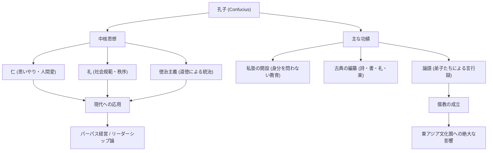

歴史上、最も影響力を持ったインフルエンサーとは誰でしょうか？現代で言えばスティーブ・ジョブズやイーロン・マスクを思い浮かべるかもしれませんが、2500年以上前に東アジア全体を席巻し、今なおその思想が受け継がれている人物がいます。それが「孔子」です。

本記事では、プロの歴史ライターの視点から、孔子という人物の波乱万丈な生涯、彼が唱えた革新的な哲学、そして現代社会やビジネスにも通じるその多大な影響力について深く掘り下げていきます。

## 孔子とは何者か？：春秋時代のイノベーター

孔子（紀元前551年〜紀元前479年）は、中国の春秋時代に活躍した思想家であり、教育者であり、哲学者です。本名は孔丘（こうきゅう）、字（あざな）は仲尼（ちゅうじ）といいます。「孔子」とは「孔先生」を意味する尊称です。

当時の中国は、周王朝の権威が失墜し、諸侯が覇権を争う乱世でした。下剋上が横行し、道徳が地に堕ちた時代において、孔子は「いかにして平和で秩序ある社会を築くか」という壮大な課題に挑みました。彼の思想は、単なる机上の空論ではなく、乱世を生き抜くための実践的な社会システム（OS）の提唱だったと言えるでしょう。

## 波乱に満ちた生涯：挫折と探求の旅

### 不遇の青年期と学問への目覚め
孔子は魯国（現在の山東省）の没落した貴族の家庭に生まれました。幼くして父を亡くし、貧しい環境で育ちましたが、彼は逆境をバネに猛勉強を重ねます。『論語』にある「吾、十有五にして学に志す（十五歳で学問を志した）」という言葉はあまりにも有名です。彼は過去の歴史や礼儀作法（礼）を徹底的に研究し、独自の思想体系を構築していきました。

### 政治家としての挑戦と挫折
50歳を過ぎて、孔子はついに魯国で要職（大司寇など）に就き、自らの理想とする政治を実践する機会を得ます。彼の卓越した手腕により国は一時的に安定しましたが、既得権益層との対立や他国の謀略により、わずか数年で失脚してしまいます。理想と現実の壁にぶつかった瞬間でした。

### 諸国漫遊と教育への専念
祖国を追われた孔子は、自らの思想（アップデートされたOS）を採用してくれる君主を求めて、弟子たちと共に13年にも及ぶ諸国漫遊の旅に出ます。しかし、武力による覇権拡大（覇道）が重視される時代において、道徳による統治（王道）を説く孔子の思想は受け入れられず、幾度も生命の危機に晒されました。

晩年、ついに祖国・魯に帰還した孔子は政治の世界から身を引き、後進の育成と古典の編纂に専念します。彼が開いた私塾には身分を問わず多くの若者が集い、その数は3000人に上ったと伝えられています。

## 孔子の哲学：現代にも通じるリーダーシップのOS

孔子の思想の根幹は「仁（じん）」と「礼（れい）」、そしてそれに基づく「徳治主義」にあります。

### 「仁」：人間愛と共感の精神
「仁」とは、他者に対する思いやり、慈愛、そして共感の心です。孔子は「己の欲せざる所は、人に施すこと勿れ（自分がされたくないことは、他人にしてもいけない）」と説きました。これは現代のビジネスにおけるステークホルダーへの配慮や、チームビルディングにおける心理的安全性にも通じる普遍的な原則です。

### 「礼」：社会秩序と規範
「礼」は、「仁」を具体的な行動として表すための規範やルールを指します。どれほど素晴らしい理念（仁）があっても、それを適切に表現するインターフェース（礼）がなければ社会は機能しません。孔子は、内面的な道徳心と外面的な社会規範のバランスを重視しました。

### 「徳治主義」：倫理によるガバナンス
法律や刑罰（法治主義）によって人々を強制的に従わせるのではなく、リーダー自身の高い道徳性（徳）によって人々を感化し、自発的に正しい行動をとらせる政治手法を「徳治主義」と呼びます。現代の企業経営において、ビジョンやパーパスによって組織を導く「パーパス経営」の先駆けと言えるかもしれません。

## 後世への影響：東アジアの基盤的価値観へ

孔子の死後、彼の教えは弟子たちによって『論語』としてまとめられ、後に「儒教（儒学）」という強大な思想体系へと発展しました。

漢の時代には国家の正統な学問（国教）として採用され、以降2000年以上にわたって中国の政治、社会、教育の基盤となりました。科挙（官僚登用試験）の主要科目として儒教が必修とされたことで、その影響力は絶対的なものとなりました。

さらに、儒教の教えは朝鮮半島や日本など周辺諸国にも伝播し、東アジア全体の倫理観や文化に深い刻印を残しました。江戸時代の日本における武士道や、現代日本企業の組織文化（年功序列や忠誠心、和を尊ぶ精神）の根底にも、孔子の思想が脈々と息づいています。

## まとめ：孔子の教えは古びない

孔子の生涯は、決して順風満帆ではありませんでした。政治家としては挫折し、生きている間にその理想が完全に実現することはありませんでした。しかし、彼が蒔いた「教育」という種は、時空を超えて大樹へと成長しました。

急激なテクノロジーの進化により、人間とは何か、社会はどうあるべきかが問われる現代において、「仁」と「礼」を説いた孔子の哲学は、私たちが立ち返るべき強力な羅針盤（コンパス）となるはずです。

### 孔子の思想と功績の構造（Mermaid図解）

