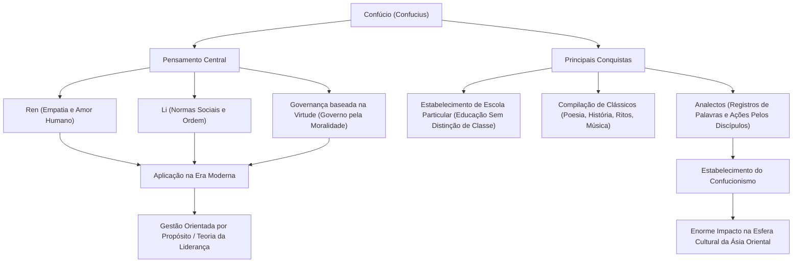

Quem é o influenciador mais impactante da história? Nos tempos modernos, você pode pensar em Steve Jobs ou Elon Musk, mas há uma pessoa que varreu toda a Ásia Oriental há mais de 2500 anos e cujos pensamentos continuam a ser passados até hoje. Esse é "Confúcio".

Neste artigo, a partir da perspectiva de um escritor de história profissional, mergulharemos profundamente na vida turbulenta da pessoa que foi Confúcio, sua filosofia inovadora e sua enorme influência que ainda se aplica à sociedade e aos negócios modernos.

## Quem foi Confúcio?: O Inovador do Período das Primaveras e Outonos

Confúcio (551 a.C. - 479 a.C.) foi um pensador, educador e filósofo que atuou na China durante o Período das Primaveras e Outonos. Seu nome verdadeiro era Kong Qiu (孔丘), e seu nome de cortesia era Zhongni (仲尼). "Confúcio" (Kongzi) é um título honorífico que significa "Mestre Kong".

A China daquela época era um mundo caótico onde a autoridade da dinastia Zhou havia caído e os senhores feudais lutavam pela hegemonia. Em uma era de insubordinação desenfreada e moralidade em declínio, Confúcio assumiu a grande tarefa de "como construir uma sociedade pacífica e ordenada". Pode-se dizer que seu pensamento não era apenas uma teoria de poltrona, mas a proposição de um sistema social prático (SO) para sobreviver em tempos conturbados.

## Uma Vida Cheia de Turbulências: A Jornada de Frustrações e Explorações

### A Juventude Desfavorecida e o Despertar para a Erudição
Confúcio nasceu em uma família aristocrática em declínio no Estado de Lu (atual província de Shandong). Ele perdeu seu pai quando era jovem e cresceu em um ambiente pobre, mas usou a adversidade como um trampolim para estudar muito. As palavras dos Analectos, "Aos quinze anos, propus-me a aprender", são extremamente famosas. Ele estudou minuciosamente a história e a etiqueta (Li) do passado, construindo seu próprio sistema de pensamento.

### Desafios e Frustrações como Político
Após os 50 anos, Confúcio finalmente assumiu cargos importantes no Estado de Lu (como Ministro do Crime) e teve a oportunidade de colocar em prática sua política ideal. Devido à sua notável habilidade, o país se estabilizou temporariamente, mas devido a conflitos com interesses estabelecidos e tramas de outros países, ele perdeu sua posição em apenas alguns anos. Foi o momento em que se chocou com a parede da realidade contra seus ideais.

### Viagens e Dedicação à Educação
Expulso de sua terra natal, Confúcio embarcou em uma jornada de 13 anos com seus discípulos em busca de um monarca que adotasse seu pensamento (um SO atualizado). No entanto, em uma época que enfatizava a expansão militar da hegemonia, o pensamento de Confúcio sobre governar pela moralidade (o Caminho do Rei) não foi aceito, e ele enfrentou perigo de vida muitas vezes.

Em seus últimos anos, tendo finalmente retornado à sua terra natal, Lu, Confúcio se aposentou do mundo político e se dedicou a educar a próxima geração e compilar os clássicos. Diz-se que muitos jovens de todas as esferas da vida se reuniram em sua escola particular, chegando a 3000 pessoas.

## A Filosofia de Confúcio: Um SO de Liderança que se Aplica aos Dias Atuais

O núcleo do pensamento de Confúcio reside em "Ren" (benevolência/humanidade) e "Li" (propriedade/rito), e na "Governança baseada na Virtude" decorrente deles.

### "Ren": O Espírito de Amor e Empatia Humana
"Ren" é a consideração, o afeto e a empatia pelos outros. Confúcio ensinou: "Não faças aos outros o que não queres que façam a ti". Este é um princípio universal que se aplica à consideração pelas partes interessadas nos negócios modernos e à segurança psicológica na construção de equipes.

### "Li": Ordem e Normas Sociais
"Li" refere-se às normas e regras para expressar "Ren" como ações concretas. Não importa quão grande seja o ideal (Ren), a sociedade não funcionará sem uma interface apropriada (Li) para expressá-lo adequadamente. Confúcio enfatizava o equilíbrio entre a moralidade interna e as normas sociais externas.

### "Governança baseada na Virtude": Governança pela Ética
O método político de não forçar as pessoas a obedecer por meio de leis e punições (Legalismo), mas de inspirar as pessoas por meio da alta moralidade do próprio líder (Virtude) para fazê-las tomar ações corretas voluntariamente é chamado de "Governança baseada na Virtude". Na gestão corporativa moderna, pode-se dizer que é a pioneira da "Gestão Orientada por Propósito", guiando organizações por visão e propósito.

## O Impacto na Posteridade: A Base de Valores da Ásia Oriental

Após a morte de Confúcio, seus ensinamentos foram compilados por seus discípulos nos "Analectos", que mais tarde se desenvolveu no poderoso sistema de pensamento chamado "Confucionismo".

Durante a Dinastia Han, foi adotado como o estudo ortodoxo do estado (religião de estado), e por mais de 2000 anos, serviu como base para a política, sociedade e educação chinesas. Como o Confucionismo se tornou uma disciplina obrigatória nos exames imperiais (Keju), sua influência tornou-se absoluta.

Além disso, os ensinamentos do Confucionismo se espalharam para países vizinhos como a Península Coreana e o Japão, deixando uma marca profunda na ética e cultura de toda a Ásia Oriental. O pensamento de Confúcio ainda está vivo na base do Bushido no Japão durante o período Edo, e na cultura organizacional das corporações japonesas modernas (sistema de antiguidade, lealdade e o espírito de respeitar a harmonia).

## Conclusão: Os Ensinamentos de Confúcio Nunca Envelhecem

A vida de Confúcio de forma alguma foi tranquila. Ele falhou como político, e seus ideais não foram totalmente realizados durante sua vida. No entanto, a semente da "educação" que ele plantou cresceu além do tempo e do espaço e se tornou uma grande árvore.

Na era moderna, onde o que é ser humano e como a sociedade deve ser estão sendo questionados devido à rápida evolução da tecnologia, a filosofia de Confúcio que ensinou "Ren" e "Li" deve servir como uma bússola poderosa para a qual devemos retornar.

### A Estrutura do Pensamento e das Conquistas de Confúcio (Diagrama Mermaid)

