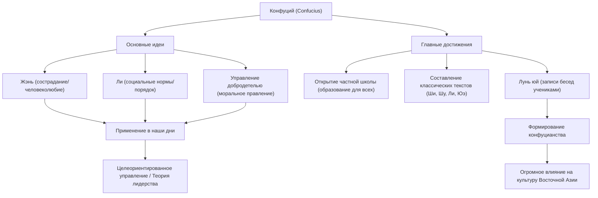

Кто является самым влиятельным человеком в истории? Сегодня на ум могут прийти Стив Джобс или Илон Маск, но есть человек, который более 2500 лет назад покорил всю Восточную Азию, и чьи идеи продолжают передаваться из поколения в поколение по сей день. Это Конфуций.

В этой статье, с точки зрения профессионального исторического писателя, мы глубоко погрузимся в бурную жизнь Конфуция, его новаторскую философию и огромное влияние, которое его идеи оказывают на современное общество и бизнес.

## Кто такой Конфуций?: Новатор периода Чуньцю (Весны и Осени)

Конфуций (551 г. до н.э. — 479 г. до н.э.) был мыслителем, педагогом и философом, жившим в период Весны и Осени в Китае. Его настоящее имя — Кун Цю, а взрослое имя — Чжунни. «Конфуций» (Кун-цзы) — это почтительное обращение, означающее «Учитель Кун».

В то время Китай был охвачен смутой: авторитет династии Чжоу пал, а удельные князья боролись за господство. В эпоху, когда процветали перевороты и мораль упала на самое дно, Конфуций взялся за грандиозную задачу: «Как построить мирное и упорядоченное общество?». Его идеи были не просто теоретическими рассуждениями, а предложением практической социальной системы (ОС) для выживания в неспокойные времена.

## Жизнь, полная потрясений: путь разочарований и поисков

### Трудная молодость и пробуждение тяги к знаниям
Конфуций родился в разорившейся аристократической семье в царстве Лу (современная провинция Шаньдун). Он рано потерял отца и рос в бедности, но использовал невзгоды как стимул для усердной учебы. Очень известны его слова из «Лунь юй» (Беседы и суждения): «В пятнадцать лет я устремил свои помыслы к учебе». Он глубоко изучал прошлую историю и этикет (Ли), создавая собственную философскую систему.

### Политические вызовы и неудачи
Перешагнув 50-летний рубеж, Конфуций наконец получил важный пост в царстве Лу (например, Да сыкоу) и возможность воплотить в жизнь свои политические идеалы. Благодаря его выдающимся способностям в стране наступила временная стабильность, однако из-за конфликтов с корыстными элитами и заговоров других стран он потерял свою должность всего через несколько лет. Это был момент столкновения идеалов с суровой реальностью.

### Странствия по государствам и посвящение себя образованию
Изгнанный со своей родины, Конфуций вместе со своими учениками отправился в 13-летнее путешествие по разным государствам в поисках правителя, который принял бы его идеи (обновленную ОС). Однако в эпоху, когда ценилась военная мощь и гегемония, идеи Конфуция об управлении на основе морали (путь истинного царя) не были приняты, и его жизнь неоднократно подвергалась опасности.

В последние годы жизни, наконец вернувшись на родину в царство Лу, Конфуций отошел от политики и посвятил себя воспитанию молодого поколения и составлению классических текстов. В его частную школу приходило множество молодых людей независимо от их социального положения, и, по преданию, их число достигало 3000 человек.

## Философия Конфуция: лидерская ОС, актуальная и сегодня

В основе философии Конфуция лежат «Жэнь» (человеколюбие) и «Ли» (ритуал/этикет), а также основанное на них «управление на основе добродетели».

### «Жэнь» (Человеколюбие): дух любви к людям и сочувствия
«Жэнь» — это сострадание, любовь и сочувствие к другим. Конфуций учил: «Чего не желаешь себе, не делай другим». Это универсальный принцип, который применим к заботе о заинтересованных сторонах в современном бизнесе и к психологической безопасности при создании команды.

### «Ли» (Ритуал/Этикет): социальный порядок и нормы
«Ли» относится к нормам и правилам выражения «Жэнь» в конкретных действиях. Какими бы прекрасными ни были идеалы (Жэнь), общество не может функционировать без интерфейса (Ли) для их надлежащего выражения. Конфуций подчеркивал важность баланса между внутренней моралью и внешними социальными нормами.

### «Управление на основе добродетели»: этическое управление
Политический метод, при котором людей не принуждают к повиновению с помощью законов и наказаний (легизм), а вдохновляют на добровольные правильные действия высокой моралью (добродетелью) самого лидера, называется «управлением на основе добродетели». В современном корпоративном управлении это можно назвать предшественником «управления на основе целей» (целеориентированного управления), когда организация направляется видением и целью.

## Влияние на будущие поколения: базовые ценности Восточной Азии

После смерти Конфуция его учения были собраны учениками в книгу «Лунь юй» (Беседы и суждения) и позже развились в мощную философскую систему, известную как конфуцианство.

В эпоху династии Хань конфуцианство было принято в качестве официальной государственной идеологии (государственной религии) и с тех пор более 2000 лет служило основой политики, общества и образования в Китае. Поскольку конфуцианство стало обязательным предметом на государственных экзаменах (кэцзюй) для отбора чиновников, его влияние стало абсолютным.

Кроме того, учения конфуцианства распространились в соседних странах, таких как Корейский полуостров и Япония, оставив глубокий след в этике и культуре всей Восточной Азии. Идеи Конфуция также лежат в основе Бусидо в Японии периода Эдо и организационной культуры современных японских компаний (система старшинства, лояльность и дух гармонии).

## Заключение: учения Конфуция не стареют

Жизнь Конфуция никогда не была гладкой. Как политик он потерпел неудачу, и его идеалы не были полностью реализованы при его жизни. Однако посеянные им семена «образования» переросли пространство и время и превратились в огромное дерево.

В современном мире, где стремительное развитие технологий заставляет нас задаваться вопросами о том, что значит быть человеком и каким должно быть общество, философия Конфуция, проповедующая «Жэнь» и «Ли», должна стать для нас мощным компасом, к которому мы должны возвращаться.

### Структура идей и достижений Конфуция (диаграмма Mermaid)

