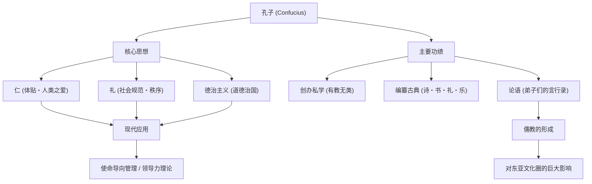

历史上最具影响力的影响者（influencer）是谁？在现代，你可能会想到史蒂夫·乔布斯或埃隆·马斯克，但在2500多年前，有一位席卷了整个东亚，其思想至今仍被传承的人物。他就是“孔子”。

本文将从专业历史作家的视角，深入探讨孔子波澜壮阔的一生、他提出的创新性哲学，以及他对现代社会和商业依然具有深远影响力的原因。

## 孔子是何许人也？：春秋时代的创新者

孔子（公元前551年〜公元前479年）是活跃于中国春秋时代的思想家、教育家和哲学家。本名孔丘，字仲尼。“孔子”意为“孔夫子（孔老师）”，是一种尊称。

当时的中国正处于周朝权威衰落、诸侯争霸的乱世。在下克上横行、道德沦丧的时代，孔子挑战了一个宏大的课题：“如何建立一个和平有序的社会”。可以说，他的思想绝非纸上谈兵，而是提出了一套在乱世中生存的实用性社会系统（OS）。

## 波澜壮阔的一生：挫折与探索之旅

### 怀才不遇的青年时期与向学的觉醒
孔子出生于鲁国（今山东省）的一个没落贵族家庭。他幼年丧父，在贫困的环境中长大，但他将逆境化作动力，刻苦学习。《论语》中“吾十有五而志于学”的名言家喻户晓。他深入研究了过去的历史和礼仪规范（礼），从而构建了自己独特的思想体系。

### 作为政治家的挑战与挫折
年过五十，孔子终于在鲁国担任要职（大司寇等），获得了实践自己理想政治的机会。凭借其卓越的才能，国家一度恢复了稳定，但由于与既得利益集团的冲突以及他国的阴谋，短短几年后他便黯然下野。这是他直面理想与现实之壁的瞬间。

### 周游列国与投身教育
被迫离开祖国后，为了寻找能采纳自己思想（更新版社会OS）的君主，孔子带领弟子们踏上了长达13年的周游列国之旅。然而，在那个重视武力扩张（霸道）的时代，孔子提倡的以道德治国（王道）的思想未被接受，他甚至数次面临生命危险。

晚年，孔子终于回到祖国鲁国，他退出政界，专心致志于培养后进和编纂古典。相传，他不分出身贵贱，在自己创办的私学中招收了许多年轻人，弟子多达三千人。

## 孔子的哲学：适用于现代的领导力OS

孔子思想的核心在于“仁”与“礼”，以及基于此的“德治主义”。

### “仁”：人类的爱与共情精神
“仁”是对他人的体贴、慈爱和共情之心。孔子主张“己所不欲，勿施于人”。这也是现代商业中关怀利益相关者、以及团队建设中营造心理安全感的普遍原则。

### “礼”：社会秩序与规范
“礼”是指将“仁”转化为具体行动的规范和规则。无论理念（仁）多么伟大，如果没有恰当表达它的界面（礼），社会就无法运转。孔子非常重视内在道德与外在社会规范的平衡。

### “德治主义”：基于伦理的治理
不依靠法律和刑罚（法治主义）强迫人们服从，而是通过领导者自身高尚的道德（德）来感化人们，使其自发地做出正确行为的政治手法被称为“德治主义”。这或许可以说是现代企业管理中，通过愿景和目标引导组织的“使命导向管理（Purpose-driven Management）”的先驱。

## 对后世的影响：东亚基础价值观的奠定

孔子死后，他的教诲被弟子们整理成《论语》，后来发展成为名为“儒教（儒学）”的强大思想体系。

在汉代，儒教被确立为国家正统学说（国教），此后两千多年里，它一直是中国政治、社会和教育的基石。随着儒教成为科举（官员选拔考试）的必考科目，其影响力变得具有绝对性。

此外，儒教的教义也传播到了朝鲜半岛和日本等周边国家，给整个东亚的伦理观和文化留下了深深的烙印。日本江户时代的武士道，以及现代日本企业的组织文化（论资排辈、忠诚心、以和为贵的精神）的根基中，也依然流淌着孔子思想的血液。

## 结语：孔子的教诲历久弥新

孔子的一生绝非一帆风顺。作为政治家，他遭遇了挫折；在他有生之年，其理想也未能完全实现。然而，他播下的“教育”这颗种子，跨越时空，成长为参天大树。

在科技急剧发展的今天，在不断叩问“人为何物”、“社会应走向何方”的现代，孔子倡导的“仁”与“礼”的哲学，必将成为指引我们回归本源的强大指南针。

### 孔子的思想与功绩结构（Mermaid图解）

