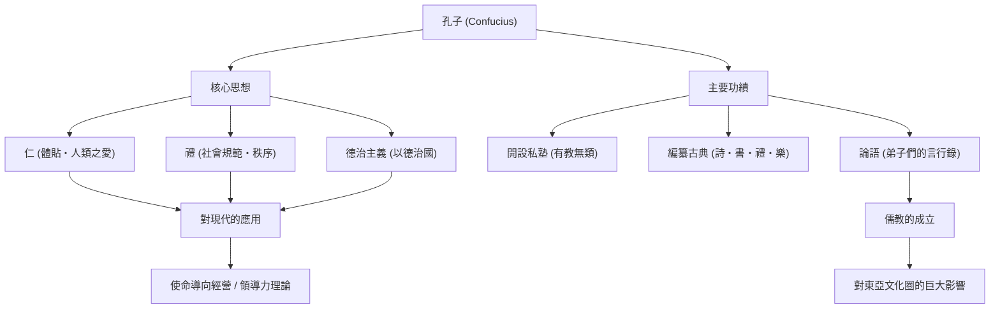

歷史上，最具影響力的網紅是誰？在現代，我們可能會想到史蒂夫·賈伯斯（Steve Jobs）或伊隆·馬斯克（Elon Musk），但在2500多年前，有一位席捲整個東亞、其思想至今仍被傳承的人物。他就是「孔子」。

在本文中，我們將從專業歷史作家的視角，深入探討孔子這位人物波瀾壯闊的生平、他所提倡的創新哲學，以及其對現代社會與商業依然深遠的影響力。

## 孔子是何許人也？：春秋時代的創新者

孔子（西元前551年〜西元前479年）是活躍於中國春秋時代的思想家、教育家及哲學家。本名孔丘，字仲尼。「孔子」是意為「孔先生」的尊稱。

當時的中國，周朝的權威掃地，是一個諸侯爭霸的亂世。在一個下剋上橫行、道德淪喪的時代，孔子挑戰了「如何建立和平且有秩序的社會」這個宏大的課題。他的思想絕非單純的紙上談兵，可以說是在亂世中求生的實踐性社會系統（OS）之提倡。

## 波瀾萬丈的生平：挫折與探索的旅程

### 懷才不遇的青年期與對學問的覺醒
孔子出生於魯國（今山東省）一個沒落的貴族家庭。他幼年喪父，在貧困的環境中長大，但他將逆境化為動力，發奮圖強。《論語》中「吾十有五而志于學」這句話非常有名。他徹底研究了過去的歷史與禮儀規範（禮），建立起獨特的思想體系。

### 作為政治家的挑戰與挫折
過了50歲，孔子終於在魯國擔任要職（如大司寇等），獲得了實踐他理想政治的機會。由於他卓越的手腕，國家一度安定，但因為與既得利益階層的對立以及他國的陰謀，短短幾年便黯然下台。這是他撞上理想與現實之牆的瞬間。

### 周遊列國與專注教育
被趕出祖國的孔子，為了尋求能採用他思想（更新版OS）的君主，與弟子們展開了長達13年的周遊列國之旅。然而，在一個重視以武力擴張霸權（霸道）的時代，孔子提倡以道德統治（王道）的思想並未被接受，甚至多次面臨生命危險。

晚年，終於回到祖國魯國的孔子退出了政治圈，專注於培育後進與編纂古典。他所開設的私塾吸引了不分階級的許多年輕人，據傳人數多達3000人。

## 孔子的哲學：現代依然適用的領導力OS

孔子思想的根基在於「仁」與「禮」，以及建立在此基礎上的「德治主義」。

### 「仁」：人類之愛與共鳴的精神
「仁」是對他人的體貼、慈愛與同理心。孔子主張「己所不欲，勿施於人」。這是與現代商業中對利害關係人的關懷，以及團隊建立中的心理安全感相通的普遍原則。

### 「禮」：社會秩序與規範
「禮」是指將「仁」具體表現為行動的規範與規則。無論有多麼美好的理念（仁），如果沒有適當表達它的介面（禮），社會就無法運作。孔子重視內在道德心與外在社會規範的平衡。

### 「德治主義」：基於倫理的治理
不透過法律與刑罰（法治主義）來強迫人們服從，而是透過領導者自身的高尚道德（德）來感化人們，使其自發採取正確行動的政治手法，被稱為「德治主義」。這或許可以說是現代企業經營中，以願景或目的引導組織的「使命導向經營（Purpose-driven Management）」之先驅。

## 對後世的影響：成為東亞的基礎價值觀

孔子死後，他的教誨被弟子們彙編成《論語》，後來發展成名為「儒教（儒學）」的強大思想體系。

在漢朝時被採用為國家的正統學問（國教），此後2000多年來成為中國政治、社會、教育的基礎。由於儒教被列為科舉（官僚任用考試）的主要必修科目，其影響力變得具有絕對性。

此外，儒教的教誨也傳播到朝鮮半島與日本等周邊國家，在整個東亞的倫理觀與文化上留下了深刻的印記。江戶時代日本的武士道，以及現代日本企業的組織文化（年資排序、忠誠心、以和為貴的精神），其根底也流淌著孔子的思想。

## 總結：孔子的教誨歷久彌新

孔子的一生絕對稱不上是一帆風順。作為政治家他遭遇了挫折，在有生之年，他的理想也未能完全實現。然而，他播下的「教育」種子，超越了時空，成長為一棵參天大樹。

在科技急遽發展、人們不斷叩問「何謂人類」、「社會應有樣貌為何」的現代，提倡「仁」與「禮」的孔子哲學，必定能成為我們應該回歸的強大羅盤（指南針）。

### 孔子的思想與功績結構（Mermaid圖解）

