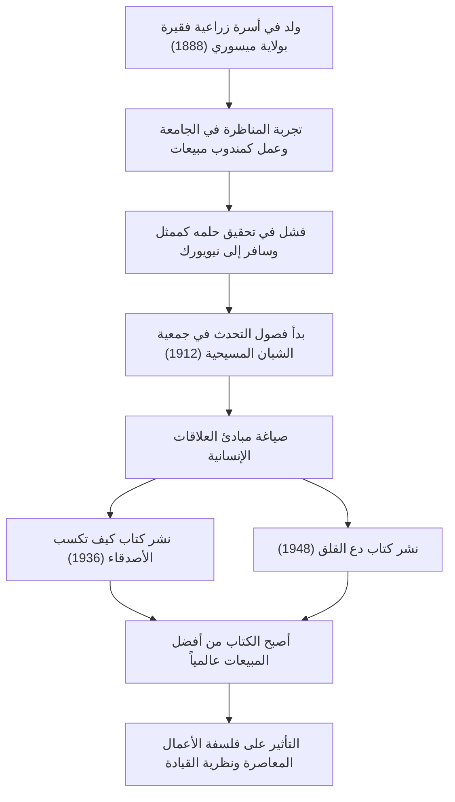

التحفة الفنية في مجال تطوير الذات والتي لا تزال تؤثر بشكل كبير على رجال الأعمال المعاصرين وقادة صناعة التكنولوجيا. نتحدث عن الكتب الشهيرة مثل "كيف تكسب الأصدقاء وتؤثر في الناس" و "دع القلق وابدأ الحياة". كيف تمكن ديل كارنيجي (1888-1955)، مبتكر هذه الأعمال، من صياغة مبادئ العلاقات الإنسانية بشكل منهجي والوصول إلى قلوب الناس في جميع أنحاء العالم؟ في هذا المقال، سنتعمق في حياته المليئة بالأحداث، وجوهر فلسفته، والإرث الذي انتقل إلى العصر الحديث.

## البداية من الفقر والإحباط في مرحلة الشباب

ولد ديل كارنيجي عام 1888 في أسرة فقيرة تعمل بالزراعة في ماريفيل بولاية ميسوري الأمريكية. نشأ في ظل الفقر والعمل الشاق، حيث كان يستيقظ في الصباح الباكر كل يوم لحلب الأبقار. ومع ذلك، وبناءً على تشجيع قوي من والدته، التحق بكلية المعلمين التابعة لولاية ميسوري في وارنسبورغ (الآن جامعة ميسوري المركزية).

لم يكن كارنيجي خلال دراسته طالباً بارزاً بأي حال من الأحوال. كان ضئيل البنية ولم يكن بارعاً في الرياضة، وللتغلب على عقدة النقص لديه، وجه اهتمامه نحو "نادي المناظرة (النقاش)". بعد جهود حثيثة، فاز في العديد من مسابقات المناظرة، والتي أصبحت أول تجربة نجاح في حياته.

بعد ترك الجامعة، عمل كبائع لبرامج التعليم عن بعد وكمندوب مبيعات لشركة تعبئة لحوم، محققاً مبيعات مذهلة. ومع ذلك، لم يتمكن من التخلي عن حلمه في أن يصبح ممثلاً وسافر إلى نيويورك، لكن النتيجة كانت الفشل الذريع. وسط خيبة الأمل، وجد نفسه يعيد النظر في حياته مرة أخرى.

## فصول التحدث في جمعية الشبان المسيحية ونقطة التحول في مصيره

في عام 1912، في سن الرابعة والعشرين، حصل كارنيجي على فرصة للعمل كمدرس في "فصول التحدث" للبالغين في جمعية الشبان المسيحية (YMCA) في نيويورك. في البداية، ترددت الجمعية في دفع راتب ثابت له، وبدلاً من ذلك عرضت عليه عقداً يعتمد على العمولة. ومع ذلك، تبين أن هذه كانت نقطة تحول كبرى.

لم تقتصر فصوله على مجرد التدريب على مهارات التحدث، بل ركزت على جوهر العلاقات الإنسانية: "كيف تكتسب الثقة وتبني علاقات جيدة مع الآخرين". تبادل المشاركون تجاربهم الخاصة وشجعوا بعضهم البعض، محققين نمواً مذهلاً. سرعان ما أصبح هذا النهج العملي والمليء بالتعاطف ذائع الصيت، واكتظت الفصول بالحضور يومياً. هذا هو النموذج الأولي لـ "دورة ديل كارنيجي" التي لا تزال مستمرة حتى يومنا هذا.

## بلورة الفلسفة: "كيف تكسب الأصدقاء" و "دع القلق"

يكمن جوهر فلسفة كارنيجي في الفهم العميق للطبيعة البشرية بأن "البشر ليسوا كائنات منطقية، بل كائنات عاطفية". وضع نفسك في مكان الشخص الآخر، وإظهار اهتمام صادق، وجعله يشعر بأهميته. هذه الأمور يسهل قولها، لكن تطبيقها غاية في الصعوبة. بناءً على سنوات خبرته في التدريس ودراسته لحالات العظماء في التاريخ، قام ببلورة ذلك إلى "مبادئ" يمكن لأي شخص تطبيقها.

نُشر كتاب "كيف تكسب الأصدقاء وتؤثر في الناس" في عام 1936 وسرعان ما أصبح من أكثر الكتب مبيعاً، حيث تمت قراءة أكثر من 30 مليون نسخة حول العالم حتى الآن. مبادئ مثل "لا تنتقد، لا تدن، ولا تشتكِ" و "كن مستمعاً جيداً" تحمل قيمة عالمية تتجاوز الزمن.

علاوة على ذلك، في عام 1948، نشر "دع القلق وابدأ الحياة"، وهو دليل عملي للتعامل مع القلق والتوتر. في مجتمعنا الحديث المليء بالمعلومات والتوتر، يتم إعادة تقييم تعاليم هذا الكتاب مثل "عش في حدود اليوم الواحد" و "توقع أسوأ الاحتمالات، وكن مستعداً لقبولها" من منظور الصحة النفسية.

## مسار وإنجازات كارنيجي

## التأثير على الأجيال القادمة: أهمية العلاقات الإنسانية في عصر التكنولوجيا

مرت أكثر من نصف قرن منذ وفاة ديل كارنيجي عام 1955، وتحول العالم إلى مجتمع تكنولوجي متقدم حيث ينتشر الإنترنت والذكاء الاصطناعي. ومع ذلك، ومن المفارقات، أنه كلما تطورت التكنولوجيا، زادت أهمية "المهارات البشرية" التي دعا إليها.

على سبيل المثال، يعتمد نجاح المشاريع في صناعة التكنولوجيا الحديثة، مثل التطوير الرشيق (Agile) ومجتمعات المصادر المفتوحة، بشكل كبير على التواصل السلس والسلامة النفسية بين أعضاء الفريق. في مجال القيادة أيضاً، أصبح الاتجاه السائد يبتعد عن أسلوب الأوامر من أعلى إلى أسفل نحو القيادة الخادمة، والتي تتعاطف مع الأعضاء وتشجع على العمل الذاتي. هذه هي بالضبط المبادئ التي علمها كارنيجي في "كيف تكسب الأصدقاء".

## خاتمة

كانت حياة ديل كارنيجي رحلة بدأت بالفقر والإحباط، لكنه استمر في دعم نمو الآخرين بينما كان يواجه نقاط ضعفه الخاصة. كلماته وتعاليمه ليست مجرد تقنيات أعمال، بل يمكن القول إنها "علوم إنسانية لعيش حياة أفضل".

حتى في العصر الذي يكتب فيه الذكاء الاصطناعي التعليمات البرمجية ويقوم بإجراء عمليات حسابية معقدة في لحظة، فإن القدرة على "تحريك قلوب الناس" لا تزال مسعى لا يمكن أن يقوم به إلا البشر. في مواجهة الصعوبات والاحتكاكات في العلاقات الإنسانية التي نواجهها في طليعة التكنولوجيا، ستظل فلسفة كارنيجي بمثابة بوصلة موثوقة لنا.
