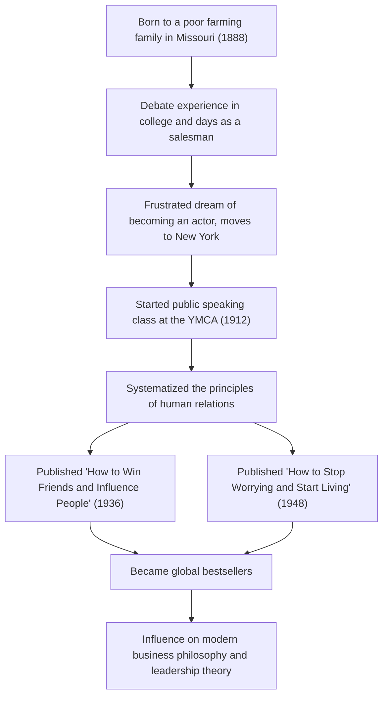

A monumental work of self-help that continues to have a massive influence on modern business people and leaders in the tech industry today. These are masterpieces such as "How to Win Friends and Influence People" and "How to Stop Worrying and Start Living". How did their creator, Dale Carnegie (1888–1955), come to systematize the principles of human relations and move the hearts of people all over the world? In this article, we will dig deep into his turbulent life, the essence of his philosophy, and the legacy he left for the modern era.

## A Beginning in Poverty and the Setbacks of Youth

Dale Carnegie was born in 1888 to a poor farming family in Maryville, Missouri, USA. During his childhood, he grew up in harsh labor and poverty, waking up early every morning to milk cows. However, with the strong encouragement of his mother, he went on to the State Normal School in Warrensburg (now University of Central Missouri).

During his student days, Carnegie was by no means a standout figure. Small in stature and not particularly good at sports, he turned his attention to the "Debate Club" to overcome his inferiority complex. Through desperate effort, he won numerous debate competitions, and this became the first successful experience in his life.

After dropping out of college, he worked as a salesman for correspondence courses and a sales representative for a meatpacking company, achieving phenomenal sales results. However, unable to give up his dream of becoming an actor, he moved to New York, only to face a crushing defeat. In despair, he was forced to re-examine his life once again.

## Public Speaking Classes at the YMCA and a Turning Point in Destiny

In 1912, at the age of 24, Carnegie got the opportunity to work as an instructor for a "public speaking class" for working adults at the YMCA (Young Men's Christian Association) in New York. Initially, the YMCA was reluctant to pay him a fixed salary, leading to a commission-based contract. However, this turned out to be a major turning point.

His classes went beyond mere technical instruction on speaking, focusing on the very core of human relations: "how to build confidence and establish good relationships with others." The participants achieved astonishing growth by sharing their own experiences and encouraging one another. This practical and empathetic approach quickly gained a reputation, and his classes were filled to capacity day after day. This is the prototype of the "Dale Carnegie Course" that continues to this day.

## The Crystallization of Philosophy: "How to Win Friends and Influence People" and "How to Stop Worrying and Start Living"

The core of Carnegie's philosophy lies in a deep understanding of humanity: "People are creatures of emotion, not creatures of logic." Putting yourself in the other person's shoes, showing genuine interest, and making them feel important. These are easy to say, but extremely difficult to put into practice. He studied historical figures' examples and his many years of teaching experience, systematizing them into "principles" that anyone could practice.

Published in 1936, "How to Win Friends and Influence People" instantly became a massive bestseller, with over 30 million copies read worldwide to date. Principles such as "Don't criticize, condemn or complain" and "Be a good listener" hold universal value that transcends time.

Furthermore, in 1948, he published "How to Stop Worrying and Start Living," a practical guide to dealing with anxiety and stress. In today's information-overloaded and stressful modern society, the book's teachings, such as "Live in 'day-tight compartments'" and "Prepare to accept the worst," are being re-evaluated from a mental health perspective as well.

## Carnegie's Trajectory and Achievements Flow

## Legacy for the Future: The Importance of Human Relations in the Tech Era

More than half a century has passed since Dale Carnegie's death in 1955, and the world has transformed into a highly advanced technological society where the Internet and AI are widespread. Paradoxically, however, the more technology advances, the more important the "human skills" he advocated become.

For example, the success of projects in the modern tech industry, such as agile development and open source communities, depends heavily on smooth communication and psychological safety among team members. In leadership as well, the mainstream is shifting from top-down command-and-control to servant leadership, which empathizes with members and encourages spontaneous action. These are exactly the principles Carnegie preached in "How to Win Friends and Influence People."

## Conclusion

Dale Carnegie's life was a journey that began with poverty and setbacks, constantly confronting his own weaknesses while supporting the growth of others. His words and teachings can be said to be "humanology for living a better life," rather than mere business techniques.

Even in an era where AI writes code and performs complex calculations instantly, the ability to "move people's hearts" remains a uniquely human endeavor. Against the difficulties and human friction we face at the forefront of technology, Carnegie's philosophy will surely continue to be a reliable compass.
