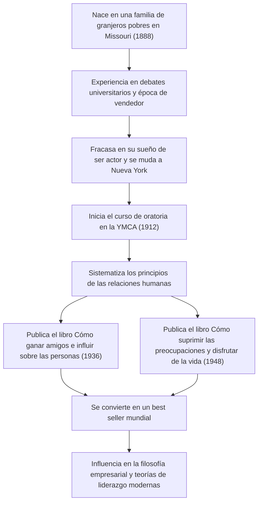

Una obra maestra del desarrollo personal que sigue teniendo una enorme influencia en los profesionales de los negocios y líderes de la industria tecnológica actual. Son los clásicos "Cómo ganar amigos e influir sobre las personas" y "Cómo suprimir las preocupaciones y disfrutar de la vida". ¿Cómo logró su creador, Dale Carnegie (1888–1955), sistematizar los principios de las relaciones humanas y conmover los corazones de personas en todo el mundo? En este artículo, profundizaremos desde su turbulenta vida y la esencia de su filosofía, hasta el legado que perdura en la actualidad.

## Partida desde la pobreza y una juventud de frustraciones

Dale Carnegie nació en 1888 en una familia de granjeros pobres en Maryville, Missouri, Estados Unidos. Durante su infancia, creció en medio de la pobreza y el trabajo duro, levantándose temprano cada mañana para ordeñar vacas. Sin embargo, por la fuerte recomendación de su madre, ingresó a la Escuela Normal Estatal de Warrensburg (actualmente la Universidad de Missouri Central).

Durante su época de estudiante, Carnegie nunca fue alguien que destacara. De complexión pequeña y sin ser bueno en los deportes, centró su atención en el "club de debate" para superar su complejo de inferioridad. Tras un arduo esfuerzo, ganó numerosos concursos de debate, lo que se convirtió en la primera experiencia de éxito en su vida.

Después de dejar la universidad, trabajó como vendedor de cursos por correspondencia y como vendedor para una empresa procesadora de carne, logrando resultados de ventas asombrosos. Sin embargo, sin poder renunciar a su sueño de ser actor, se mudó a Nueva York, pero el resultado fue un fracaso rotundo. En medio de la desesperación, tuvo que reconsiderar su vida una vez más.

## Clases de oratoria en la YMCA y un giro del destino

En 1912, a la edad de 24 años, Carnegie tuvo la oportunidad de trabajar como instructor en un "curso de oratoria" para adultos en la YMCA (Asociación Cristiana de Jóvenes) de Nueva York. Inicialmente, la YMCA se mostró reacia a pagarle un salario fijo y acordó un contrato a comisión. Sin embargo, esto resultó ser un gran punto de inflexión.

Sus clases no se limitaban a la mera instrucción técnica sobre cómo dar un discurso, sino que se centraban en la base de las relaciones humanas: "cómo tener confianza en uno mismo y construir buenas relaciones con los demás". Los participantes compartían sus propias experiencias y se animaban mutuamente, logrando un crecimiento sorprendente. Este enfoque práctico y lleno de empatía rápidamente ganó reputación, y las clases se llenaron día tras día. Este fue el prototipo del "Curso Dale Carnegie", que continúa hasta el día de hoy.

## La cristalización de su filosofía: "Cómo ganar amigos e influir sobre las personas" y "Cómo suprimir las preocupaciones y disfrutar de la vida"

El núcleo de la filosofía de Carnegie radica en una profunda comprensión humana: "las personas no son criaturas de lógica, sino criaturas de emociones". Ponerse en el lugar del otro, mostrar un interés sincero y hacerlos sentir importantes. Estas cosas son fáciles de decir, pero extremadamente difíciles de poner en práctica. Él estudió sus años de experiencia en conferencias y casos de grandes figuras históricas, y los sistematizó en "principios" que cualquiera puede aplicar.

Publicado en 1936, "Cómo ganar amigos e influir sobre las personas" se convirtió rápidamente en un gran éxito de ventas y ha sido leído por más de 30 millones de personas en todo el mundo hasta la fecha. Principios como "No critique, no condene ni se queje" y "Sea un buen oyente" tienen un valor universal que trasciende el tiempo.

Además, en 1948 publicó "Cómo suprimir las preocupaciones y disfrutar de la vida", una guía práctica para lidiar con la ansiedad y el estrés. En la estresante sociedad actual de sobrecarga de información, las enseñanzas de este libro, como "Vivir en compartimentos estancos al día" y "Estar dispuesto a aceptar lo peor", están siendo reevaluadas desde la perspectiva de la salud mental.

## Flujo de la trayectoria y los logros de Carnegie

## Influencia en las generaciones futuras: La importancia de las relaciones humanas en la era tecnológica

Ha pasado más de medio siglo desde que Dale Carnegie falleció en 1955, y el mundo se ha transformado en una sociedad altamente tecnológica donde Internet y la IA se han generalizado. Sin embargo, paradójicamente, cuanto más avanza la tecnología, más aumenta la importancia de las "habilidades humanas" que él propuso.

Por ejemplo, el éxito de los proyectos en la industria tecnológica moderna, como el desarrollo ágil y las comunidades de código abierto, depende en gran medida de la comunicación fluida y la seguridad psicológica entre los miembros del equipo. En cuanto al liderazgo, el liderazgo de servicio, que empatiza con los miembros y fomenta el comportamiento espontáneo, se está convirtiendo en la corriente principal, en lugar del estilo autoritario de arriba hacia abajo. Estos son exactamente los mismos principios que Carnegie predicó en "Cómo ganar amigos e influir sobre las personas".

## Conclusión

La vida de Dale Carnegie comenzó con la pobreza y la frustración, un viaje en el que continuó apoyando el crecimiento de los demás mientras enfrentaba sus propias debilidades. Sus palabras y enseñanzas no son meras técnicas de negocios, sino que se puede decir que son "humanidades para vivir una vida mejor".

Incluso en una era en la que la IA escribe código y realiza cálculos complejos al instante, "conmover el corazón de las personas" es algo que solo los humanos pueden hacer. Ante las dificultades y las fricciones en las relaciones humanas a las que nos enfrentamos a la vanguardia de la tecnología, la filosofía de Carnegie seguirá siendo, sin duda, una brújula fiable.
