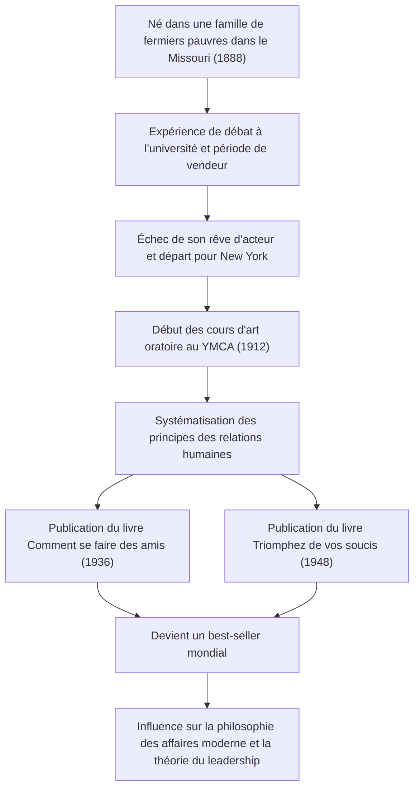

Un chef-d'œuvre du développement personnel qui continue d'avoir une influence massive sur les professionnels et les leaders de l'industrie technologique d'aujourd'hui. Ce sont des classiques comme "Comment se faire des amis" (How to Win Friends and Influence People) et "Triomphez de vos soucis : vivez que diable !" (How to Stop Worrying and Start Living). Comment leur créateur, Dale Carnegie (1888-1955), a-il systématisé les principes des relations humaines et réussi à toucher le cœur des gens du monde entier ? Dans cet article, nous plongerons profondément dans sa vie tumultueuse, l'essence de sa philosophie et l'héritage transmis à l'ère moderne.

## Départs dans la pauvreté et frustrations de jeunesse

Dale Carnegie est né en 1888 dans une famille de fermiers pauvres à Maryville, dans le Missouri, aux États-Unis. Dans son enfance, il a grandi dans la pauvreté et le travail acharné, se levant tôt tous les matins pour traire les vaches, entre autres. Cependant, fortement encouragé par sa mère, il intègre l'École normale d'État de Warrensburg (aujourd'hui l'Université de Central Missouri).

Durant ses années étudiantes, Carnegie ne se distinguait pas particulièrement. Petit de taille et peu doué pour le sport, il s'est tourné vers le "club de débat" pour surmonter son complexe d'infériorité. Après des efforts acharnés, il a remporté de nombreux concours d'éloquence, ce qui est devenu sa première expérience de réussite dans la vie.

Après avoir abandonné l'université, il a travaillé comme vendeur par correspondance et représentant pour une entreprise de conditionnement de viande, obtenant des résultats de vente phénoménaux. Cependant, incapable d'abandonner son rêve de devenir acteur, il s'est installé à New York, mais a essuyé un échec cuisant. Désespéré, il a été contraint de repenser sa vie.

## Cours d'art oratoire au YMCA et tournant du destin

En 1912, à l'âge de 24 ans, Carnegie a l'opportunité de travailler comme instructeur pour des "cours d'art oratoire" destinés aux adultes au YMCA (Young Men's Christian Association) de New York. Au début, le YMCA était réticent à lui verser un salaire fixe, de sorte que son contrat était basé sur des commissions. Cependant, cela s'est avéré être un tournant majeur.

Ses cours ne se limitaient pas à de simples techniques de discours ; ils se concentraient sur l'essence même des relations humaines : "comment avoir confiance en soi et établir de bonnes relations avec les autres". Les participants ont partagé leurs propres expériences, se sont encouragés mutuellement et ont connu une croissance remarquable. Cette approche pratique et empathique a rapidement fait parler d'elle, et ses classes faisaient salle comble tous les jours. C'est le prototype du "Cours Dale Carnegie" qui perdure encore aujourd'hui.

## L'essence de la philosophie : "Comment se faire des amis" et "Triomphez de vos soucis"

Au cœur de la philosophie de Carnegie se trouve une profonde compréhension humaine : "Les humains ne sont pas des créatures de logique, mais des créatures d'émotion". Se mettre à la place de l'autre, montrer un intérêt sincère et lui donner un sentiment d'importance. C'est facile à dire, mais extrêmement difficile à mettre en pratique. S'appuyant sur des années d'expérience en enseignement et l'étude des grands personnages historiques, il a systématisé ces concepts en "principes" que tout le monde peut appliquer.

Publié en 1936, "Comment se faire des amis" est immédiatement devenu un grand best-seller, avec plus de 30 millions d'exemplaires vendus dans le monde à ce jour. Des principes tels que "Ne critiquez pas, ne condamnez pas, ne vous plaignez pas" et "Soyez à l'écoute" possèdent une valeur universelle intemporelle.

De plus, en 1948, il a publié "Triomphez de vos soucis", un guide pratique pour faire face à l'anxiété et au stress. Dans notre société moderne stressante et saturée d'informations, l'enseignement de ce livre, comme "Vivre dans des compartiments étanches pour aujourd'hui" et "S'attendre au pire et s'y préparer", est réévalué du point de vue de la santé mentale.

## Parcours et réalisations de Carnegie

## Impact sur la postérité : L'importance des relations humaines à l'ère de la technologie

Plus d'un demi-siècle s'est écoulé depuis la mort de Dale Carnegie en 1955, et le monde s'est transformé en une société technologique avancée où Internet et l'IA sont omniprésents. Paradoxalement, plus la technologie progresse, plus l'importance des "compétences humaines" qu'il prônait augmente.

Par exemple, le succès des projets dans l'industrie technologique moderne, comme le développement agile et les communautés open source, dépend fortement d'une communication fluide et de la sécurité psychologique entre les membres de l'équipe. Même en matière de leadership, le style autoritaire descendant cède la place au "servant leadership" qui encourage l'empathie et l'action spontanée des membres. Ce sont précisément les principes que Carnegie enseignait dans "Comment se faire des amis".

## Conclusion

La vie de Dale Carnegie a commencé par la pauvreté et les échecs, un parcours au cours duquel il a affronté ses propres faiblesses tout en continuant à soutenir la croissance des autres. Ses paroles et ses enseignements ne sont pas de simples techniques commerciales, mais peuvent être qualifiés d'"étude humaine pour mener une vie meilleure".

Même à une époque où l'IA écrit du code et effectue instantanément des calculs complexes, seul un humain peut véritablement "toucher le cœur des autres". Face aux difficultés et aux frictions interpersonnelles que nous rencontrons à l'avant-garde de la technologie, la philosophie de Carnegie continuera d'être une boussole fiable.
