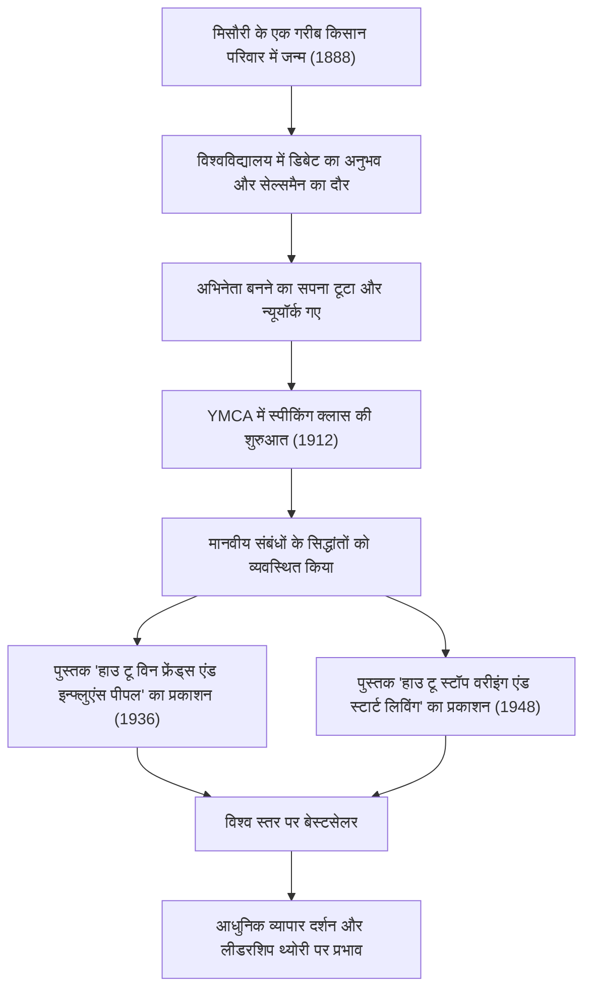

आधुनिक व्यवसायियों और तकनीकी उद्योग के लीडर्स को आज भी गहराई से प्रभावित करने वाला आत्म-विकास का एक मील का पत्थर। वे महान पुस्तकें हैं 'हाउ टू विन फ्रेंड्स एंड इन्फ्लुएंस पीपल' (How to Win Friends and Influence People) और 'हाउ टू स्टॉप वरीइंग एंड स्टार्ट लिविंग' (How to Stop Worrying and Start Living)। इनके रचयिता डेल कार्नेगी (Dale Carnegie, 1888–1955) ने किस तरह मानवीय संबंधों के सिद्धांतों को व्यवस्थित किया और दुनिया भर के लोगों के दिलों को प्रेरित किया? इस लेख में, हम उनके उथल-पुथल भरे जीवन से लेकर उनके दर्शन के सार, और आधुनिक युग में विरासत के रूप में मिली उनकी सीख तक की गहराई से पड़ताल करेंगे।

## गरीबी से शुरुआत और निराशाजनक युवावस्था

डेल कार्नेगी का जन्म 1888 में अमेरिका के मिसौरी राज्य के मैरीविले में एक गरीब किसान परिवार में हुआ था। उनका बचपन हर सुबह जल्दी उठकर गायों का दूध दुहने जैसी कठोर मेहनत और गरीबी में बीता। हालाँकि, अपनी माँ के पुरजोर आग्रह पर, उन्होंने वॉरेन्सबर्ग के स्टेट नॉर्मल स्कूल (अब सेंट्रल मिसौरी यूनिवर्सिटी) में दाखिला लिया।

अपने छात्र जीवन में, कार्नेगी कोई खास लोकप्रिय या प्रमुख छात्र नहीं थे। छोटे कद और खेलों में अच्छे न होने के कारण, अपनी हीन भावना को दूर करने के लिए उन्होंने 'डिबेट क्लब' (Debate Club) की ओर रुख किया। अपनी कड़ी मेहनत के बाद उन्होंने कई डिबेट प्रतियोगिताओं में जीत हासिल की, और यह उनके जीवन की पहली सफलता का अनुभव बन गया।

विश्वविद्यालय छोड़ने के बाद, उन्होंने पत्राचार शिक्षा के लिए एक सेल्समैन और एक मीट कंपनी में सेल्समैन के रूप में काम किया, और शानदार बिक्री रिकॉर्ड बनाए। हालाँकि, अभिनेता बनने के अपने सपने को न छोड़ पाने के कारण वह न्यूयॉर्क चले गए, लेकिन वहाँ उन्हें पूरी तरह असफलता मिली। इस निराशा के बीच, उन्होंने एक बार फिर अपने जीवन के उद्देश्य पर पुनर्विचार किया।

## YMCA में स्पीकिंग क्लास और किस्मत का मोड़

1912 में, 24 साल की उम्र में, कार्नेगी को न्यूयॉर्क के YMCA (यंग मेन्स क्रिश्चियन एसोसिएशन) में वयस्कों के लिए 'स्पीकिंग क्लास' (Speaking Class) पढ़ाने का अवसर मिला। शुरुआत में, YMCA उन्हें एक निश्चित वेतन देने से कतरा रहा था और उन्होंने कमीशन के आधार पर एक अनुबंध किया। हालाँकि, यह एक बड़ा मोड़ साबित हुआ।

उनकी कक्षाएं केवल भाषण की तकनीक सिखाने तक सीमित नहीं थीं, बल्कि उन्होंने 'कैसे आत्मविश्वास पैदा करें और दूसरों के साथ अच्छे संबंध बनाएं' जैसे मानवीय संबंधों के मूल पर ध्यान केंद्रित किया। प्रतिभागियों ने अपने अनुभव साझा किए और एक-दूसरे को प्रोत्साहित किया, जिससे उनमें आश्चर्यजनक रूप से विकास हुआ। यह व्यावहारिक और सहानुभूतिपूर्ण दृष्टिकोण बहुत तेजी से लोकप्रिय हो गया, और कक्षाएं हर दिन पूरी तरह से भर जाने लगीं। यही आज तक चलने वाले 'डेल कार्नेगी कोर्स' का मूल रूप है।

## दर्शन का सार: 'हाउ टू विन फ्रेंड्स एंड इन्फ्लुएंस पीपल' और 'हाउ टू स्टॉप वरीइंग एंड स्टार्ट लिविंग'

कार्नेगी के दर्शन का मूल यह गहरी मानवीय समझ है कि 'मनुष्य तार्किक प्राणी नहीं, बल्कि भावनात्मक प्राणी है।' दूसरों की जगह खुद को रखना, उनमें सच्ची दिलचस्पी दिखाना और उन्हें महत्वपूर्ण महसूस कराना। ये बातें कहने में आसान हैं, लेकिन इन्हें व्यवहार में लाना बहुत मुश्किल है। अपने वर्षों के शिक्षण अनुभव और इतिहास के महान लोगों के उदाहरणों का अध्ययन करके, उन्होंने इसे ऐसे 'सिद्धांतों' में व्यवस्थित किया जिन्हें कोई भी व्यक्ति लागू कर सकता है।

1936 में प्रकाशित 'हाउ टू विन फ्रेंड्स एंड इन्फ्लुएंस पीपल' (How to Win Friends and Influence People) रातों-रात एक बड़ी बेस्टसेलर बन गई, और अब तक दुनिया भर में इसकी 3 करोड़ से अधिक प्रतियां पढ़ी जा चुकी हैं। 'आलोचना, निंदा या शिकायत न करें', 'एक अच्छे श्रोता बनें' जैसे सिद्धांत समय से परे एक सार्वभौमिक मूल्य रखते हैं।

इसके अलावा, 1948 में, उन्होंने चिंता और तनाव से निपटने के लिए एक व्यावहारिक मार्गदर्शिका 'हाउ टू स्टॉप वरीइंग एंड स्टार्ट लिविंग' (How to Stop Worrying and Start Living) प्रकाशित की। अत्यधिक जानकारी और तनाव वाले आज के आधुनिक समाज में, इस पुस्तक की 'आज, एक दिन के अंतराल में जिएं' और 'सबसे बुरी स्थिति की कल्पना करें और उसे स्वीकार करने के लिए तैयार रहें' जैसी शिक्षाओं का मानसिक स्वास्थ्य के दृष्टिकोण से फिर से मूल्यांकन किया जा रहा है।

## कार्नेगी का सफर और उपलब्धियों का प्रवाह

## भावी पीढ़ियों पर प्रभाव: तकनीकी युग में मानवीय संबंधों का महत्व

डेल कार्नेगी के निधन (1955) को आधी सदी से अधिक समय बीत चुका है, और दुनिया एक उन्नत तकनीकी समाज में बदल गई है जहां इंटरनेट और एआई का व्यापक रूप से उपयोग किया जाता है। हालाँकि, विरोधाभासी रूप से, तकनीक जितनी अधिक विकसित होती है, उनके द्वारा सुझाए गए 'ह्यूमन स्किल्स' (Human Skills) का महत्व उतना ही अधिक बढ़ जाता है।

उदाहरण के लिए, एजाइल डेवलपमेंट (Agile Development) और ओपन सोर्स कम्युनिटी जैसी आधुनिक तकनीकी उद्योग में परियोजनाओं की सफलता काफी हद तक टीम के सदस्यों के बीच सुचारू संचार और मनोवैज्ञानिक सुरक्षा पर निर्भर करती है। लीडरशिप में भी, टॉप-डाउन कमांड शैली से हटकर एक सर्वेंट लीडरशिप (Servant Leadership) चलन में आ रही है जो सदस्यों के साथ सहानुभूति रखती है और उनके स्वतंत्र कार्यों को प्रोत्साहित करती है। ये ठीक वही सिद्धांत हैं जो कार्नेगी ने 'हाउ टू विन फ्रेंड्स एंड इन्फ्लुएंस पीपल' में सिखाए थे।

## निष्कर्ष

डेल कार्नेगी का जीवन गरीबी और असफलताओं से शुरू हुआ, और यह अपनी खुद की कमजोरियों का सामना करते हुए दूसरों के विकास में मदद करने की एक लंबी यात्रा थी। उनके शब्द और शिक्षाएं केवल व्यावसायिक तकनीकें नहीं हैं, बल्कि उन्हें 'बेहतर जीवन जीने के लिए मानविकी' कहा जा सकता है।

एक ऐसे युग में जहां एआई कोड लिखता है और तुरंत जटिल गणनाएं करता है, 'लोगों के दिलों को प्रेरित करना' अभी भी एक ऐसा काम है जो केवल मनुष्य ही कर सकते हैं। तकनीकी मोर्चे पर हम जिन कठिनाइयों और मानवीय संबंधों के संघर्षों का सामना करते हैं, उनके लिए कार्नेगी का दर्शन हमेशा एक विश्वसनीय कम्पास (मार्गदर्शक) बना रहेगा।
