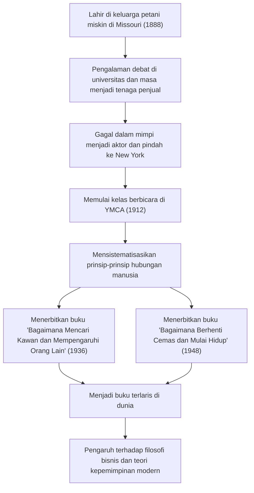

Karya monumental pengembangan diri yang terus memberikan pengaruh besar pada para profesional bisnis dan pemimpin industri teknologi modern hingga saat ini. Itulah buku-buku mahakarya seperti "Bagaimana Mencari Kawan dan Mempengaruhi Orang Lain (How to Win Friends and Influence People)" dan "Bagaimana Berhenti Cemas dan Mulai Hidup (How to Stop Worrying and Start Living)". Bagaimana penciptanya, Dale Carnegie (1888–1955), mampu mensistematisasikan prinsip-prinsip hubungan manusia dan menggerakkan hati orang-orang di seluruh dunia? Dalam artikel ini, kita akan menggali lebih dalam dari kehidupannya yang penuh gejolak, esensi filosofinya, hingga warisan yang diteruskan ke era modern.

## Berawal dari Kemiskinan dan Masa Muda yang Penuh Kegagalan

Dale Carnegie lahir pada tahun 1888 dari sebuah keluarga petani miskin di Maryville, Missouri, Amerika Serikat. Masa kecilnya dihabiskan dalam kerja keras dan kemiskinan, seperti bangun pagi setiap hari untuk memerah susu sapi. Namun, dengan dorongan kuat dari ibunya, ia melanjutkan pendidikannya di State Normal School di Warrensburg (kini University of Central Missouri).

Semasa mahasiswa, Carnegie bukanlah sosok yang menonjol. Memiliki postur tubuh kecil dan tidak pandai berolahraga, ia mengalihkan perhatiannya ke "Klub Debat" untuk mengatasi rasa rendah dirinya. Setelah berusaha keras, ia berhasil memenangkan berbagai kompetisi debat, dan ini menjadi pengalaman sukses pertamanya dalam hidup.

Setelah putus kuliah, ia bekerja sebagai tenaga penjual kursus korespondensi dan perwakilan penjualan di perusahaan daging, mencetak rekor penjualan yang luar biasa. Namun, ia tidak bisa melepaskan mimpinya menjadi aktor dan pindah ke New York, tetapi hasilnya adalah kegagalan total. Di tengah keputusasaan, ia sekali lagi harus meninjau kembali hidupnya.

## Kelas Berbicara di YMCA dan Titik Balik Takdir

Pada tahun 1912, Carnegie yang berusia 24 tahun mendapat kesempatan menjadi instruktur "kelas berbicara" untuk orang dewasa di YMCA (Young Men's Christian Association) New York. Awalnya, pihak YMCA enggan membayarnya dengan gaji tetap, sehingga mereka menyepakati kontrak berbasis komisi. Namun, hal ini justru menjadi titik balik besar.

Kelas-kelasnya bukan sekadar panduan teknik berpidato, melainkan berfokus pada inti hubungan manusia, yaitu "bagaimana memiliki kepercayaan diri dan membangun hubungan yang baik dengan orang lain". Para peserta saling berbagi pengalaman dan menyemangati satu sama lain, yang menghasilkan pertumbuhan luar biasa. Pendekatan praktis dan penuh empati ini dengan cepat meraih reputasi baik, dan kelas tersebut penuh sesak setiap harinya. Inilah prototipe dari "Kursus Dale Carnegie" yang berlanjut hingga hari ini.

## Kristalisasi Filosofi: "Bagaimana Mencari Kawan dan Mempengaruhi Orang Lain" dan "Bagaimana Berhenti Cemas dan Mulai Hidup"

Inti dari filosofi Carnegie terletak pada pemahaman manusia yang mendalam bahwa "manusia bukanlah makhluk logika, melainkan makhluk emosi". Menempatkan diri pada posisi orang lain, menaruh minat yang tulus, dan membuat mereka merasa penting. Hal-hal ini mudah diucapkan namun sangat sulit dipraktikkan. Ia mensistematisasikan pengalaman mengajarnya selama bertahun-tahun dan studi tentang kasus-kasus tokoh besar dalam sejarah menjadi "prinsip-prinsip" yang dapat dipraktikkan oleh siapa saja.

Diterbitkan pada tahun 1936, "Bagaimana Mencari Kawan dan Mempengaruhi Orang Lain" dengan cepat menjadi buku terlaris, dan hingga saat ini telah dibaca lebih dari 30 juta kopi di seluruh dunia. Prinsip-prinsip seperti "jangan mengkritik, mencerca, atau mengeluh" dan "jadilah pendengar yang baik" memiliki nilai universal yang melampaui zaman.

Lebih lanjut, pada tahun 1948, ia menerbitkan buku panduan praktis untuk mengatasi kecemasan dan stres, "Bagaimana Berhenti Cemas dan Mulai Hidup". Di masyarakat modern saat ini yang kelebihan informasi dan penuh tekanan, ajaran buku ini seperti "hidup dalam sekat-sekat hari ini" dan "bayangkan kemungkinan terburuk dan bersiaplah untuk menerimanya" telah dinilai kembali dari perspektif kesehatan mental.

## Jejak dan Alur Pencapaian Carnegie

## Pengaruh pada Generasi Berikutnya: Pentingnya Hubungan Manusia di Era Teknologi

Lebih dari setengah abad telah berlalu sejak Dale Carnegie wafat pada tahun 1955, dan dunia telah bertransformasi menjadi masyarakat teknologi tinggi di mana internet dan AI tersebar luas. Namun, secara paradoks, semakin berkembangnya teknologi, semakin tinggi pula pentingnya "keterampilan manusia (human skills)" yang ia anjurkan.

Sebagai contoh, keberhasilan proyek-proyek di industri teknologi modern, seperti pengembangan agile dan komunitas open-source, sangat bergantung pada kelancaran komunikasi dan keamanan psikologis di antara anggota tim. Dalam hal kepemimpinan, gaya perintah dari atas ke bawah (top-down) telah mulai tergantikan oleh servant leadership (kepemimpinan pelayan) yang berempati kepada anggota dan mendorong tindakan sukarela. Ini persis seperti prinsip-prinsip yang diajarkan Carnegie dalam "Bagaimana Mencari Kawan dan Mempengaruhi Orang Lain".

## Penutup

Kehidupan Dale Carnegie dimulai dari kemiskinan dan kegagalan, dan merupakan perjalanan yang terus mendukung pertumbuhan orang lain sambil menghadapi kelemahannya sendiri. Kata-kata dan ajarannya bukanlah sekadar teknik bisnis, melainkan dapat dikatakan sebagai "studi manusia untuk menjalani kehidupan yang lebih baik".

Bahkan di era di mana AI menulis kode dan melakukan perhitungan kompleks dalam sekejap, kemampuan untuk "menggerakkan hati orang" tetaplah merupakan sebuah tindakan yang hanya bisa dilakukan oleh manusia. Terhadap berbagai kesulitan dan gesekan hubungan manusia yang kita hadapi di garis depan teknologi, filosofi Carnegie akan terus menjadi kompas yang dapat diandalkan.
