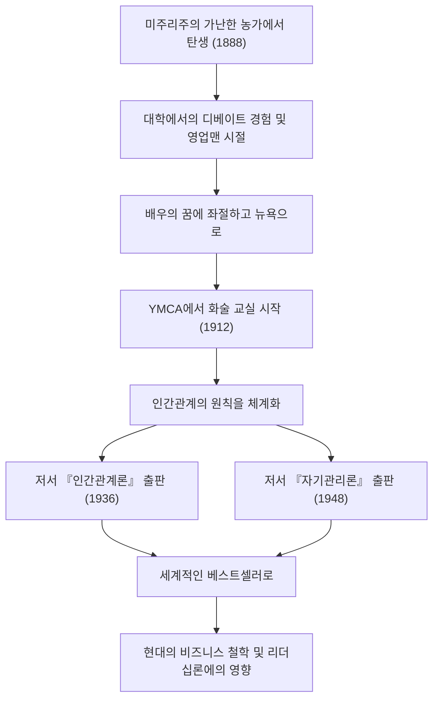

현대의 비즈니스맨이나 테크 업계의 리더들에게 지금까지도 지대한 영향을 미치고 있는 자기계발의 금자탑. 그것이 『인간관계론 (How to Win Friends and Influence People)』이나 『자기관리론 (How to Stop Worrying and Start Living)』과 같은 명저입니다. 이들의 창시자인 데일 카네기(Dale Carnegie, 1888–1955)는 어떻게 인간관계의 원칙을 체계화하고 전 세계 사람들의 마음을 움직일 수 있었을까요? 본 기사에서는 그의 파란만장한 생애부터 그 철학의 진수, 그리고 현대에 계승되는 유산까지 깊이 파헤쳐 보겠습니다.

## 빈곤에서의 출발과 좌절의 청년기

데일 카네기는 1888년 미국 미주리주 메리빌의 가난한 농가에서 태어났습니다. 어린 시절에는 매일 아침 일찍 일어나 소젖을 짜는 등 가혹한 노동과 빈곤 속에서 자랐습니다. 그러나 어머니의 강력한 권유로 워런스버그의 주립 사범학교(현재의 센트럴 미주리 대학교)에 진학합니다.

학창 시절의 카네기는 결코 눈에 띄는 존재가 아니었습니다. 체격도 왜소하고 스포츠도 잘하지 못했던 그는 열등감을 극복하기 위해 '변론(디베이트) 클럽'에 눈을 돌립니다. 필사적인 노력 끝에 수많은 변론 대회에서 우승을 차지하고, 이것이 그의 인생에서 첫 성공 경험이 되었습니다.

대학 중퇴 후 그는 통신 교육 세일즈맨과 정육 회사 영업맨으로 일하며 경이로운 영업 실적을 남깁니다. 하지만 배우가 되겠다는 꿈을 포기하지 못하고 뉴욕으로 건너가지만 결과는 참패였습니다. 실의 속에서 그는 다시 자신의 인생을 되돌아보게 됩니다.

## YMCA에서의 화술 교실과 운명의 전환점

1912년, 24세가 된 카네기는 뉴욕의 YMCA(기독교 청년회)에서 직장인을 위한 '화술 교실'의 강사를 맡을 기회를 얻습니다. 애초에 YMCA 측은 그에게 고정급 지급을 꺼려 성과급제 계약을 맺었습니다. 그런데 이것이 큰 전환점이 됩니다.

그의 수업은 단순한 스피치 기술 지도에 그치지 않고, "어떻게 자신감을 갖고 타인과 좋은 관계를 맺을 것인가"라는 인간관계의 근간에 초점을 맞춘 것이었습니다. 참가자들은 자신의 경험을 나누고 서로 격려하며 놀라운 성장을 이루었습니다. 이 실천적이고 공감에 찬 접근법은 순식간에 입소문을 타며 교실은 연일 만원을 이루었습니다. 이것이 오늘날까지 이어지는 '데일 카네기 코스'의 원형입니다.

## 철학의 결정체: 『인간관계론』과 『자기관리론』

카네기 철학의 핵심은 "사람은 논리의 동물이 아니라 감정의 동물이다"라는 깊은 인간 이해에 있습니다. 상대방의 입장에 서서 진심 어린 관심을 기울이고, 중요성을 느끼게 하는 것. 이것들은 말로 하기는 쉽지만 실천하기는 지극히 어렵습니다. 그는 오랜 강의 경험과 역사상 위인들의 사례를 연구하여, 그것을 누구나 실천할 수 있는 '원칙'으로 체계화했습니다.

1936년에 출판된 『인간관계론』은 순식간에 대형 베스트셀러가 되어, 현재까지 전 세계적으로 3000만 부 이상 읽히고 있습니다. "비판도 비난도 하지 않고 불평도 하지 않는다", "듣는 사람의 입장에 선다"와 같은 원칙은 시대를 초월하여 보편적인 가치를 지닙니다.

나아가 1948년에는 불안과 스트레스에 대처하기 위한 실천적인 지침서 『자기관리론』을 출판했습니다. 정보 과잉으로 스트레스가 많은 현대 사회에서 이 책의 "오늘, 하루의 단락으로 산다", "최악의 사태를 가정하고 그것을 받아들일 준비를 한다"는 가르침은 정신 건강 관점에서도 재평가받고 있습니다.

## 카네기의 궤적과 공적 흐름

## 후세에의 영향: 테크 시대에서의 인간관계의 중요성

데일 카네기가 세상을 떠난 1955년부터 반세기 이상이 지나고, 세계는 인터넷과 AI가 보급되는 고도의 테크놀로지 사회로 변모했습니다. 그러나 역설적이게도 테크놀로지가 진화하면 할수록 그가 제창한 '휴먼 스킬'의 중요성은 높아지고 있습니다.

예를 들어 애자일 개발이나 오픈 소스 커뮤니티 등 현대 테크 업계에서의 프로젝트 성공은 팀원 간의 원활한 커뮤니케이션과 심리적 안전감에 크게 의존하고 있습니다. 리더십에 있어서도 하향식 명령형에서 멤버들에게 공감하고 자발적인 행동을 촉구하는 서번트 리더십이 주류가 되어가고 있습니다. 이것들은 바로 카네기가 『인간관계론』에서 설파한 원칙 그 자체입니다.

## 맺음말

데일 카네기의 생애는 빈곤과 좌절에서 시작하여, 자신의 나약함과 마주하면서도 타인의 성장을 계속 지원해 온 여정이었습니다. 그의 말이나 가르침은 단순한 비즈니스 테크닉이 아니라 "더 나은 삶을 살기 위한 인간학"이라고 할 수 있습니다.

AI가 코드를 작성하고 복잡한 계산을 순식간에 처리하는 시대에 있어서도 "사람의 마음을 움직이는" 것은 역시 인간만이 할 수 있는 영위입니다. 우리가 기술의 최전선에서 직면하는 어려움이나 인간관계의 마찰에 대해, 카네기의 철학은 앞으로도 확실한 나침반이 될 것입니다.
