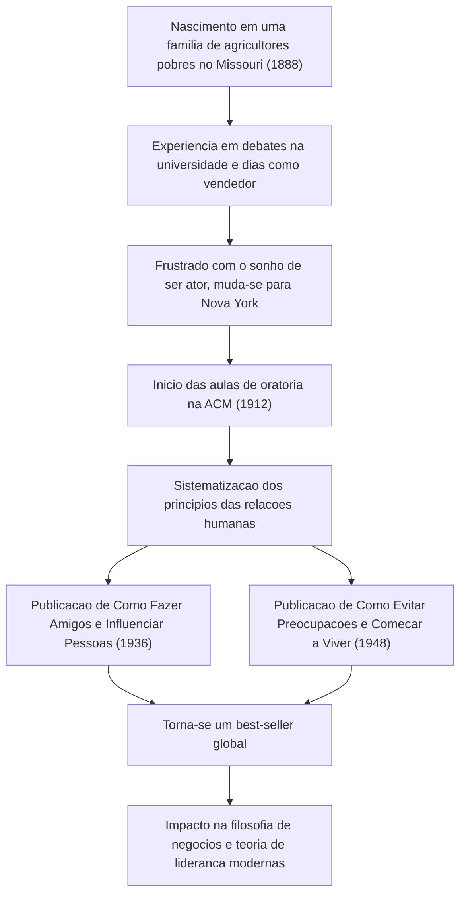

Um marco do autodesenvolvimento que continua a ter um impacto profundo nos profissionais de negócios modernos e líderes da indústria de tecnologia até hoje. Estes são livros clássicos como "Como Fazer Amigos e Influenciar Pessoas" e "Como Evitar Preocupações e Começar a Viver". Como o seu criador, Dale Carnegie (1888–1955), conseguiu sistematizar os princípios das relações humanas e emocionar pessoas em todo o mundo? Neste artigo, vamos mergulhar profundamente em sua vida turbulenta, na essência de sua filosofia e no legado que é transmitido até os dias de hoje.

## Início na Pobreza e uma Juventude de Frustrações

Dale Carnegie nasceu em 1888 numa família de agricultores pobres em Maryville, Missouri, EUA. Durante sua infância, ele cresceu em meio a trabalho árduo e pobreza, como acordar cedo todas as manhãs para ordenhar vacas. No entanto, com o forte incentivo de sua mãe, ele ingressou na Escola Normal do Estado em Warrensburg (hoje Universidade de Missouri Central).

Durante seus dias de estudante, Carnegie não era de forma alguma uma figura de destaque. Sendo de pequena estatura e não sendo bom em esportes, ele se voltou para o clube de "debate" a fim de superar seu complexo de inferioridade. Após muito esforço, ele venceu diversas competições de debate, o que se tornou a primeira experiência de sucesso em sua vida.

Após abandonar a universidade, ele trabalhou como vendedor de cursos por correspondência e como vendedor para uma empresa de carnes, alcançando resultados de vendas impressionantes. Contudo, incapaz de desistir de seu sonho de se tornar ator, mudou-se para Nova York, mas o resultado foi um fracasso retumbante. Em desespero, ele foi forçado a reavaliar sua vida mais uma vez.

## Aulas de Oratória na ACM (YMCA) e uma Virada do Destino

Em 1912, aos 24 anos, Carnegie teve a oportunidade de atuar como instrutor em um curso de oratória para adultos na ACM (Associação Cristã de Moços) em Nova York. Inicialmente, a ACM relutou em pagar-lhe um salário fixo, e ele foi contratado sob um sistema de comissão. No entanto, isso provou ser um grande ponto de virada.

Suas aulas iam além do simples ensino de técnicas de discurso; elas focavam na essência das relações humanas: "como ter autoconfiança e construir bons relacionamentos com os outros". Os participantes alcançaram um crescimento notável ao compartilhar suas próprias experiências e encorajar uns aos outros. Essa abordagem prática e empática rapidamente ganhou reputação, e as aulas ficaram lotadas dia após dia. Este foi o protótipo do "Dale Carnegie Course", que continua até hoje.

## A Cristalização de Sua Filosofia: "Como Fazer Amigos..." e "Como Evitar Preocupações..."

O cerne da filosofia de Carnegie reside em sua profunda compreensão humana de que "as pessoas não são criaturas lógicas, mas criaturas emocionais". Colocar-se no lugar do outro, demonstrar interesse sincero e fazê-los sentirem-se importantes. Essas coisas são fáceis de dizer, mas extremamente difíceis de praticar. Ele sistematizou anos de experiência ensinando e estudando casos de grandes figuras históricas em "princípios" que qualquer um poderia praticar.

Publicado em 1936, "Como Fazer Amigos e Influenciar Pessoas" tornou-se rapidamente um grande best-seller e, até o momento, já vendeu mais de 30 milhões de cópias em todo o mundo. Princípios como "não critique, não condene ou reclame" e "seja um bom ouvinte" possuem um valor universal que transcende o tempo.

Além disso, em 1948, ele publicou "Como Evitar Preocupações e Começar a Viver", um guia prático para lidar com a ansiedade e o estresse. Na estressante sociedade moderna, com sua sobrecarga de informações, os ensinamentos deste livro de "viver em compartimentos diários" e "preparar-se para aceitar o pior" estão sendo reavaliados do ponto de vista da saúde mental.

## O Caminho e as Realizações de Carnegie

## Impacto nas Gerações Futuras: A Importância das Relações Humanas na Era da Tecnologia

Mais de meio século se passou desde a morte de Dale Carnegie em 1955, e o mundo se transformou em uma sociedade altamente tecnológica com a disseminação da Internet e da IA. Paradoxalmente, no entanto, quanto mais a tecnologia evolui, mais importantes se tornam as "habilidades humanas" que ele defendeu.

Por exemplo, o sucesso de projetos na indústria de tecnologia moderna, como desenvolvimento ágil e comunidades de código aberto, depende fortemente de uma comunicação fluida e da segurança psicológica entre os membros da equipe. Na liderança também, o estilo de comando de cima para baixo está sendo substituído pela liderança servidora, que enfatiza a empatia com os membros e incentiva a ação proativa. Estes são exatamente os princípios que Carnegie pregava em "Como Fazer Amigos e Influenciar Pessoas".

## Conclusão

A vida de Dale Carnegie foi uma jornada que começou na pobreza e frustração, e continuou a apoiar o crescimento de outras pessoas enquanto enfrentava suas próprias fraquezas. Suas palavras e ensinamentos não são meras técnicas de negócios, mas sim um "estudo humano para viver uma vida melhor".

Mesmo em uma era onde a IA escreve códigos e realiza cálculos complexos instantaneamente, a capacidade de "emocionar os corações das pessoas" ainda é um esforço singularmente humano. A filosofia de Carnegie continuará a ser uma bússola confiável para as dificuldades e atritos interpessoais que enfrentamos na vanguarda da tecnologia.
