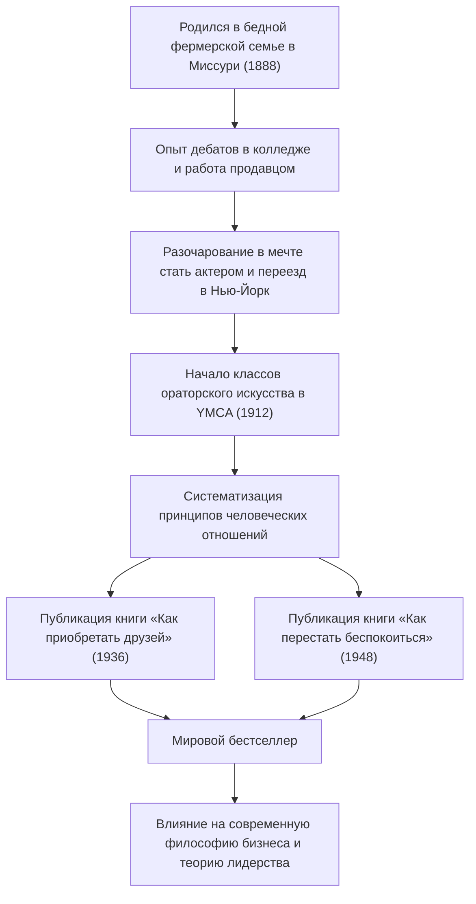

Шедевр саморазвития, который продолжает оказывать огромное влияние на современных бизнесменов и лидеров технологической индустрии. Это такие знаменитые книги, как «Как приобретать друзей и оказывать влияние на людей» (How to Win Friends and Influence People) и «Как перестать беспокоиться и начать жить» (How to Stop Worrying and Start Living). Как их создатель, Дейл Карнеги (Dale Carnegie, 1888–1955), смог систематизировать принципы человеческих отношений и тронуть сердца людей по всему миру? В этой статье мы глубоко погрузимся в его полную бурных событий жизнь, суть его философии и наследие, которое передается в наши дни.

## Отправная точка в бедности и разочарования в юности

Дейл Карнеги родился в 1888 году в бедной фермерской семье в Мэривилле, штат Миссури, США. В детстве он вырос в суровых условиях труда и бедности: каждое утро рано вставал, чтобы доить коров. Однако по настоятельной рекомендации матери он поступил в Государственный педагогический колледж в Уорренсберге (ныне Университет Центрального Миссури).

В студенческие годы Карнеги отнюдь не выделялся. Обладая невысоким ростом и не будучи сильным в спорте, он обратил свое внимание на дискуссионный клуб (клуб дебатов), чтобы преодолеть чувство неполноценности. После упорного труда он одержал победу на многочисленных турнирах по дебатам, что стало его первым успешным опытом в жизни.

После того как он бросил колледж, он работал продавцом заочного обучения и торговым представителем мясной компании, показывая феноменальные результаты в продажах. Однако, не в силах отказаться от мечты стать актером, он переехал в Нью-Йорк, но потерпел сокрушительное поражение. В отчаянии ему пришлось вновь пересмотреть свою жизнь.

## Классы ораторского искусства в YMCA и поворот судьбы

В 1912 году 24-летний Карнеги получил возможность стать преподавателем «классов ораторского искусства» для взрослых в нью-йоркском YMCA (Христианская ассоциация молодых людей). Изначально YMCA не хотела платить ему фиксированную зарплату, поэтому контракт был заключен на комиссионной основе. Однако это стало важным поворотным моментом.

Его уроки не ограничивались простым обучением технике речи, а были сосредоточены на основах человеческих отношений: «как обрести уверенность и построить хорошие отношения с другими». Участники делились своим опытом, подбадривали друг друга и добивались поразительного роста. Этот практичный и полный эмпатии подход быстро завоевал популярность, и классы ежедневно были переполнены. Это стало прототипом «Курса Дейла Карнеги», который существует и по сей день.

## Кристаллизация философии: «Как приобретать друзей...» и «Как перестать беспокоиться...»

Суть философии Карнеги кроется в глубоком понимании человека: «Люди — это создания не логики, а эмоций». Вставать на место другого, проявлять искренний интерес и давать почувствовать собственную значимость. Об этом легко сказать, но крайне сложно применить на практике. Он изучил свой многолетний опыт преподавания, а также примеры великих людей из истории и систематизировал их в «принципы», которые каждый может применять на практике.

Опубликованная в 1936 году книга «Как приобретать друзей и оказывать влияние на людей» в мгновение ока стала супербестселлером, и на сегодняшний день во всем мире прочитано более 30 миллионов копий. Такие принципы, как «Не критикуйте, не осуждайте, не жалуйтесь» и «Будьте хорошим слушателем», имеют универсальную ценность вне зависимости от эпохи.

Кроме того, в 1948 году он опубликовал практическое руководство «Как перестать беспокоиться и начать жить» для того, чтобы справляться с тревогой и стрессом. В современном обществе, перегруженном информацией и стрессом, учение из этой книги: «Живите в отсеке сегодняшнего дня» и «Представьте худшее, что может случиться, и будьте готовы принять это», — вновь оценивается с точки зрения психического здоровья.

## Жизненный путь и достижения Карнеги

## Влияние на будущие поколения: важность человеческих отношений в эру технологий

С момента смерти Дейла Карнеги в 1955 году прошло более полувека, и мир превратился в высокотехнологичное общество, в котором распространены интернет и ИИ. Однако, парадоксально, но чем больше развиваются технологии, тем важнее становятся предложенные им «человеческие навыки» (human skills).

Например, успех проектов в современной технологической индустрии, таких как гибкая методология разработки (Agile) и сообщества открытого исходного кода (open source), во многом зависит от гладкого общения и психологической безопасности между членами команды. В лидерстве также наблюдается переход от директивного стиля «сверху вниз» к служащему лидерству (servant leadership), которое сопереживает членам команды и поощряет их к самостоятельным действиям. Это и есть те самые принципы, которые Карнеги проповедовал в книге «Как приобретать друзей и оказывать влияние на людей».

## Заключение

Жизнь Дейла Карнеги началась с бедности и разочарований, и это был путь, на котором он сталкивался с собственными слабостями, продолжая помогать другим расти. Его слова и учения можно назвать не просто бизнес-техниками, а «наукой о человеке для лучшей жизни».

Даже в эпоху, когда ИИ пишет код и мгновенно выполняет сложные вычисления, способность «трогать сердца людей» по-прежнему остается тем, что могут делать только люди. Философия Карнеги будет продолжать служить надежным компасом перед лицом трудностей и трений в человеческих отношениях, с которыми мы сталкиваемся на передовой линии технологий.
