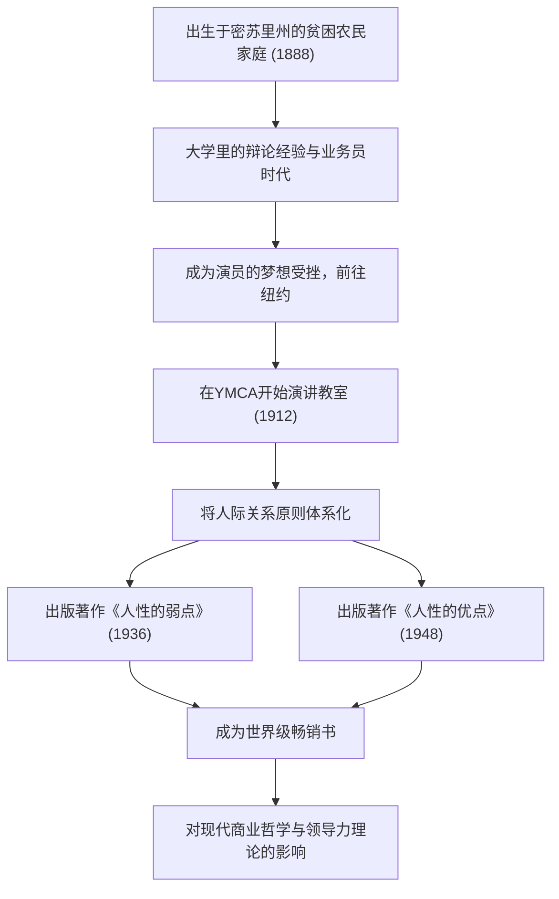

现代的商务人士和科技行业的领导者们，至今仍深受一部自我启发领域的金字塔尖之作的巨大影响。那就是《人性的弱点》（How to Win Friends and Influence People）和《人性的优点》（How to Stop Worrying and Start Living）等名著。这些著作的作者戴尔·卡耐基（Dale Carnegie, 1888–1955）是如何系统化人际关系原则，从而打动全世界人们的心的呢？本文将从他充满波折的生平，到他哲学的精髓，以及传承至今的遗产进行深入探讨。

## 从贫困中出发与充满挫折的青年期

戴尔·卡耐基1888年出生于美国密苏里州玛丽维尔的一个贫困农民家庭。童年时期每天早起挤牛奶等，在繁重的劳动和贫困中长大。然而，在母亲的强烈建议下，他进入了沃伦斯堡的州立师范学校（现中央密苏里大学）就读。

学生时代的卡耐基绝不是一个引人注目的人。身材矮小且不擅长体育运动的他，为了克服自卑感而将目光投向了“辩论俱乐部”。经过拼命的努力，他在多次辩论比赛中夺冠，这成为了他人生中的第一次成功体验。

大学退学后，他先后担任函授教育的推销员和肉类加工公司的业务员，创下了惊人的销售业绩。但是，他始终无法放弃成为演员的梦想而前往纽约，结果却惨败。在失意之中，他再次开始重新审视自己的人生。

## 在YMCA的演讲教室与命运的转机

1912年，24岁的卡耐基获得了在纽约YMCA（基督教青年会）担任面向社会人士的“演讲教室”讲师的机会。起初，YMCA方面不愿支付他固定薪水，而是签订了按佣金分成的合同。然而，这却成为了一个巨大的转机。

他的课程不仅限于单纯的演讲技巧指导，而是聚焦于“如何拥有自信，建立与他人良好关系”这一人际关系的核心。参与者们分享自己的亲身体验，互相鼓励，取得了惊人的成长。这种实用且充满共鸣的方法迅速赢得了声誉，教室连日爆满。这就是延续至今的“戴尔·卡耐基课程”的雏形。

## 哲学的结晶：《人性的弱点》与《人性的优点》

卡耐基哲学的核心在于“人不是逻辑的动物，而是感情的动物”这样一种深刻的人性理解。站在对方的立场，给予真诚的关注，让人感到自己很重要。这些话说起来容易，实践起来却极其困难。他研究了多年的讲学经验和历史伟人们的案例，将其体系化为任何人都能实践的“原则”。

1936年出版的《人性的弱点》瞬间成为了超级畅销书，至今在全世界已被阅读超过3000万册。“不批评、不责备、不抱怨”、“做一个善于倾听的人”等原则，具有超越时代的普遍价值。

此外在1948年，他出版了应对焦虑和压力的实用指南《人性的优点》。在信息过载、压力巨大的现代社会，这本书中“活在今天这一个独立的区隔里”、“设想最坏的情况并准备接受它”的教诲，从心理健康的角度也得到了重新评价。

## 卡耐基的轨迹与功绩流程图

## 对后世的影响：科技时代中人际关系的重要性

戴尔·卡耐基逝世的1955年至今已过去半个多世纪，世界已经蜕变成了一个互联网和人工智能普及的高度科技化社会。然而，矛盾的是，科技越是进步，他所提倡的“人际交往能力”（Human Skills）的重要性就越高。

例如，在敏捷开发和开源社区等现代科技行业中，项目的成功很大程度上依赖于团队成员之间顺畅的沟通和心理安全感。在领导力方面，也正在从自上而下的命令型，向与成员共情、促发其自发行动的仆从式领导力（Servant Leadership）转变。这些正是卡耐基在《人性的弱点》中所阐述的原则。

## 结语

戴尔·卡耐基的一生始于贫困与挫折，是一条在直面自身弱点的同时，不断支持他人成长的道路。他的话语和教诲不仅是单纯的商业技巧，更可以说是“为了过上更好人生的关于人的学问”。

即使在AI编写代码、瞬间完成复杂计算的时代，“打动人心”依然是只有人类才能完成的活动。面对我们在技术最前沿所遭遇的困难和人际关系摩擦，卡耐基的哲学在未来仍将是一座可靠的指南针。
