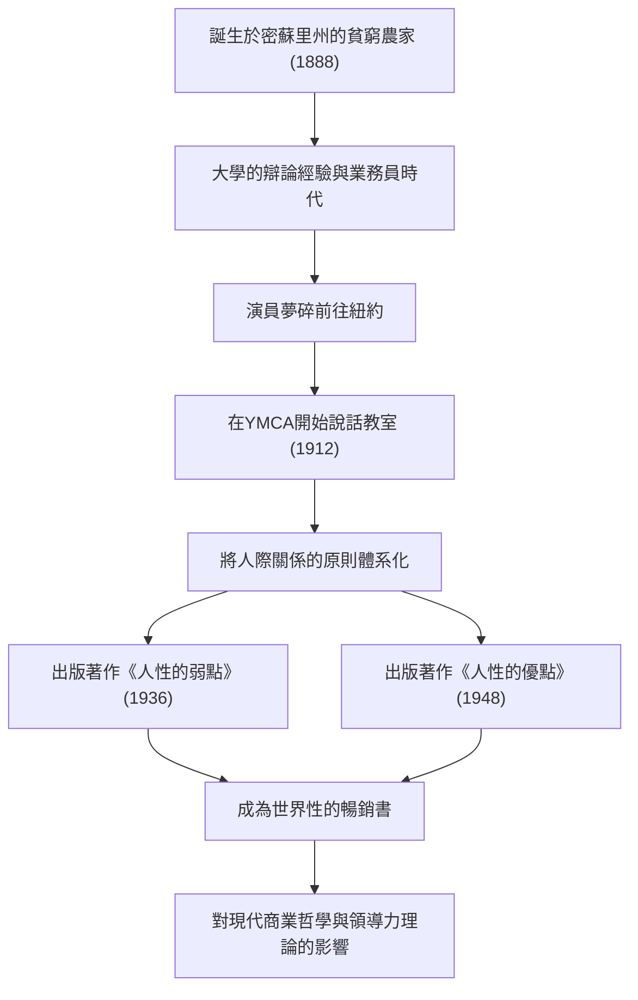

對於現代商務人士與科技業界的領袖們，至今仍持續產生巨大影響的自我啟發金字塔。那就是《人性的弱點（How to Win Friends and Influence People）》與《人性的優點（How to Stop Worrying and Start Living）》等名著。這些作品的作者戴爾·卡內基（Dale Carnegie, 1888–1955），究竟是如何將人際關係的原則體系化，進而打動全世界人們的心的呢？本篇文章將從他充滿波折的一生，深入探討其哲學的精髓，以及傳承至現代的遺產。

## 從貧困出發與充滿挫折的青年時期

戴爾·卡內基於1888年出生在美國密蘇里州瑪麗維爾的一個貧窮農家。幼年時期每天清早起床擠牛奶等，在嚴酷的勞動與貧困中長大。然而，在母親的強烈建議下，他進入了華倫斯堡的州立師範學校（現在的中密蘇里大學）就讀。

學生時代的卡內基，絕對不是個引人注目的存在。體格瘦小且不擅長運動的他，為了克服自卑感，將目光投向了「辯論社」。經過拚命的努力，他在無數的辯論大賽中奪冠，這成為了他人生中最初的成功體驗。

大學休學後，他曾擔任函授教育的推銷員及肉品公司的業務員，並留下了驚人的業績。然而，他無法放棄成為演員的夢想而前往紐約，結果卻慘遭失敗。在失意之中，他再次重新審視了自己的人生。

## YMCA的說話教室與命運的轉機

1912年，24歲的卡內基獲得了在紐約的YMCA（基督教青年會）擔任針對社會人士的「說話教室」講師的機會。起初，YMCA方面不願支付他固定薪水，而改以抽成制簽約。然而，這卻成為了巨大的轉機。

他的課程不僅僅停留在單純的演講技巧指導，而是聚焦於「如何建立自信，並與他人建立良好關係」這個人際關係的根本。參加者們透過分享自身經歷並互相鼓勵，取得了驚人的成長。這種充滿實踐性與共鳴的方法瞬間引起了廣泛好評，教室連日爆滿。這就是延續至今的「戴爾·卡內基課程」的原型。

## 哲學的結晶：《人性的弱點》與《人性的優點》

卡內基哲學的核心，在於「人不是邏輯的動物，而是感情的動物」這種深刻的對人類的理解。站在對方的立場，給予真誠的關心，並讓對方感到自己很重要。這些用嘴巴說很簡單，但實踐起來卻極為困難。他研究了多年的講課經驗與歷史上偉人們的案例，並將其體系化為任何人都能實踐的「原則」。

1936年出版的《人性的弱點》，瞬間成為超級暢銷書，至今在全世界已被閱讀超過3000萬冊。「不批評、不責備、不抱怨」、「做一個好聽眾」等原則，跨越時代具有普遍的價值。

此外，在1948年，他出版了應對不安與壓力的實踐指南《人性的優點》。在資訊過載且充滿壓力的現代社會中，這本書中「活在今天的方格中」、「設想最壞的情況，並準備好接受它」的教誨，從心理健康的觀點來看也再次獲得了極高評價。

## 卡內基的軌跡與功績流程

## 對後世的影響：科技時代中人際關係的重要性

自戴爾·卡內基於1955年逝世以來，已經過去了半個多世紀，世界已蛻變為網際網路與AI普及的高度科技社會。然而，矛盾的是，科技越是進步，他所提倡的「人際技能（Human Skills）」就越顯得重要。

例如，敏捷開發或開源社群等，現代科技業界中專案的成功，極大程度上依賴於團隊成員間順暢的溝通與心理安全感。在領導力方面，也正從由上而下的命令型，轉變為與成員產生共鳴、促使自發行動的僕人式領導（Servant Leadership）成為主流。這些正好就是卡內基在《人性的弱點》中所闡述的原則。

## 結語

戴爾·卡內基的一生，是從貧困與挫折開始，在面對自身弱點的同時，持續支援他人成長的歷程。他的言語與教誨，不僅僅是單純的商業技巧，更可以說是「為了過上更美好人生的為人處事學」。

即使在AI能寫程式、瞬間完成複雜計算的時代，能夠「打動人心」的，終究還是只有人類才能辦到的事。面對我們在技術最前線所遭遇的困難與人際關係的摩擦，卡內基的哲學在未來也將繼續作為我們可靠的指南針。
