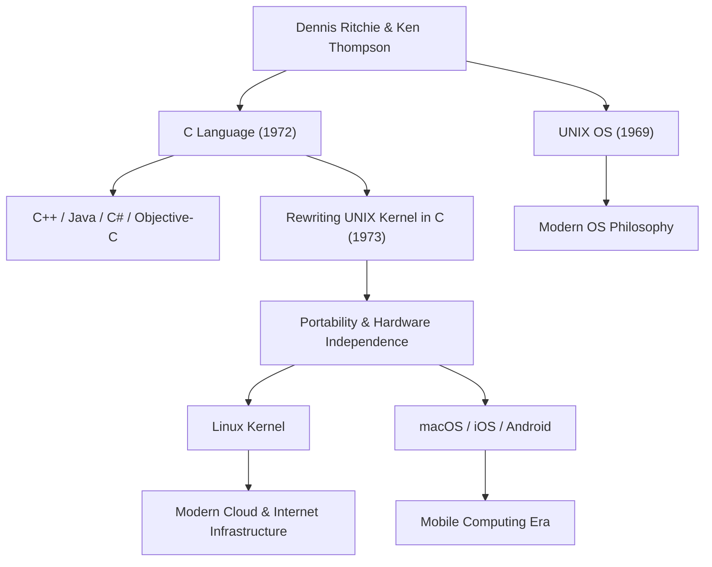

دينيس ماكاليستر ريتشي (9 سبتمبر 1941 - 12 أكتوبر 2011) هو أحد أهم الشخصيات وأكثرها تأثيراً في علوم الحاسوب الحديثة. على الرغم من أنه لم يحظَ بتسليط الضوء الساطع كأمثال ستيف جوبز أو بيل غيتس، إلا أن الإرث الذي تركه يشكل الأساس لكل تقنية نستخدمها اليوم. إن لغة "C" ونظام التشغيل "UNIX" اللذين شارك في تطويرهما بعمق، ينبضان بالحياة في كل مكان في مجتمعنا الرقمي الحديث، من خوادم الإنترنت إلى الهواتف الذكية، وأجهزة الكمبيوتر العملاقة، وحتى الأجهزة المنزلية.

## نشأته وأيامه في مختبرات بيل

ولد دينيس ريتشي في برونكسفيل بولاية نيويورك ونشأ في نيوجيرسي. كان والده، أليستير ريتشي، عالماً عمل لفترة طويلة في مختبرات بيل (Bell Labs) وكان مرجعاً في نظرية دوائر التبديل. نشأ دينيس محاطاً بالعلوم والتكنولوجيا منذ صغره، والتحق بجامعة هارفارد حيث حصل على درجات علمية في الفيزياء والرياضيات التطبيقية. وبعد ذلك، أجرى أبحاثاً في فجر علوم الحاسوب في كلية الدراسات العليا بنفس الجامعة، لكنه كان يمتلك اهتماماً قوياً ببناء أنظمة عملية أكثر من البقاء في الأوساط الأكاديمية.

في عام 1967، انضم إلى مختبرات بيل، وهو نفس المكان الذي كان يعمل فيه والده. في ذلك الوقت، كانت مختبرات بيل واحدة من أبرز حواضن الابتكار في العالم، حيث تم اختراع الترانزستور ونظرية المعلومات، وكانت مكاناً تتجمع فيه ألمع العقول من جميع أنحاء العالم. وهناك التقى بكين تومسون، الذي أصبح حليفه مدى الحياة. هذا اللقاء بين هذين العبقريين غيّر تاريخ الحوسبة بشكل جذري وإلى الأبد.

## ولادة لغة C ونظام UNIX

في أواخر الستينيات، شارك ريتشي وتومسون في مشروع لتطوير نظام تشغيل طموح ومعقد للغاية في ذلك الوقت يُدعى "Multics" (خدمة المعلومات والحوسبة المتعددة). ولكن، مع تضخم المشروع والتأخيرات المتكررة، قررت مختبرات بيل الانسحاب من Multics.

بعد أن فقدا بيئة تطوير ممتازة، بحث الاثنان عن نظام أبسط وأسهل في الاستخدام، حيث يمكنهما كتابة البرامج براحة. بدأوا في إعادة استخدام كمبيوتر PDP-7 غير مرغوب فيه كان يعلوه الغبار في زاوية المختبر، وبدأوا في تطوير نظامهم الخفيف الخاص. كان هذا هو النموذج الأولي لنظام التشغيل الذي أُطلق عليه لاحقاً اسم "UNIX".

في البداية، كُتب نظام UNIX بلغة التجميع (Assembly)، مما جعله يعتمد كلياً على بنية أجهزة محددة. لحل هذه المشكلة وتمكين نقل النظام إلى أجهزة كمبيوتر أخرى، قام ريتشي بإجراء تحسينات بناءً على لغة "B" التي طورها تومسون، وفي عام 1972 ابتكر لغة "C".

كانت الثورة الكبرى للغة C هي أنها جمعت بتوازن مثالي بين القدرة على إجراء عمليات ذاكرة منخفضة المستوى للأجهزة (مثل المؤشرات) وخصائص اللغات عالية المستوى التي يسهل على البشر قراءتها وكتابتها منطقياً (مثل البرمجة المهيكلة).

في عام 1973، قام ريتشي وتومسون بإعادة كتابة الجزء الأساسي (النواة) من نظام UNIX بالكامل باستخدام لغة C. ومن خلال هذا النهج، الذي كان يُعتبر غير تقليدي في ذلك الوقت، بكتابة نظام التشغيل بلغة عالية المستوى بدلاً من لغة التجميع المعتمدة على الأجهزة، تطور نظام UNIX بشكل كبير ليصبح نظاماً قابلاً للنقل بدرجة عالية إلى أي جهاز.

## الفلسفة: "أبقه بسيطاً" والثقة في المبرمج

في قلب فلسفة التصميم لدينيس ريتشي، كانت "البساطة" (Simplicity) و"الأناقة" (Elegance) حاضرتين دائماً. لم تُصمم لغة C لتمتلك ميزات ضخمة في حد ذاتها، بل لتقديم الحد الأدنى من الوظائف البسيطة الضرورية، مع ترك الباقي لتقدير المبرمج. وكما يُقال: "تعتمد لغة C على افتراض أن المبرمج يفهم تماماً ما يحاول القيام به"، فقد كانت بمثابة شفرة حادة وعالية المرونة للمحترفين.

تتجذر فلسفته هذه بعمق في فلسفة تصميم UNIX، أو ما يُعرف بـ "فلسفة UNIX". إن مبادئ مثل "اجعل كل برنامج يقوم بشيء واحد وبشكل جيد" و"اربط البرامج معاً باستخدام الأنابيب، واستخدم تيارات النصوص كواجهة عالمية"، لم تكن تهدف إلى إنشاء نظام ضخم ومعقد، بل إلى الجمع بين أدوات بسيطة ومستقلة لحل المشكلات المعقدة، وهو ما يمثل قمة النمطية والتعاون.

## التأثير على الأجيال القادمة وإرث العملاق الهادئ

لا تقتصر إنجازات دينيس ريتشي على إنشاء لغة واحدة أو نظام تشغيل واحد. فقد أصبحت المفاهيم التي ابتكرها بمثابة مخطط لصناعة البرمجيات الحديثة بأكملها.

لغات البرمجة المشتقة من لغة C أو المتأثرة بها بشدة، مثل C++، Java، C#، Objective-C، Go، و Rust، لا تزال تهيمن على التيار الرئيسي لتطوير البرمجيات اليوم. بالإضافة إلى ذلك، انتقل سلالة UNIX إلى أنظمة مفتوحة المصدر مثل Linux، وأنظمة Apple مثل macOS و iOS، وحتى Android. إن البنية التحتية للخوادم التي تدعم الإنترنت، والهواتف الذكية التي نلمسها كل يوم، لا يمكن أن توجد بدون الحمض النووي للرموز التي تركها وراءه.

بفضل هذه الإنجازات الهائلة، حصل على جائزة تورينج (Turing Award)، التي تُعتبر جائزة نوبل في عالم الحوسبة، مع كين تومسون في عام 1983. وفي عام 1999، منحه الرئيس كلينتون الميدالية الوطنية للتكنولوجيا، من بين العديد من أرفع الأوسمة. ومع ذلك، فقد كان شخصاً متواضعاً للغاية، ولم يكن يحب لفت الانتباه في الأماكن العامة، وظل طوال حياته مهندساً يمتلك روح الهاكر.

في 12 أكتوبر 2011، بعد أسبوع واحد فقط من وفاة ستيف جوبز، توفي دينيس ريتشي بهدوء في منزله في نيوجيرسي. في حين تصدرت وفاة جوبز عناوين الأخبار في جميع أنحاء العالم وبكى الكثيرون، لم تحظَ وفاة ريتشي بالكثير من الاهتمام في المجتمع العام. ومع ذلك، داخل مجتمع تكنولوجيا المعلومات العالمي، تم استقبال الخبر بهدوء ولكن بامتنان وحزن عميقين لا يُقاسان.

"لقد منحنا ستيف جوبز نافذة (منتجاً) جميلة، لكن دينيس ريتشي صنع الأساس والأدوات لبناء ذلك المنزل."

هذه الكلمات تجسد حجم مساهمته الفعلية في المجتمع الحديث. إن العالم الرقمي الحديث مبني على الأساس القوي والأنيق الذي بناه. ستستمر إنجازات دينيس ريتشي الهادئة في العيش إلى الأبد كأساس للحوسبة، دون أن تتلاشى ألوانها أبداً.

## رسم بياني للعلاقات بين الإنجازات والتأثيرات

يوضح الرسم البياني التالي كيف ترتبط الإنجازات الرئيسية لدينيس ريتشي بالتكنولوجيا الحديثة.

