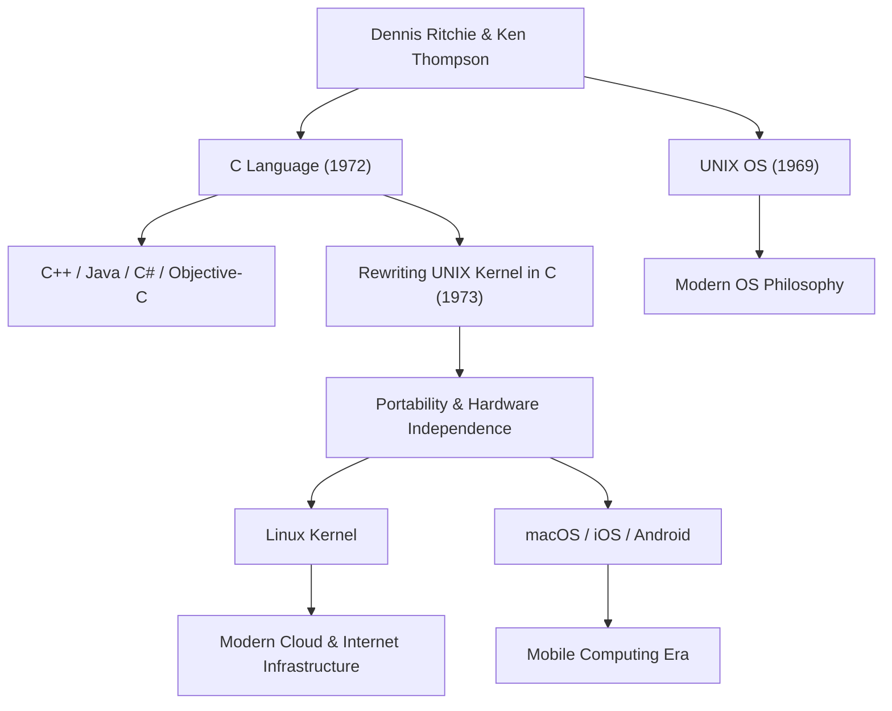

Dennis MacAlistair Ritchie (9. September 1941 - 12. Oktober 2011) ist eine der wichtigsten und einflussreichsten Persönlichkeiten in der modernen Informatik. Obwohl er selten so im Rampenlicht stand wie [Steve Jobs](/de/p/biography-steve-jobs/) oder Bill Gates, bildet sein Vermächtnis das Fundament für fast alle Technologien, die wir heute nutzen. Die Programmiersprache "C" und das Betriebssystem "UNIX", an deren Entwicklung er maßgeblich beteiligt war, sind überall in unserer modernen digitalen Gesellschaft lebendig – von Internet-Servern über Smartphones und Supercomputer bis hin zu Haushaltsgeräten.

## Frühe Jahre und die Zeit in den Bell Labs

Dennis Ritchie wurde in Bronxville, New York, geboren und wuchs in New Jersey auf. Sein Vater, Alistair Ritchie, war ein langjähriger Wissenschaftler an den Bell Labs und eine Kapazität auf dem Gebiet der Schaltkreistheorie. Von klein auf von Wissenschaft und Technologie umgeben, besuchte Dennis die Harvard University, wo er Abschlüsse in Physik und angewandter Mathematik erwarb. Danach forschte er an der gleichen Universität in den Anfängen der Informatik, hatte jedoch ein stärkeres Interesse am praktischen Systembau als an einem Verbleib in der akademischen Welt.

1967 trat er wie sein Vater in die Bell Labs ein. Die damaligen Bell Labs waren eine der weltweit führenden Wiegen der Innovation, in der der Transistor und die Informationstheorie erfunden wurden, und ein Ort, an dem sich die klügsten Köpfe aus aller Welt versammelten. Dort lernte er Ken Thompson kennen, der sein lebenslanger Verbündeter werden sollte. Die Begegnung dieser beiden Genies sollte die Geschichte der Computer grundlegend und für immer verändern.

## Die Geburt von C und UNIX

In den späten 1960er Jahren waren Ritchie und Thompson an einem damals äußerst ehrgeizigen und komplexen Betriebssystem-Entwicklungsprojekt namens "Multics" (Multiplexed Information and Computing Service) beteiligt. Aufgrund des ausufernden Projekts und wiederholter Verzögerungen beschlossen die Bell Labs jedoch, sich aus Multics zurückzuziehen.

Ihrer exzellenten Entwicklungsumgebung beraubt, suchten die beiden nach einem einfacheren, benutzerfreundlicheren System, auf dem sie bequem programmieren konnten. Sie fanden in einer Ecke des Labors einen ausgemusterten, verstaubten PDP-7-Computer, den sie wiederverwendeten, um mit der Entwicklung ihres eigenen ressourcenschonenden Systems zu beginnen. Dies war der Prototyp des Betriebssystems, das später "UNIX" genannt werden sollte.

Anfangs war UNIX in Assemblersprache geschrieben, was bedeutete, dass es vollständig von einer bestimmten Hardware-Architektur abhängig war. Um dieses Problem zu lösen und das System auf andere Computer portieren zu können, verbesserte Ritchie die von Thompson entwickelte "B-Sprache" und erschuf 1972 die "C-Sprache".

Die größte Revolution der C-Sprache bestand darin, dass sie die perfekte Balance fand: Sie ermöglichte Low-Level-Speicheroperationen der Hardware (wie [Zeiger](/de/p/c-language-pointers-memory-management-stack-heap/)), wies aber gleichzeitig die Eigenschaften einer Hochsprache (wie strukturierte Programmierung) auf, die für den Menschen logisch lesbar und schreibbar war.

1973 schrieben Ritchie und Thompson den Kern von UNIX (den Kernel) vollständig in C um. Durch diesen für die damalige Zeit unkonventionellen Ansatz, ein Betriebssystem nicht in hardwareabhängiger Assemblersprache, sondern in einer Hochsprache zu schreiben, entwickelte sich UNIX dramatisch zu einem hochgradig portablen System, das auf jede Hardware übertragen werden konnte.

## Philosophie: "Keep it simple" und das Vertrauen in den Programmierer

Im Zentrum von Dennis Ritchies Designphilosophie standen immer "Einfachheit" (Simplicity) und "Eleganz" (Elegance). C wurde so konzipiert, dass die Sprache selbst keine massiven Funktionen besitzt, sondern nur das absolute Minimum an einfachen Funktionen bereitstellt und den Rest dem Ermessen des Programmierers überlässt. Wie es heißt: "C geht davon aus, dass der Programmierer genau weiß, was er tut", war es ein scharfes, hochflexibles Werkzeug für Profis.

Seine Philosophie ist auch tief in der Designphilosophie von UNIX verankert, der sogenannten "[UNIX-Philosophie](/de/p/philosophy-unix-modular-design/)". Prinzipien wie "Lass ein Programm eine Sache gut machen" und "Verbinde Programme mit Pipes und verwende Textströme als universelle Schnittstelle" verkörperten das absolute Höchstmaß an Modularität und Kooperation: Anstatt komplexe, gigantische Systeme zu bauen, wurden einfache, unabhängige Werkzeuge kombiniert, um komplexe Probleme zu lösen.

## Einfluss auf die Nachwelt und das Vermächtnis des stillen Riesen

Dennis Ritchies Errungenschaften beschränken sich nicht darauf, nur eine Sprache oder ein Betriebssystem geschaffen zu haben. Die von ihm entwickelten Konzepte wurden zur Blaupause für die gesamte moderne Softwareindustrie.

Programmiersprachen, die von C abstammen oder stark davon beeinflusst wurden, wie C++, Java, C#, Objective-C, Go und Rust, dominieren noch heute die Softwareentwicklung. Die UNIX-Genealogie lebt im Open-Source-Linux, in Apples macOS, iOS und sogar in Android weiter. Weder die Server-Infrastruktur, die das Internet stützt, noch die Smartphones, die wir jeden Tag berühren, könnten ohne die DNA des von ihm hinterlassenen Codes existieren.

Für seine enormen Leistungen wurde ihm eine Vielzahl höchster Auszeichnungen zuteil: 1983 erhielt er zusammen mit Ken Thompson den Turing-Preis, der als Nobelpreis der Informatik gilt, und 1999 wurde ihm von Präsident Clinton die National Medal of Technology verliehen. Er selbst war jedoch sehr bescheiden, vermied es, in der Öffentlichkeit auf sich aufmerksam zu machen, und blieb sein ganzes Leben lang ein Ingenieur mit Hacker-Ethos.

Am 12. Oktober 2011, nur eine Woche nach dem Tod von [Steve Jobs](/de/p/biography-steve-jobs/), verstarb Dennis Ritchie friedlich in seinem Haus in New Jersey. Während der Tod von Jobs weltweit große Beachtung fand und viele Menschen trauerten, blieb der Tod von Ritchie in der breiten Öffentlichkeit weitgehend unbeachtet. In der weltweiten IT-Community wurde er jedoch mit stiller und unermesslich tiefer Dankbarkeit und Trauer aufgenommen.

"[Steve Jobs](/de/p/biography-steve-jobs/) gab uns ein wunderschönes Fenster (Produkte), aber Dennis Ritchie schuf das Fundament und die Werkzeuge, um das Haus zu bauen."

Diese Worte veranschaulichen das gewaltige Ausmaß seines tatsächlichen Beitrags zu unserer modernen Gesellschaft. Die moderne digitale Welt ist auf dem soliden und eleganten Fundament aufgebaut, das er errichtet hat. Dennis Ritchies stille, aber monumentale Errungenschaft wird nie verblassen und für immer als Grundlage der Computertechnik weiterleben.

## Korrelationsdiagramm seiner Errungenschaften und Einflüsse

Das folgende Diagramm zeigt, wie Dennis Ritchies wichtigste Errungenschaften mit der modernen Technologie verbunden sind.

