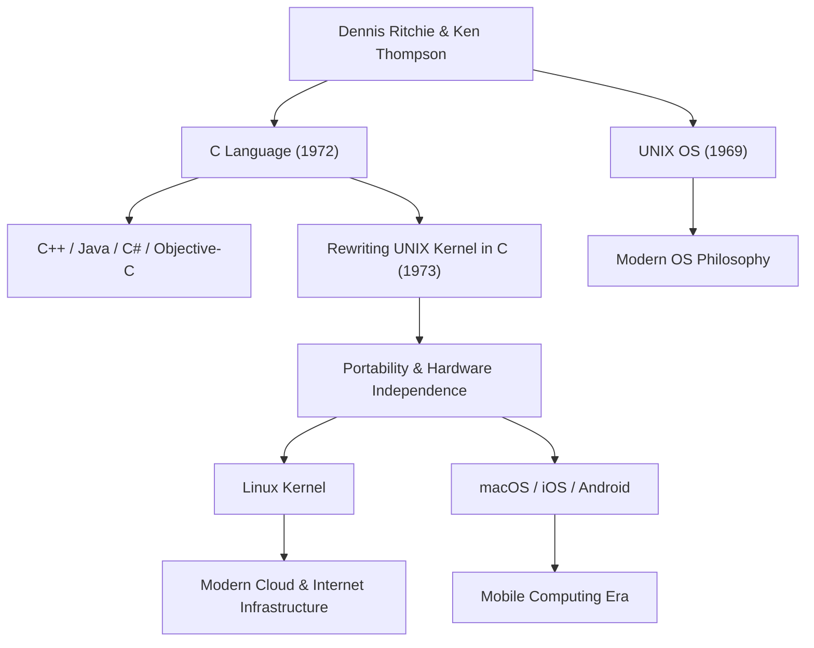

Dennis MacAlistair Ritchie (September 9, 1941 – October 12, 2011) is one of the most important and influential figures in modern computer science. Although he rarely bathed in the flashy limelight like Steve Jobs or Bill Gates, the legacy he left behind forms the foundation of all the technology we use today. The "C programming language" and the "UNIX" operating system, which he was deeply involved in developing, pulse everywhere in our modern digital society, from internet servers and smartphones to supercomputers and even home appliances.

## Early Life and Days at Bell Labs

Dennis Ritchie was born in Bronxville, New York, and raised in New Jersey. His father, Alistair Ritchie, was a longtime scientist at Bell Labs and an authority on switching circuit theory. Growing up surrounded by science and technology from an early age, Dennis went on to Harvard University, where he earned degrees in physics and applied mathematics. He subsequently conducted research at the dawn of computer science in graduate school there, but he had a stronger interest in building practical systems than remaining in academia.

In 1967, he joined Bell Labs, the same place his father worked. At the time, Bell Labs was one of the world's leading cradles of innovation, where the transistor and information theory were born, and a place where brilliant minds from around the world gathered. There, he met Ken Thompson, who would become his lifelong ally. The meeting of these two geniuses would fundamentally and forever change the history of computing.

## The Birth of C Language and UNIX

In the late 1960s, Ritchie and Thompson were participating in a project to develop an operating system called "Multics" (Multiplexed Information and Computing Service), which was extremely ambitious and complex for its time. However, due to the project's bloat and repeated delays, Bell Labs decided to pull out of Multics.

Having lost an excellent development environment, the two sought a system that was simpler, easier to use, and comfortable for them to write programs in. They repurposed an unwanted, dust-gathering PDP-7 computer in a corner of the lab and began developing their own lightweight system. This was the prototype of the OS that would later be named "UNIX."

Initially, UNIX was written in assembly language, making it entirely dependent on a specific hardware architecture. To solve this and make the system portable to other computers, Ritchie iteratively improved upon the "B language" developed by Thompson, giving birth to the "C language" in 1972.

The greatest revolution of the C language was its perfect balance: it allowed low-level hardware memory manipulation (such as pointers) while simultaneously possessing the characteristics of a high-level language (such as structured programming) that was logically easy for humans to read and write.

In 1973, Ritchie and Thompson completely rewrote the core of UNIX (the kernel) in this C language. By taking the then-unconventional approach of writing an operating system in a high-level language rather than hardware-dependent assembly language, UNIX underwent a dramatic evolution into a highly portable system that could be moved across any hardware.

## Philosophy: "Keep it simple" and Trust in the Programmer

At the heart of Dennis Ritchie's design philosophy were always "Simplicity" and "Elegance." The C language was designed not to have massive built-in features, but to provide the bare minimum of simple functionalities, leaving the rest to the programmer's discretion. "C language is based on the premise that the programmer knows exactly what they are trying to do," as the saying goes, making it a sharp, highly flexible blade for professionals.

This philosophy of his is also deeply etched into the design concept of UNIX, the so-called "UNIX philosophy." Principles such as "Make each program do one thing well" and "Connect programs via pipes and use text streams as a universal interface" were the ultimate expression of modularity and cooperation—solving complex problems by combining simple, independent tools rather than building massive, complex systems.

## Legacy and the Quiet Giant's Impact on Posterity

Dennis Ritchie's achievements go far beyond merely creating a single language or OS. The concepts he spawned became the blueprint for the entire modern software industry.

Programming languages derived from or heavily influenced by C—such as C++, Java, C#, Objective-C, Go, and Rust—continue to dominate mainstream software development today. Furthermore, the UNIX lineage has been passed down to open-source Linux, Apple's macOS and iOS, and even Android. Neither the server infrastructure that supports the internet nor the smartphones we touch every day could exist without the DNA of the code he left behind.

For his monumental achievements, he received numerous highest honors, including the Turing Award, known as the Nobel Prize of computing, which he won alongside Ken Thompson in 1983, and the National Medal of Technology awarded by President Clinton in 1999. However, he himself was very modest, did not prefer to assert himself in public, and remained an engineer with a hacker spirit throughout his life.

On October 12, 2011, just one week after the death of Steve Jobs, Dennis Ritchie passed away quietly at his home in New Jersey. While Jobs' death was widely reported around the world and mourned by many, Ritchie's passing received little mainstream attention. However, within the global IT community, it was received quietly, but with immeasurable gratitude and deep sorrow.

"Steve Jobs gave us the beautiful windows (products), but Dennis Ritchie built the foundation and the tools to build the house."

These words illustrate the magnitude of his practical contribution to modern society. The modern digital world is built upon the robust and elegant foundation he constructed. The quiet monumental work of Dennis Ritchie will never fade and will live on forever as the foundation of computing.

## Correlation Diagram of Achievements and Impact

The following diagram shows how Dennis Ritchie's main achievements connect to modern technology.

