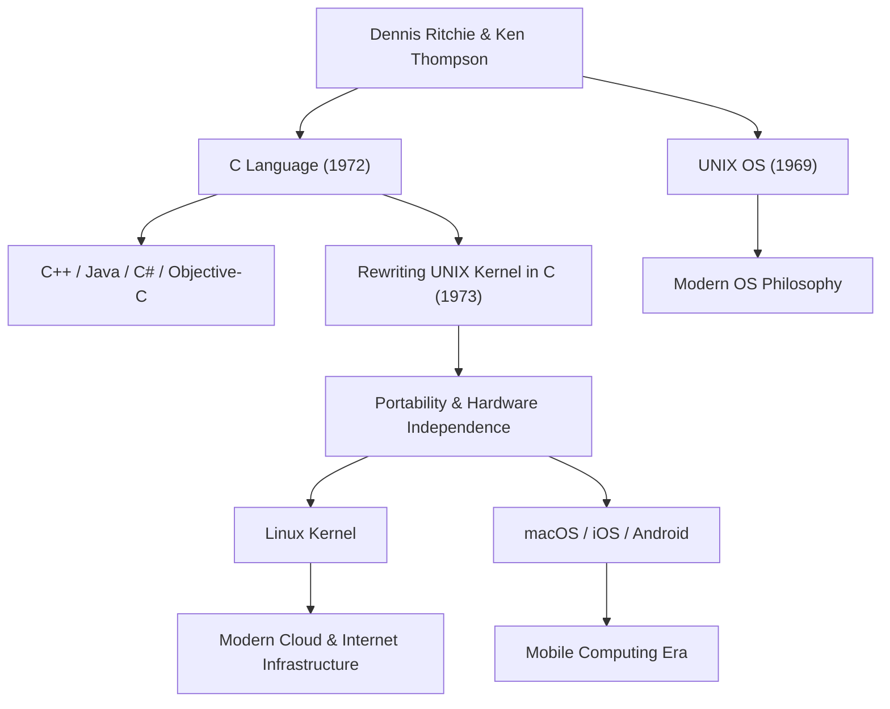

Dennis MacAlistair Ritchie (9 de septiembre de 1941 - 12 de octubre de 2011) fue una de las figuras más importantes e influyentes de la informática moderna. Aunque rara vez recibió los llamativos reflectores de Steve Jobs o Bill Gates, el legado que dejó es la base de toda la tecnología que utilizamos hoy en día. El "lenguaje C" y el sistema operativo "UNIX", en cuyo desarrollo estuvo profundamente involucrado, laten en cada rincón de nuestra sociedad digital moderna, desde servidores de Internet hasta teléfonos inteligentes, supercomputadoras e incluso electrodomésticos.

## Primeros Años y sus Días en Bell Labs

Dennis Ritchie nació en Bronxville, Nueva York, y creció en Nueva Jersey. Su padre, Alistair Ritchie, fue un científico que trabajó durante mucho tiempo en Bell Labs y una autoridad en la teoría de circuitos de conmutación. Al crecer rodeado de ciencia y tecnología desde una edad temprana, Dennis ingresó a la Universidad de Harvard y obtuvo títulos en física y matemáticas aplicadas. Posteriormente, realizó investigaciones en los albores de la informática en la misma escuela de posgrado, pero tenía un mayor interés en la construcción de sistemas prácticos en lugar de permanecer en el mundo académico.

En 1967, se unió a Bell Labs, al igual que su padre. En ese momento, Bell Labs era una de las principales cunas de innovación del mundo, donde se crearon los transistores y la teoría de la información, y un lugar donde se reunían las mentes más brillantes de todo el mundo. Allí, conoció a Ken Thompson, quien se convertiría en su aliado de por vida. El encuentro de estos dos genios cambiaría fundamental y para siempre la historia de las computadoras.

## El Nacimiento de C y UNIX

A finales de la década de 1960, Ritchie y Thompson participaban en un proyecto de desarrollo de un sistema operativo extremadamente ambicioso y complejo para su época, llamado "Multics" (Multiplexed Information and Computing Service). Sin embargo, debido a la expansión del proyecto y a los repetidos retrasos, Bell Labs decidió retirarse de Multics.

Habiendo perdido su excelente entorno de desarrollo, los dos buscaban un sistema más simple y fácil de usar en el que pudieran escribir programas cómodamente. Reutilizaron una computadora PDP-7 que acumulaba polvo en un rincón del laboratorio y comenzaron a desarrollar su propio sistema ligero. Este fue el prototipo del sistema operativo que más tarde se llamaría "UNIX".

Inicialmente, UNIX estaba escrito en lenguaje ensamblador, por lo que dependía completamente de una arquitectura de hardware específica. Para resolver esto y permitir que el sistema fuera portado a otras computadoras, Ritchie mejoró el "lenguaje B" desarrollado por Thompson y creó el "lenguaje C" en 1972.

La mayor revolución del lenguaje C fue que combinaba en perfecto equilibrio la capacidad de realizar operaciones de memoria de bajo nivel en el hardware (como punteros) con las características de los lenguajes de alto nivel (como la programación estructurada), que eran lógicamente fáciles de leer y escribir para los humanos.

En 1973, Ritchie y Thompson reescribieron completamente la parte central (el kernel) de UNIX en este lenguaje C. Mediante un enfoque que era inusual para la época (escribir el sistema operativo en un lenguaje de alto nivel en lugar de un lenguaje ensamblador dependiente del hardware), UNIX experimentó una evolución dramática hacia un sistema altamente portátil que podía adaptarse a cualquier hardware.

## Filosofía: "Keep it simple" y Confianza en los Programadores

En el corazón de la filosofía de diseño de Dennis Ritchie siempre estuvieron la "simplicidad" (Simplicity) y la "elegancia" (Elegance). El lenguaje C fue diseñado no para tener funciones masivas en el lenguaje en sí, sino para proporcionar las funciones simples y mínimas necesarias, dejando el resto a discreción del programador. Como se dice a menudo, "C asume que el programador sabe exactamente lo que está haciendo"; era una herramienta afilada y altamente flexible para los profesionales.

Esta filosofía suya también está profundamente grabada en la filosofía de diseño de UNIX, la llamada "filosofía UNIX". Los principios como "Haz que cada programa haga una cosa bien" y "Conecta los programas mediante tuberías (pipes) usando flujos de texto como una interfaz universal" fueron el pináculo de la modularidad y la cooperación: resolver problemas complejos combinando herramientas simples e independientes en lugar de construir enormes sistemas complejos.

## Influencia en las Generaciones Futuras y el Legado del Gigante Silencioso

Los logros de Dennis Ritchie van mucho más allá de la simple creación de un lenguaje o un sistema operativo. Los conceptos que él introdujo se convirtieron en los planos para toda la industria moderna del software.

Los lenguajes de programación derivados o fuertemente influenciados por C, como C++, Java, C#, Objective-C, Go y Rust, aún dominan la corriente principal del desarrollo de software. El linaje de UNIX se ha transmitido al Linux de código abierto, macOS e iOS de Apple, e incluso a Android. Ni la infraestructura de servidores que sostiene Internet ni los teléfonos inteligentes que tocamos todos los días podrían existir sin el ADN del código que dejó atrás.

Debido a sus enormes contribuciones, recibió numerosos y máximos honores, como el Premio Turing en 1983 junto con Ken Thompson, a menudo considerado el Premio Nobel de la computación, y la Medalla Nacional de Tecnología otorgada por el presidente Clinton en 1999. Sin embargo, él mismo fue muy modesto, no le gustaba imponerse en público y siguió siendo un ingeniero con espíritu de hacker durante toda su vida.

El 12 de octubre de 2011, solo una semana después de la muerte de Steve Jobs, Dennis Ritchie falleció pacíficamente en su casa de Nueva Jersey. Mientras que la muerte de Jobs fue reportada masivamente en todo el mundo y llevó a muchas personas a derramar lágrimas, la muerte de Ritchie no recibió mucha atención en la sociedad en general. Sin embargo, dentro de la comunidad mundial de TI, fue recibida en silencio y con una gratitud y tristeza inconmensurablemente profundas.

"Steve Jobs nos dio una hermosa ventana (productos), pero Dennis Ritchie hizo los cimientos y las herramientas para construir esa casa".

Estas palabras ilustran la magnitud de su contribución real a la sociedad moderna. El mundo digital moderno está construido sobre los cimientos sólidos y elegantes que él estableció. La obra silenciosa y monumental de Dennis Ritchie nunca se desvanecerá, sino que vivirá para siempre como la base de la computación.

## Diagrama de Correlación de Logros e Influencias

El siguiente diagrama muestra cómo los principales logros de Dennis Ritchie se conectan con la tecnología moderna.

