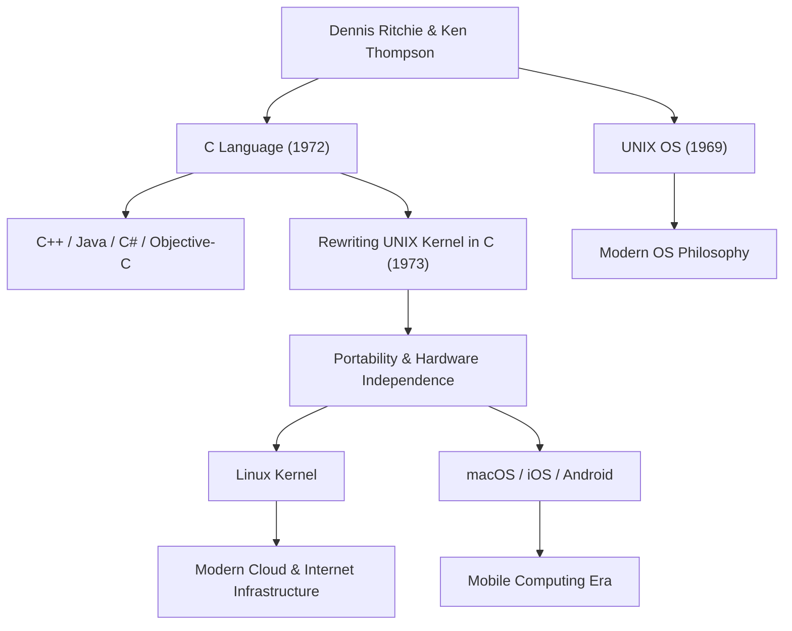

Dennis MacAlistair Ritchie (9 septembre 1941 - 12 octobre 2011) est l'une des figures les plus importantes et les plus influentes de l'informatique moderne. Bien qu'il ait rarement été sous les feux des projecteurs comme l'ont été Steve Jobs ou Bill Gates, l'héritage qu'il a laissé constitue le socle de toutes les technologies que nous utilisons aujourd'hui. Le « langage C » et le système d'exploitation « UNIX », dont il a profondément influencé le développement, sont omniprésents dans la société numérique contemporaine, des serveurs Internet aux smartphones, en passant par les supercalculateurs et même les appareils électroménagers.

## Jeunesse et années aux Bell Labs

Dennis Ritchie est né à Bronxville, dans l'État de New York, et a grandi dans le New Jersey. Son père, Alistair Ritchie, était un scientifique ayant longtemps travaillé aux Laboratoires Bell (Bell Labs) et une autorité en matière de théorie des circuits de commutation. Ayant grandi entouré de science et de technologie dès son plus jeune âge, Dennis a étudié à l'Université d'Harvard, où il a obtenu des diplômes en physique et en mathématiques appliquées. Il y a ensuite mené des recherches à l'aube de l'informatique, mais il était beaucoup plus intéressé par la construction pratique de systèmes que par une carrière académique.

En 1967, il rejoint les mêmes laboratoires Bell que son père. À cette époque, les Bell Labs étaient l'un des plus grands berceaux de l'innovation au monde, où le transistor et la théorie de l'information ont été inventés, attirant les esprits les plus brillants du monde entier. C'est là qu'il rencontre son allié de toujours, Ken Thompson. La rencontre de ces deux génies changera fondamentalement et à jamais l'histoire de l'informatique.

## La naissance du langage C et d'UNIX

À la fin des années 1960, Ritchie et Thompson ont participé à un projet extrêmement ambitieux et complexe pour l'époque : le développement d'un système d'exploitation appelé « Multics (Multiplexed Information and Computing Service) ». Cependant, face à l'envergure du projet et aux retards répétés, les Bell Labs ont décidé de se retirer de Multics.

Privés d'un environnement de développement performant, les deux hommes cherchaient un système plus simple, plus convivial et sur lequel ils pourraient programmer confortablement. Ils ont récupéré un ordinateur PDP-7 inutilisé qui prenait la poussière dans un coin du laboratoire et ont commencé à développer leur propre système léger. C'est le prototype du système d'exploitation qui sera plus tard baptisé « UNIX ».

Au début, UNIX était écrit en langage assembleur, ce qui le rendait totalement dépendant d'une architecture matérielle spécifique. Pour résoudre ce problème et permettre au système d'être porté sur d'autres ordinateurs, Ritchie a développé le « langage C » en 1972, en améliorant le « langage B » développé par Thompson.

La plus grande révolution du langage C a été d'offrir un équilibre parfait : il permettait la manipulation de bas niveau de la mémoire matérielle (comme les pointeurs) tout en conservant les caractéristiques d'un langage de haut niveau, facile à lire et à écrire logiquement par les humains (comme la programmation structurée).

En 1973, Ritchie et Thompson ont entièrement réécrit le cœur d'UNIX (le noyau) en langage C. Cette approche novatrice pour l'époque — écrire un système d'exploitation dans un langage de haut niveau plutôt qu'en assembleur dépendant du matériel — a fait d'UNIX un système d'une portabilité exceptionnelle, capable d'évoluer de manière spectaculaire pour être adapté à n'importe quel matériel.

## Philosophie : « Keep it simple » et confiance envers les programmeurs

Au cœur de la philosophie de conception de Dennis Ritchie se trouvaient toujours la « simplicité (Simplicity) » et l'« élégance (Elegance) ». Le langage C a été conçu non pas comme un langage doté de fonctionnalités massives, mais plutôt pour fournir le strict minimum de fonctionnalités simples, laissant le reste à la discrétion du programmeur. Comme on le dit souvent, « le langage C part du principe que le programmeur sait exactement ce qu'il fait » ; c'était un outil tranchant et extrêmement flexible pour les professionnels.

Cette philosophie est également profondément ancrée dans la conception d'UNIX, connue sous le nom de « philosophie UNIX ». Des principes tels que « qu'un programme fasse une seule chose, et qu'il la fasse bien » ou « relier les programmes entre eux par des pipes, et utiliser les flux de texte comme interface universelle » représentaient l'apogée de la modularité et de la collaboration : résoudre des problèmes complexes en combinant des outils simples et indépendants, plutôt que de créer un système massif et complexe.

## L'impact sur les générations futures et l'héritage de l'étoile discrète

Les réalisations de Dennis Ritchie ne se limitent pas à la simple création d'un langage ou d'un système d'exploitation. Les concepts qu'il a inventés sont devenus le modèle de l'ensemble de l'industrie logicielle moderne.

Les langages de programmation dérivés ou fortement influencés par le C, tels que C++, Java, C#, Objective-C, Go et Rust, dominent encore aujourd'hui le développement de logiciels. La lignée d'UNIX s'est poursuivie avec le système open source Linux, ainsi que macOS et iOS d'Apple, et même Android. L'infrastructure des serveurs qui soutient Internet, tout comme les smartphones que nous utilisons quotidiennement, ne pourraient exister sans l'ADN de son code.

Pour ses accomplissements immenses, il a reçu de nombreux honneurs prestigieux, notamment le prix Turing en 1983 (souvent considéré comme le prix Nobel de l'informatique) avec Ken Thompson, et la National Medal of Technology remise par le président Clinton en 1999. Cependant, il était lui-même très modeste, n'aimant pas s'imposer en public, et est resté toute sa vie un ingénieur avec l'esprit d'un hacker.

Le 12 octobre 2011, à peine une semaine après le décès de Steve Jobs, Dennis Ritchie s'est éteint paisiblement à son domicile dans le New Jersey. Alors que la mort de Jobs a fait la une des journaux du monde entier et a suscité de nombreuses larmes, celle de Ritchie est passée relativement inaperçue du grand public. Cependant, au sein de la communauté informatique mondiale, elle a été accueillie avec une profonde tristesse et une gratitude silencieuse, mais incommensurable.

« Steve Jobs nous a donné de belles fenêtres (des produits), mais Dennis Ritchie a construit les fondations et les outils pour bâtir la maison. »

Cette citation illustre l'ampleur de sa contribution réelle à la société moderne. Le monde numérique d'aujourd'hui repose sur les fondations solides et élégantes qu'il a construites. L'œuvre discrète de Dennis Ritchie ne s'effacera jamais ; elle continuera de vivre éternellement comme le fondement de l'informatique.

## Diagramme des contributions et de leur impact

Le diagramme ci-dessous illustre comment les principales réalisations de Dennis Ritchie sont liées aux technologies modernes.

