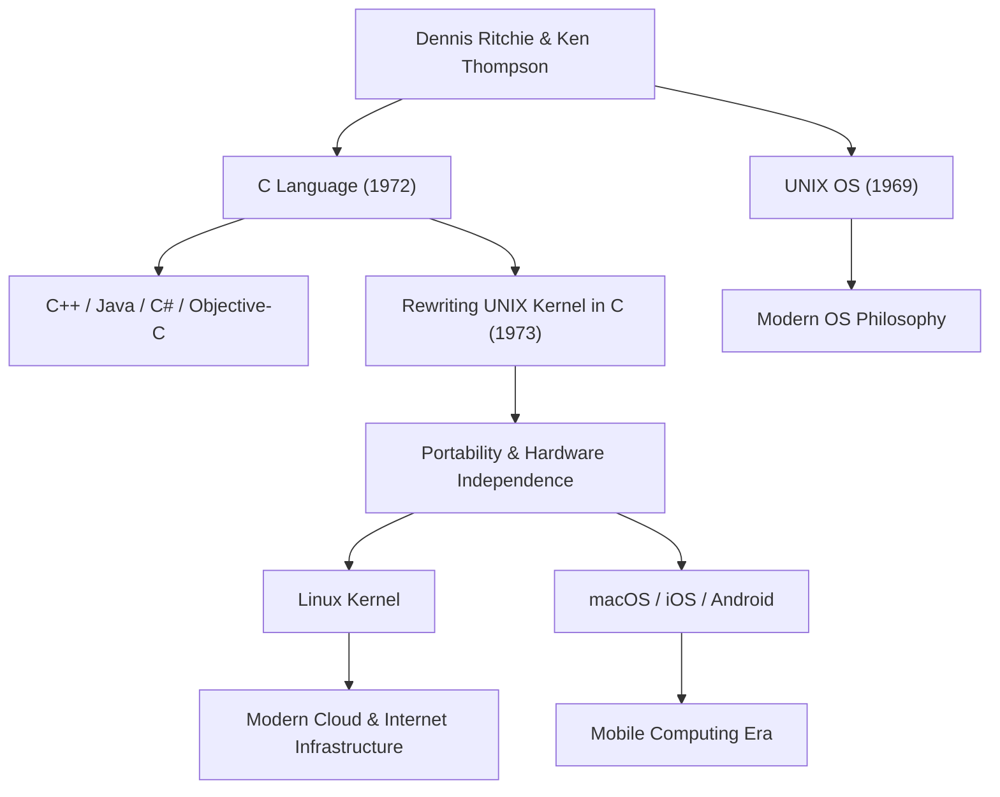

डेनिस मैकएलिस्टर रिची (Dennis MacAlistair Ritchie, 9 सितंबर 1941 - 12 अक्टूबर 2011) आधुनिक कंप्यूटर विज्ञान के सबसे महत्वपूर्ण और प्रभावशाली व्यक्तियों में से एक हैं। हालांकि उन्होंने स्टीव जॉब्स या बिल गेट्स की तरह चकाचौंध वाली प्रसिद्धि हासिल नहीं की, लेकिन उनकी विरासत उन सभी तकनीकों का आधार है जिनका हम आज उपयोग करते हैं। "C भाषा" (C language) और "UNIX" ऑपरेटिंग सिस्टम, जिनके विकास में उनका गहरा योगदान था, आज इंटरनेट सर्वर से लेकर स्मार्टफोन, सुपरकंप्यूटर और यहाँ तक कि घरेलू उपकरणों तक, आधुनिक डिजिटल समाज के हर हिस्से में जीवित हैं।

## प्रारंभिक जीवन और बेल लैब्स के दिन

डेनिस रिची का जन्म ब्रोंक्सविले, न्यूयॉर्क में हुआ था और वे न्यू जर्सी में पले-बढ़े। उनके पिता, एलिस्टेयर रिची, बेल लैब्स (Bell Labs) में लंबे समय तक काम करने वाले एक वैज्ञानिक थे और स्विचिंग सर्किट सिद्धांत के विशेषज्ञ थे। बचपन से ही विज्ञान और तकनीक से घिरे डेनिस ने हार्वर्ड विश्वविद्यालय में दाखिला लिया और भौतिकी तथा अनुप्रयुक्त गणित (applied mathematics) में डिग्री हासिल की। इसके बाद उन्होंने उसी विश्वविद्यालय से कंप्यूटर विज्ञान के शुरुआती दिनों में शोध किया, लेकिन शिक्षा जगत में रहने के बजाय, उनकी व्यावहारिक सिस्टम निर्माण में गहरी रुचि थी।

1967 में, वे अपने पिता की तरह बेल लैब्स में शामिल हो गए। उस समय का बेल लैब्स दुनिया के अग्रणी नवाचार का पालना था, जहाँ ट्रांजिस्टर और सूचना सिद्धांत का जन्म हुआ था, और यह दुनिया भर के बेहतरीन दिमागों का केंद्र था। वहाँ उनकी मुलाकात केन थॉम्पसन (Ken Thompson) से हुई, जो उनके जीवन भर के सहयोगी बने। इन दो प्रतिभाओं की मुलाकात कंप्यूटर के इतिहास को बुनियादी रूप से और हमेशा के लिए बदल देने वाली थी।

## C भाषा और UNIX का जन्म

1960 के दशक के अंत में, रिची और थॉम्पसन उस समय के एक बहुत ही महत्वाकांक्षी और जटिल ऑपरेटिंग सिस्टम विकास परियोजना में भाग ले रहे थे, जिसे "Multics" (Multiplexed Information and Computing Service) कहा जाता था। हालाँकि, परियोजना के बहुत बड़े हो जाने और बार-बार होने वाली देरी के कारण, बेल लैब्स ने Multics से हटने का फैसला किया।

एक उत्कृष्ट विकास का माहौल खो देने के बाद, दोनों एक ऐसे सिस्टम की तलाश में थे जो सरल हो, उपयोग में आसान हो, और जिस पर वे आराम से प्रोग्राम लिख सकें। उन्होंने लैब के एक कोने में धूल फांक रहे एक बेकार PDP-7 कंप्यूटर का फिर से उपयोग किया और अपना खुद का एक हल्का सिस्टम विकसित करना शुरू किया। यही उस OS का प्रारंभिक रूप है जिसे बाद में "UNIX" नाम दिया गया।

शुरुआत में, UNIX को असेंबली भाषा में लिखा गया था, इसलिए यह एक विशिष्ट हार्डवेयर आर्किटेक्चर पर पूरी तरह से निर्भर था। इस समस्या को हल करने और सिस्टम को अन्य कंप्यूटरों में पोर्ट करने योग्य बनाने के लिए, रिची ने थॉम्पसन द्वारा विकसित "B भाषा" के आधार पर सुधार किए और 1972 में "C भाषा" बनाई।

C भाषा की सबसे बड़ी क्रांति यह थी कि इसमें हार्डवेयर के निचले स्तर के मेमोरी ऑपरेशंस (जैसे पॉइंटर्स) की क्षमता थी, और साथ ही यह उच्च-स्तरीय भाषा की विशेषताओं (जैसे संरचित प्रोग्रामिंग) का एक आदर्श संतुलन भी प्रदान करती थी, जिसे मनुष्य आसानी से तार्किक रूप से पढ़ और लिख सकते थे।

1973 में, रिची और थॉम्पसन ने UNIX के मुख्य भाग (कर्नेल) को पूरी तरह से C भाषा में फिर से लिखा। हार्डवेयर पर निर्भर असेंबली भाषा के बजाय एक उच्च-स्तरीय भाषा में ऑपरेटिंग सिस्टम को लिखने के उस समय के इस असामान्य दृष्टिकोण ने UNIX को एक ऐसे सिस्टम में बदल दिया जिसे किसी भी हार्डवेयर (अत्यधिक पोर्टेबल) में पोर्ट किया जा सकता था।

## दर्शन: "इसे सरल रखें" (Keep it simple) और प्रोग्रामर पर विश्वास

डेनिस रिची के डिजाइन दर्शन के केंद्र में हमेशा "सरलता" (Simplicity) और "सुंदरता" (Elegance) थी। C भाषा को इस तरह से डिज़ाइन किया गया है कि भाषा में स्वयं बहुत बड़े कार्य नहीं होते हैं, बल्कि यह न्यूनतम आवश्यक और सरल कार्य प्रदान करती है, और बाकी को प्रोग्रामर के विवेक पर छोड़ देती है। जैसा कि कहा जाता है, "C भाषा इस धारणा पर आधारित है कि प्रोग्रामर को ठीक से पता है कि वह क्या करने की कोशिश कर रहा है," यह पेशेवरों के लिए एक तेज और अत्यधिक लचीला उपकरण था।

उनका यह दर्शन UNIX की डिज़ाइन विचारधारा, जिसे "UNIX दर्शन" कहा जाता है, में भी गहराई से अंकित है। "एक प्रोग्राम को एक काम अच्छी तरह से करने दें" और "प्रोग्रामों को पाइप से जोड़ें और टेक्स्ट स्ट्रीम का एक सार्वभौमिक इंटरफ़ेस के रूप में उपयोग करें" जैसे सिद्धांत, एक जटिल और विशाल सिस्टम बनाने के बजाय सरल और स्वतंत्र उपकरणों को मिलाकर जटिल समस्याओं को हल करने के लिए, मॉड्यूलैरिटी और सहयोग की पराकाष्ठा थे।

## भावी पीढ़ियों पर प्रभाव और शांत महानायक की विरासत

डेनिस रिची की उपलब्धि केवल एक भाषा या OS बनाने तक ही सीमित नहीं है। उनके द्वारा बनाई गई अवधारणाएँ आधुनिक सॉफ्टवेयर उद्योग के संपूर्ण ढांचे का ब्लूप्रिंट बन गईं।

C++, Java, C#, Objective-C, Go और Rust जैसी प्रोग्रामिंग भाषाएँ, जो C भाषा से ली गई हैं या इससे काफी प्रभावित हैं, आज भी सॉफ्टवेयर विकास की मुख्यधारा हैं। UNIX की वंशावली ओपन-सोर्स Linux, Apple के macOS, iOS और यहाँ तक कि Android में भी जारी है। इंटरनेट को सपोर्ट करने वाला सर्वर इंफ्रास्ट्रक्चर और वे स्मार्टफोन जिन्हें हम हर दिन छूते हैं, उनके द्वारा लिखे गए कोड के DNA के बिना मौजूद नहीं हो सकते थे।

उनकी महान उपलब्धियों के लिए, उन्हें 1983 में केन थॉम्पसन के साथ ट्यूरिंग अवार्ड से सम्मानित किया गया, जिसे कंप्यूटर जगत का नोबेल पुरस्कार कहा जाता है, और 1999 में राष्ट्रपति क्लिंटन द्वारा नेशनल मेडल ऑफ टेक्नोलॉजी प्रदान किया गया। उन्हें कई सर्वोच्च सम्मान मिले। हालाँकि, वह स्वयं बहुत विनम्र थे, सार्वजनिक रूप से खुद को व्यक्त करना पसंद नहीं करते थे, और जीवन भर हैकर स्वभाव वाले इंजीनियर बने रहे।

12 अक्टूबर 2011 को, स्टीव जॉब्स के निधन के ठीक एक सप्ताह बाद, डेनिस रिची का न्यू जर्सी स्थित उनके घर में शांति से निधन हो गया। जहाँ जॉब्स की मृत्यु को दुनिया भर में व्यापक रूप से कवर किया गया और कई लोगों ने शोक व्यक्त किया, वहीं रिची की मृत्यु पर आम जनता का ज्यादा ध्यान नहीं गया। हालाँकि, वैश्विक आईटी समुदाय के भीतर, इसे चुपचाप और असीमित कृतज्ञता और दुख के साथ प्राप्त किया गया।

"स्टीव जॉब्स ने हमें एक सुंदर खिड़की (उत्पाद) दी, लेकिन डेनिस रिची ने उस घर को बनाने के लिए नींव और उपकरण बनाए।"

ये शब्द आधुनिक समाज में उनके वास्तविक योगदान के आकार को दर्शाते हैं। आधुनिक डिजिटल दुनिया उस मजबूत और सुंदर नींव पर बनी है जिसका उन्होंने निर्माण किया था। डेनिस रिची की शांत महानता कभी फीकी नहीं पड़ेगी और हमेशा कंप्यूटिंग की नींव के रूप में जीवित रहेगी।

## उपलब्धि और प्रभाव का सहसंबंध आरेख

नीचे दिया गया आरेख दिखाता है कि डेनिस रिची की प्रमुख उपलब्धियाँ आधुनिक तकनीक से कैसे जुड़ती हैं।

